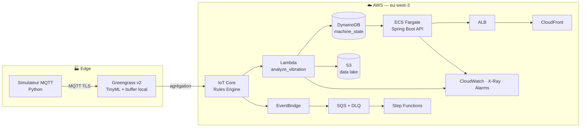

# Architecture globale

**Supervision IoT temps réel d'une ligne d'assemblage aérospatiale.**  
Déployé sur AWS `eu-west-3` (Paris) — 100% Terraform — event-driven.

---

## Flux bout en bout

---

## Couches

| Couche | Rôle | Services |
|--------|------|----------|
| **Edge** | Collecte, filtrage, buffer offline | Greengrass v2, TinyML |
| **Ingestion** | Transport sécurisé, routage | IoT Core, Rules Engine |
| **Compute** | Détection anomalies, orchestration | Lambda, EventBridge, SQS, Step Functions |
| **Stockage** | État temps réel, archive | DynamoDB, S3 |
| **Supervision** | API REST opérateur | ECS Fargate, ALB, CloudFront |
| **Observabilité** | Métriques, traces, alertes | CloudWatch, X-Ray, SNS |

---

## Principes

- **Event-driven** : aucun polling — chaque message capteur déclenche le traitement
- **Least Privilege** : chaque service a son propre rôle IAM minimal
- **IaC 100%** : tout Terraform, zéro modification console AWS
- **Résilience** : SQS DLQ + Step Functions retry + Greengrass buffer offline
