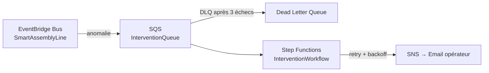

# Composants & Services

Inventaire des services AWS déployés avec leur configuration clé.

---

## IoT Core

| Paramètre | Valeur |
|-----------|--------|
| Protocole | MQTT/TLS port 8883 |
| Auth device | Certificat X.509 (mTLS) |
| Topic pattern | `assembly-line/+/metrics` |
| Rules | → Lambda `analyze_vibration`, → Lambda `StoreMetrics` |
| Device Shadow | `reported` / `desired` par poste |

**Payload capteur :**
```json
{ "id_poste": "poste-1", "vibration": 1.24, "temperature": 72.3, "pression": 4.2, "timestamp": "2026-08-06T10:00:00Z" }
```

---

## Lambda

| Fonction | Déclencheur | Rôle |
|----------|-------------|------|
| `analyze_vibration` | IoT Rule | Détecte anomalie, écrit DynamoDB, publie sur EventBridge |
| `StoreMetrics` | IoT Rule | Archive raw data en S3 |
| `AlertDispatcher` | EventBridge | Publie sur SNS |
| `cf_expiry` | EventBridge Scheduler (31/12) | Arrête ECS + désactive CloudFront API |

---

## EventBridge + SQS + Step Functions



---

## DynamoDB

| Paramètre | Valeur |
|-----------|--------|
| Table | `machine_state` |
| Partition key | `site_id` (String) |
| Sort key | `poste_id` (String) |
| Chiffrement | KMS CMK |
| Billing | Pay-per-request |

---

## ECS Fargate — supervision-api

| Paramètre | Valeur |
|-----------|--------|
| Image | Spring Boot Java 21 |
| CPU / RAM | 256 vCPU / 512 MB |
| Port | 8080 |
| Subnet | Public (assign_public_ip=true) |
| desired_count | 0 (arrêté) / 1 (demo) |
| Health check | `GET /actuator` |

---

## Réseau VPC

| Ressource | CIDR / Config |
|-----------|--------------|
| VPC | 10.10.0.0/16 |
| Subnet public A | 10.10.1.0/24 — eu-west-3a (ECS + ALB) |
| Subnet public B | 10.10.3.0/24 — eu-west-3b (ALB multi-AZ) |
| Subnet privé | 10.10.2.0/24 — eu-west-3a (Lambda) |
| IGW | Seul point de sortie internet |
| NAT Gateway | ❌ Supprimée (économie ~$32/mois) |

---

## CloudFront

| Distribution | URL | Origine |
|-------------|-----|---------|
| Portfolio | do1vmragia1j9.cloudfront.net | S3 |
| API | dv03heuf7nfn6.cloudfront.net | ALB |

---

## Greengrass v2 (Edge)

| Composant | Rôle |
|-----------|------|
| `EdgeFilter` | Filtre et agrège les messages avant envoi cloud |
| `AnomalyDetector` | TinyML (Isolation Forest) — détection locale hors réseau |
| Buffer local | Stockage JSONL en cas de coupure réseau |
