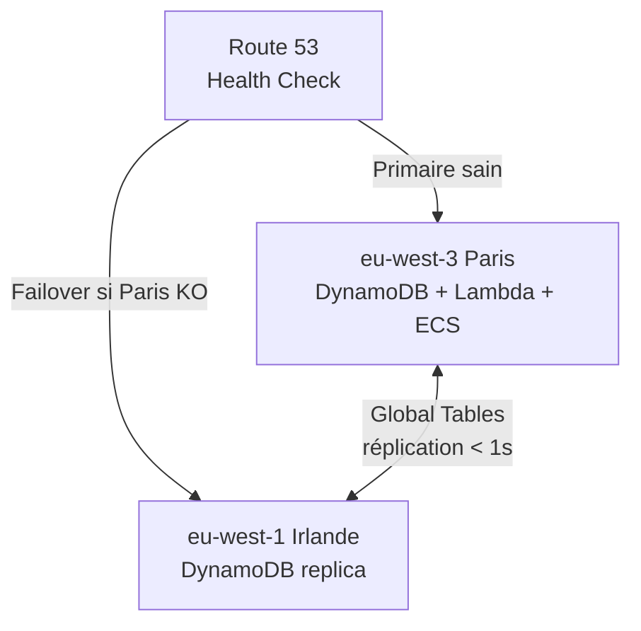

# Architecture multi-région

**Résilience géographique Active/Passive.**  
Primaire : `eu-west-3` (Paris) — Secondaire : `eu-west-1` (Irlande).

---

## Schéma

---

## Composants déployés

| Ressource | Config |
|-----------|--------|
| DynamoDB Global Tables | Réplication eu-west-3 ↔ eu-west-1 |
| Route 53 Health Check | Intervalle 30s — seuil 3 échecs → failover |
| Route 53 Record | Failover Routing Policy — Primaire/Secondaire |

---

## Objectifs de résilience

| Métrique | Cible |
|----------|-------|
| RTO (Recovery Time) | < 5 min |
| RPO (Recovery Point) | < 30 s |
| SLA global | 99.99% |

---

## Limitation actuelle

Seul DynamoDB est répliqué. En cas de panne `eu-west-3` :
- Les données sont accessibles depuis `eu-west-1` ✅
- L'API ECS / Lambda ne bascule pas automatiquement (non déployé) ⚠️
