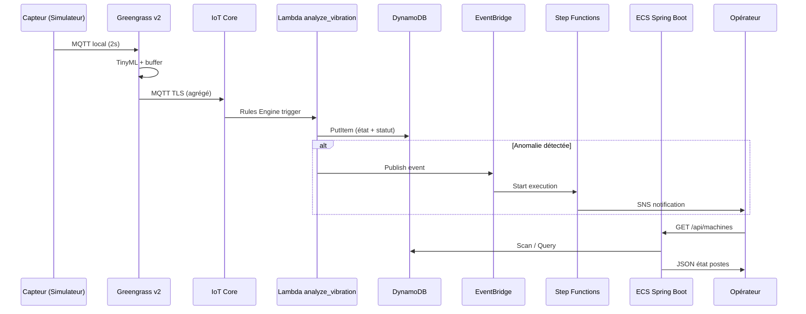

# Consolidation — Vue end-to-end

Flux complet du capteur terrain jusqu'à l'opérateur.

---

## Flux nominal

---

## Points de résilience

| Point | Mécanisme |
|-------|-----------|
| Coupure réseau edge | Greengrass buffer JSONL + reconnect Full Jitter |
| Lambda failure | SQS DLQ après 3 tentatives |
| ECS down | CloudFront cache + ALB health check |
| Région AWS down | DynamoDB Global Tables + Route 53 failover |
| Pic de trafic | EventBridge → SQS découple le burst |
