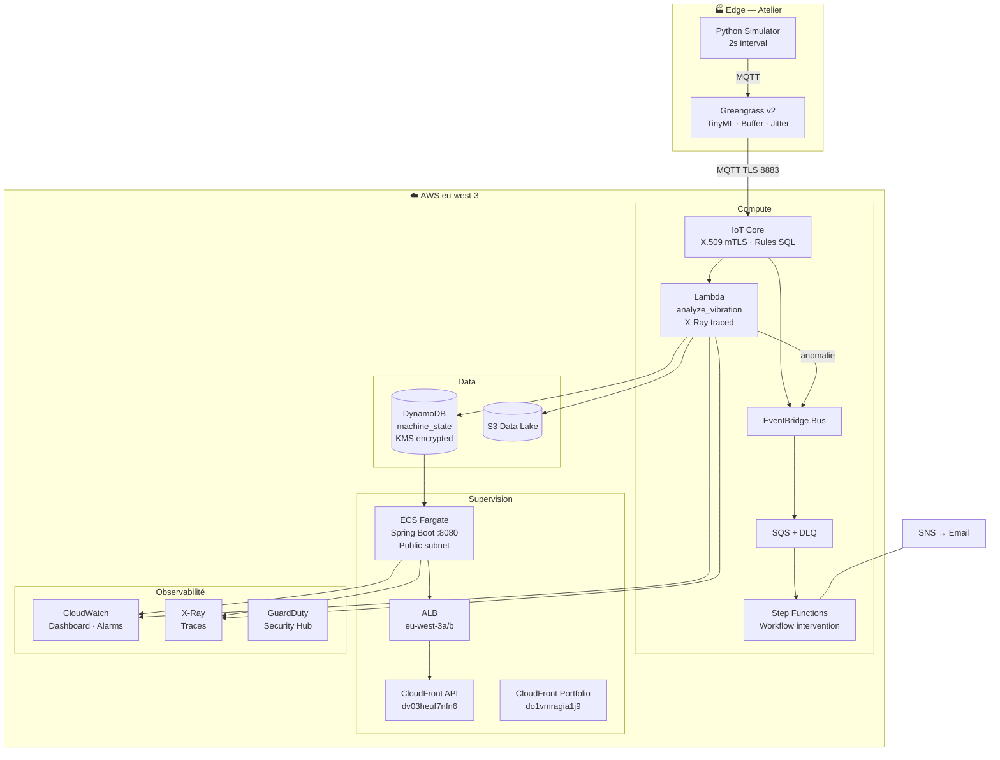

# Synthèse — Architecture complète

**Document de référence** — vue unique de tout le système déployé.

---

## Diagramme complet

---

## Stack déployée

| Catégorie | Services |
|-----------|---------|
| **IoT** | IoT Core, Greengrass v2, Device Shadow |
| **Compute** | Lambda (×4), EventBridge, SQS+DLQ, Step Functions |
| **Data** | DynamoDB Global Tables, S3 |
| **API** | ECS Fargate, ALB, CloudFront (×2) |
| **Sécurité** | KMS, IAM, GuardDuty, Security Hub, AWS Config |
| **Ops** | CloudWatch, X-Ray, SNS, CloudTrail |
| **IaC** | Terraform + GitHub Actions CI/CD |

---

## URLs de production

| Service | URL |
|---------|-----|
| Portfolio | https://do1vmragia1j9.cloudfront.net |
| API supervision | https://dv03heuf7nfn6.cloudfront.net/api/machines |
