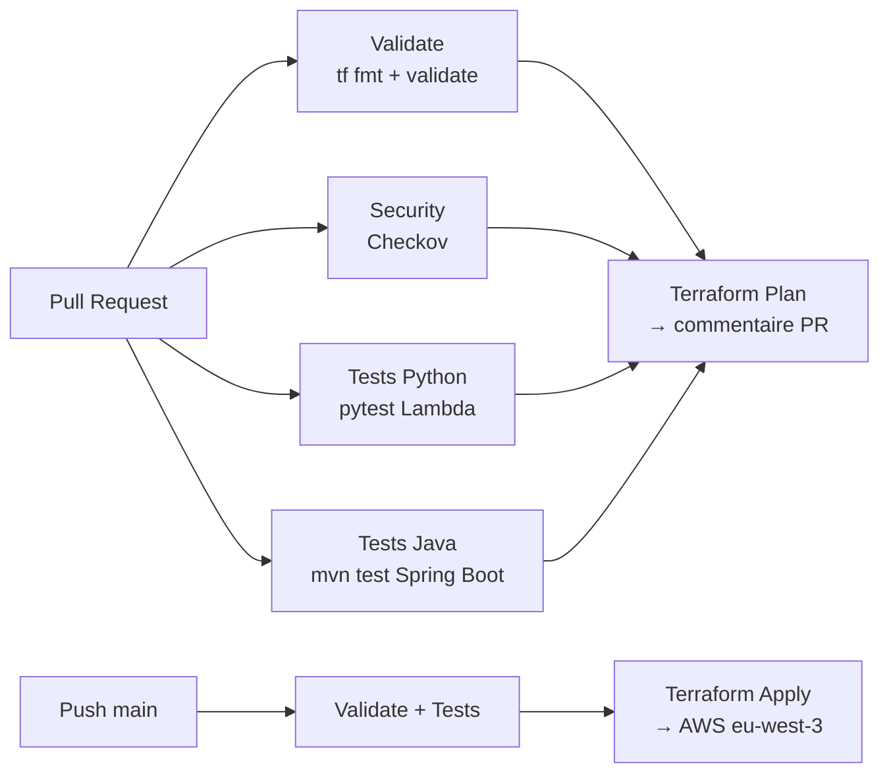

# CI/CD — GitHub Actions

Pipeline automatisé déclenché sur PR et push `main`.

---

## Stages

---

## Jobs

| Job | Déclencheur | Action |
|-----|-------------|--------|
| `terraform-validate` | PR + push | `tf fmt -check` + `tf validate` |
| `security-scan` | PR + push | Checkov — soft-fail |
| `python-tests` | PR + push | pytest — couverture ≥ 70% |
| `spring-boot-tests` | PR + push | `mvn test` — @WebMvcTest (mock DynamoDB) |
| `terraform-plan` | PR uniquement | Plan affiché en commentaire PR |
| `terraform-apply` | push `main` | Apply → AWS (env: production) |
| `drift-detection` | Hebdo (schedule) | `tf plan -detailed-exitcode` → alerte si drift |

---

## Secrets GitHub

| Secret | Usage |
|--------|-------|
| `AWS_ACCESS_KEY_ID` | Credentials Terraform |
| `AWS_SECRET_ACCESS_KEY` | Credentials Terraform |
| `AWS_REGION` | `eu-west-3` |

---

## Note important

Le pipeline Terraform ne builide pas l'image Docker.  
Pour déployer une nouvelle version de l'API Spring Boot : push manuel vers ECR ou pipeline Docker séparé.
