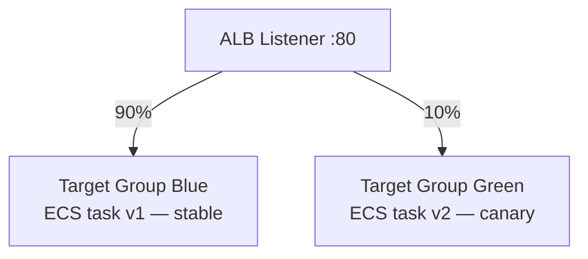

# Canary Deployment

Déploiement progressif : 10% trafic vers nouvelle version avant généralisation.

---

## Schéma ALB



---

## Procédure

```bash
# 1. Déployer v2 sur Target Group Green (ECS)
aws ecs update-service --cluster smart-assembly-cluster \
  --service supervision-api-canary --desired-count 1

# 2. Routing ALB 90/10
aws elbv2 modify-rule --rule-arn <RULE_ARN> \
  --actions '[{"Type":"forward","ForwardConfig":{"TargetGroups":[
    {"TargetGroupArn":"<TG_BLUE_ARN>","Weight":90},
    {"TargetGroupArn":"<TG_GREEN_ARN>","Weight":10}]}}]'

# 3. Surveiller erreurs 5xx sur TG Green (10 min)
# 4a. Succès → Weight: Blue=0, Green=100
# 4b. Échec  → Weight: Blue=100, Green=0 (rollback)
```

---

## Comparatif stratégies

| Stratégie | Risque | Rollback |
|-----------|--------|---------|
| Rolling (défaut ECS) | Moyen | Lent |
| **Canary ALB** | Faible — 10% exposés | < 30s |
| Blue/Green complet | Faible | Instantané |
