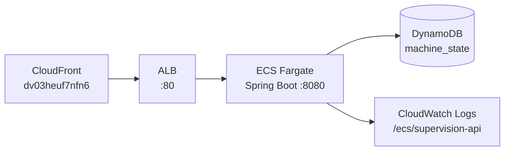

# ECS Fargate — supervision-api

API REST Spring Boot — lit DynamoDB et expose l'état des postes aux opérateurs.

---

## Schéma



---

## Config déployée

| Paramètre | Valeur |
|-----------|--------|
| Cluster | `smart-assembly-cluster` |
| Service | `supervision-api` |
| Image | ECR `supervision-api:latest` (Java 21) |
| CPU / RAM | 256 vCPU / 512 MB |
| Port | 8080 |
| Subnet | Public — `subnet-0d77f67929dd7b056` |
| Public IP | Oui (`assign_public_ip = true`) — accès ECR via IGW |
| Health check | `GET /actuator` (intervalle 30s, retries 5, startPeriod 90s) |
| desired_count | **0** (arrêté) — **1** pour une demo |

---

## Endpoints API

| Endpoint | Description |
|----------|-------------|
| `GET /api/machines` | Liste tous les postes + statut |
| `GET /api/machines/{id}` | Détail d'un poste |
| `GET /actuator/health` | Health check applicatif |

---

## Démarrer / Arrêter

```powershell
# Démarrer (avant entretien)
$td = (aws.cmd ecs describe-task-definition --task-definition supervision-api --region eu-west-3 | ConvertFrom-Json).taskDefinition.taskDefinitionArn
aws.cmd ecs update-service --cluster smart-assembly-cluster --service supervision-api --task-definition $td --desired-count 1 --region eu-west-3

# Arrêter (économie ~$12/mois)
aws.cmd ecs update-service --cluster smart-assembly-cluster --service supervision-api --desired-count 0 --region eu-west-3
```

> Démarrage Spring Boot : ~45 secondes. API disponible après ~2 minutes.
