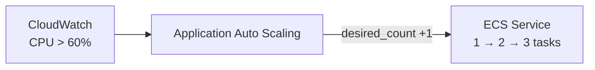

# ECS Auto Scaling

Scale automatique du service `supervision-api` selon la charge CPU.

---

## Politique déployée

| Paramètre | Valeur |
|-----------|--------|
| Métrique | `ECSServiceAverageCPUUtilization` |
| Scale out | CPU > 60% pendant 2 périodes → +1 task |
| Scale in | CPU < 30% pendant 5 périodes → -1 task |
| Min tasks | 1 |
| Max tasks | 3 |
| Cooldown | 60s scale out / 120s scale in |

---

## Schéma

---

## Note

Auto Scaling inactif quand `desired_count = 0`.  
Le scaling ne redémarre pas le service — il faut d'abord le démarrer manuellement.
