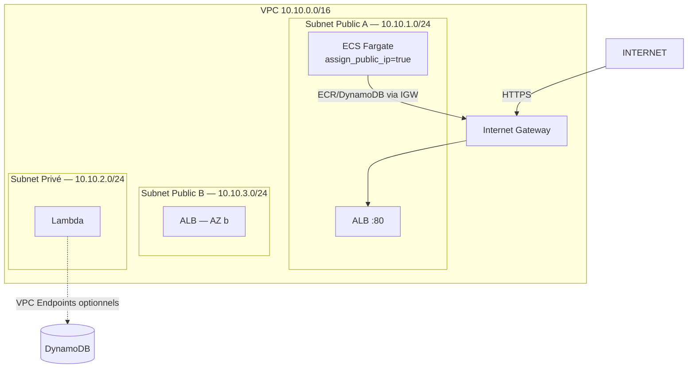

# Sécurité — Vue d'ensemble

---

## Réseau

> NAT Gateway supprimée. ECS accède à ECR et DynamoDB via IGW (subnet public).

---

## IAM — Rôles déployés

| Rôle | Service | Permissions |
|------|---------|------------|
| `ecs-task-execution-role` | ECS | Pull ECR, write CloudWatch Logs |
| `supervision-api-task-role` | ECS (app) | DynamoDB read, KMS decrypt, CloudWatch read |
| `analyze-vibration-role` | Lambda | DynamoDB write, S3 put, EventBridge publish, X-Ray |
| `cf-expiry-role` | Lambda | ECS update-service, CloudFront update |

---

## Chiffrement

| Donnée | Mécanisme |
|--------|-----------|
| DynamoDB at rest | KMS CMK `7d2fd7d2...` |
| S3 at rest | KMS CMK |
| IoT transport | TLS 1.2 (mTLS X.509) |
| API transport | HTTPS (CloudFront → TLS) |

---

## IoT — Authentification devices

- Chaque device possède un certificat X.509 signé par AWS CA
- IoT Policy : `iot:Publish` sur `assembly-line/${iot:ClientId}/metrics` uniquement
- Révocation individuelle possible sans affecter les autres devices
