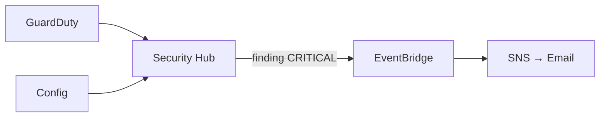

# Sécurité avancée — GuardDuty · Security Hub · Config

Détection de menaces et conformité en continu.

---

## Services déployés

| Service | Rôle | Ce qu'il surveille |
|---------|------|-------------------|
| **GuardDuty** | Détection menaces | CloudTrail, VPC Flow Logs, DNS — comportements anormaux |
| **Security Hub** | Centralisation | Agrège findings GuardDuty + Config + Inspector |
| **AWS Config** | Conformité IaC | Drift detection — ressources hors Terraform |

---

## GuardDuty — Menaces détectées

```
UnauthorizedAccess:IAMUser/MaliciousIPCaller  → IP malveillante
Recon:IAMUser/MaliciousIPCaller               → Reconnaissance
CryptoCurrency:EC2/BitcoinTool                → Mining
Policy:IAMUser/RootCredentialUsage            → Usage root account
```

→ Finding → Security Hub → EventBridge → SNS → Email

---

## AWS Config — Règles actives

| Règle | Vérification |
|-------|-------------|
| `encrypted-volumes` | EBS chiffré |
| `s3-bucket-ssl-requests-only` | S3 HTTPS only |
| `iam-root-access-key-check` | Pas de clé root active |
| `cloudtrail-enabled` | CloudTrail actif |

---

## Flux finding → alerte


