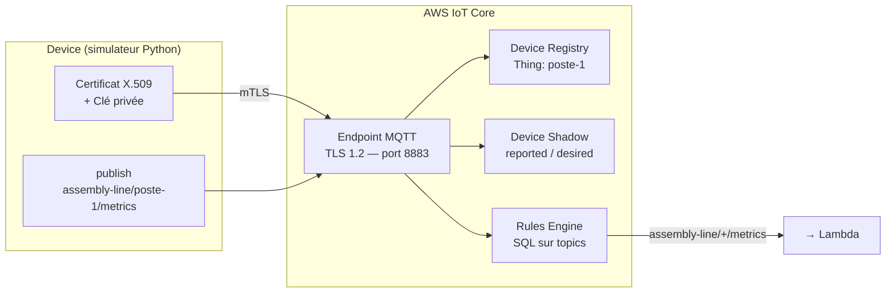
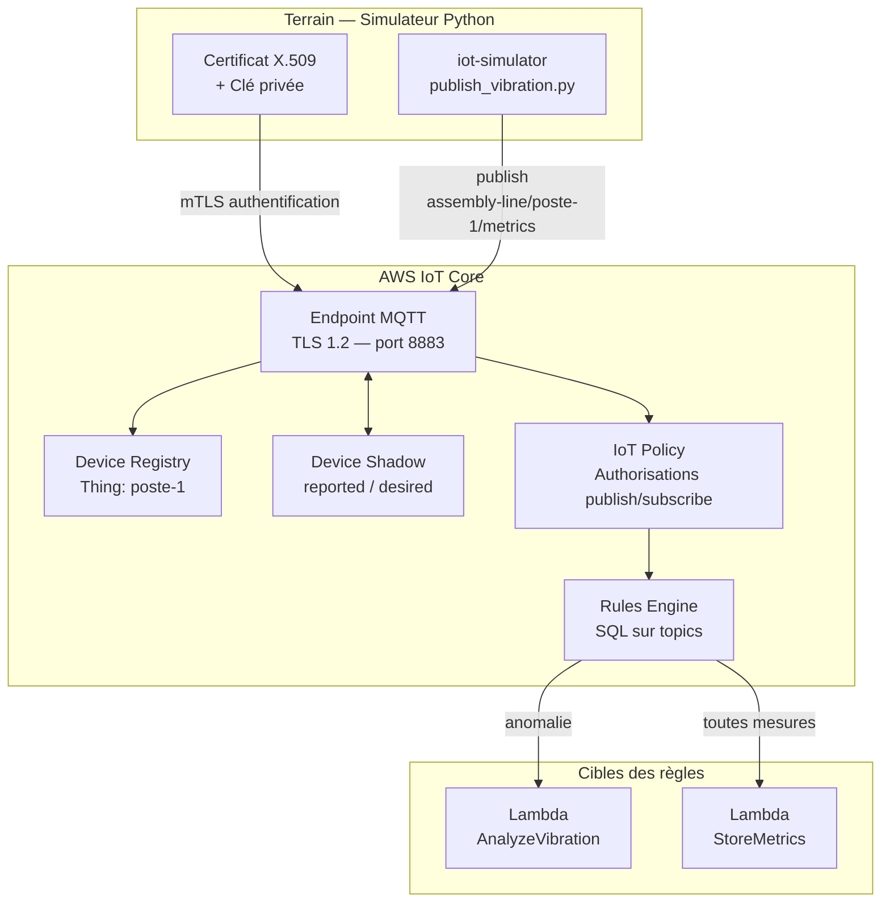
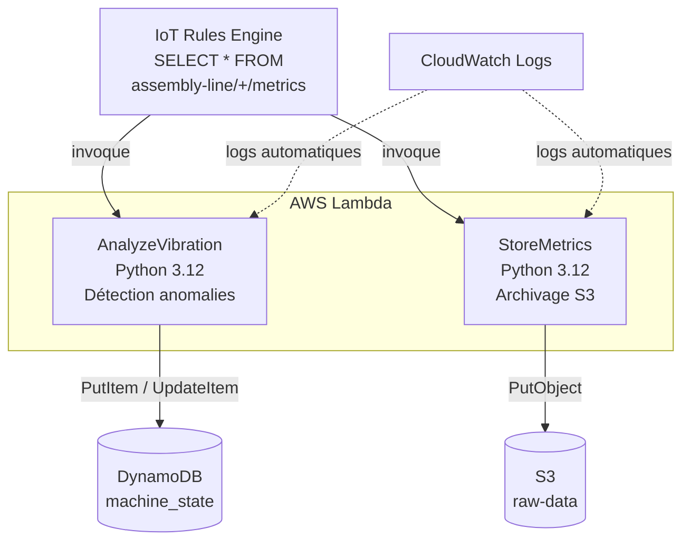
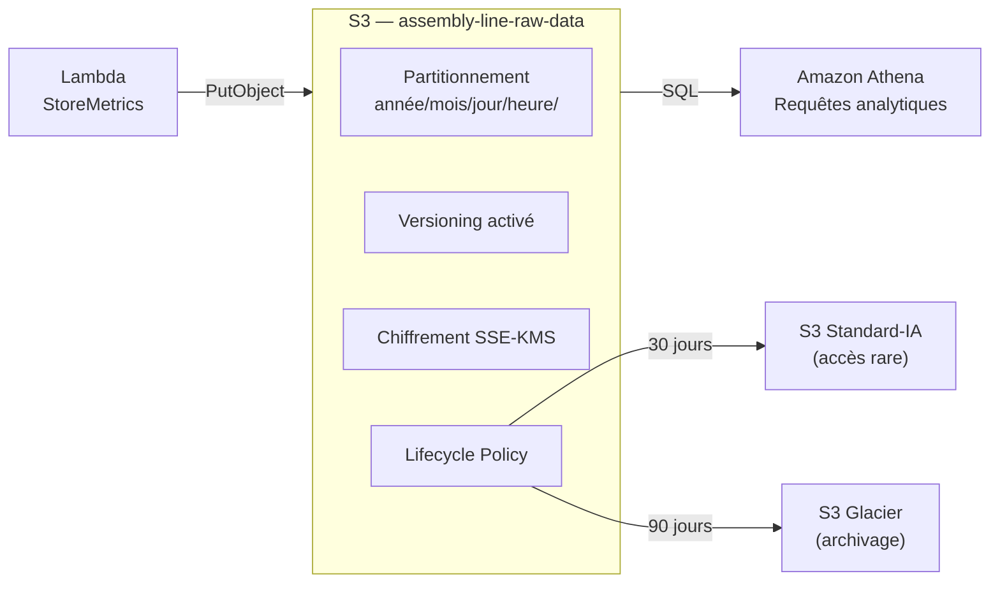
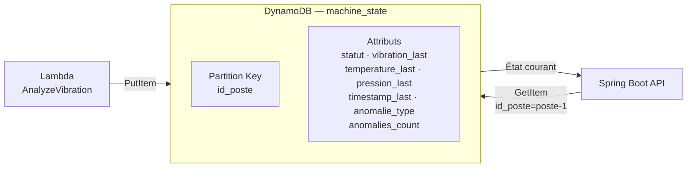
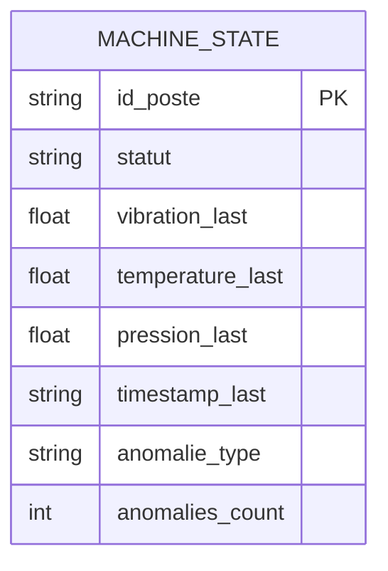
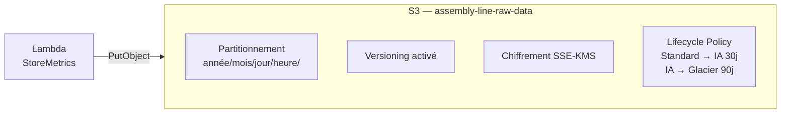
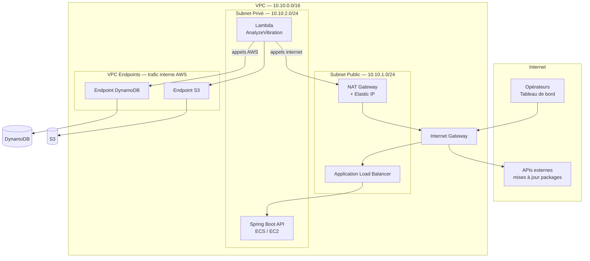
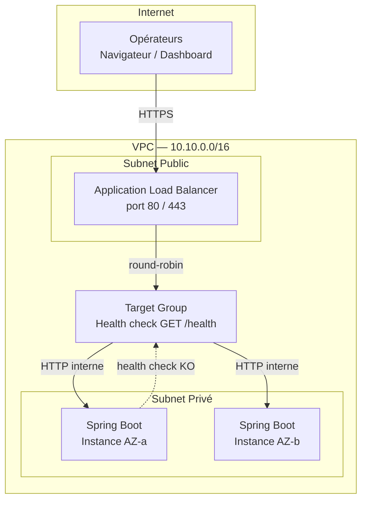

# Architecture par Composant

---

## 1. AWS IoT Core — Connectivité terrain

IoT Core est le point d'entrée de tous les messages capteurs. Il gère l'authentification des devices, le routage des messages et la synchronisation d'état.



**Concepts clés :**

- **mTLS** : chaque device s'authentifie avec son propre certificat X.509. Pas de mot de passe. Si un device est compromis, on révoque uniquement son certificat.
- **Device Shadow** : état persistant du device côté cloud. Si le device se déconnecte, l'état reste accessible. Utile pour connaître le dernier état connu d'un poste.
- **Rules Engine** : filtre SQL sur les topics. `SELECT * FROM 'assembly-line/+/metrics'` capte tous les postes en un seul pattern.

---

## 2. AWS IoT Core — Connectivité terrain

### Problème adressé

Les capteurs terrain (vibration, température, pression) doivent envoyer leurs mesures vers le cloud de façon **sécurisée, fiable et scalable**.

Le problème d'une connexion directe vers une API REST classique :
- Pas de gestion native de la déconnexion/reconnexion réseau
- Pas d'authentification device sans infrastructure PKI à maintenir
- Pas de routage intelligent des messages vers plusieurs consommateurs
- Pas de persistance de l'état device côté cloud

AWS IoT Core résout ces quatre problèmes en un seul service managé.

### Architecture



### Format du message MQTT

```json
{
  "id_poste":    "poste-1",
  "vibration":   1.24,
  "temperature": 72.3,
  "pression":    4.2,
  "timestamp":   "2026-07-08T10:00:00Z"
}
```

Publié toutes les **2 secondes** sur le topic `assembly-line/{id_poste}/metrics`.

### Décisions de conception justifiées

**mTLS — authentification mutuelle par certificat X.509**
Chaque device s'authentifie avec son propre certificat signé par une CA AWS.
Pas de mot de passe, pas de token à gérer. Si un device est compromis, on révoque uniquement son certificat — les autres ne sont pas affectés.
C'est le standard de l'industrie pour l'authentification IoT à grande échelle.

**MQTT sur TLS port 8883 — pas HTTP**
MQTT est un protocole publish/subscribe conçu pour les contraintes réseau industrielles : faible bande passante, connexions instables, heartbeat configurable.
Le QoS 1 (At Least Once) garantit la livraison même en cas de coupure réseau courte — le message est bufferisé et renvoyé à la reconnexion.

**Device Shadow — état persistant côté cloud**
Le Shadow maintient l'état du device même quand il est déconnecté.
`reported` = ce que le device a envoyé en dernier.
`desired` = ce qu'on veut que le device fasse (ex : changer un seuil d'alerte à distance).
À la reconnexion, le device reçoit automatiquement le delta entre `reported` et `desired`.

**Rules Engine SQL — routage déclaratif**
```sql
SELECT * FROM 'assembly-line/+/metrics'
```
Le `+` est un wildcard MQTT — une seule règle capture tous les postes.
Le Rules Engine évalue la règle et déclenche les Lambdas cibles sans qu'on code le routage — c'est AWS qui gère la fanout.

**IoT Policy — least privilege sur les topics**
La policy autorise uniquement :
- `iot:Connect` — se connecter à l'endpoint
- `iot:Publish` sur `assembly-line/${iot:ClientId}/metrics` — publier uniquement sur son propre topic
- `iot:Subscribe` sur son propre shadow

Un device `poste-1` ne peut pas publier sur le topic de `poste-2`. Isolation stricte par device.

### Trade-offs

**IoT Core vs Kafka/MSK pour l'ingestion**
Kafka offre une rétention configurable et un rejeu multi-consommateurs natif.
IoT Core est choisi ici car il gère nativement l'authentification device (certificats X.509), le protocole MQTT, et le Device Shadow — des fonctionnalités qu'il faudrait construire manuellement autour de Kafka.
Pour un flux pur données (pas de devices), Kinesis ou Kafka seraient plus appropriés.

**QoS 1 vs QoS 2**
QoS 2 (Exactly Once) garantit qu'un message est délivré exactement une fois — mais au coût d'un handshake à 4 temps, plus lent.
On choisit QoS 1 (At Least Once) + idempotence côté Lambda : plus simple, plus rapide, et l'idempotence compense les doublons éventuels.

---

## 2. AWS Lambda — Traitement événementiel

### Problème adressé

Les messages MQTT arrivent en continu depuis les capteurs. Deux traitements doivent s'exécuter sur chaque message, de façon indépendante et sans serveur à gérer :

- **Analyse des anomalies** : détecter si une mesure dépasse un seuil critique et mettre à jour l'état du poste dans DynamoDB
- **Archivage brut** : persister chaque message dans S3 pour l'historique et le futur ML

Une architecture à base de serveurs (EC2, ECS) demanderait de gérer le provisionnement, la scalabilité et la disponibilité.
Lambda résout le problème différemment : pas de serveur, facturation à l'invocation, scalabilité automatique jusqu'à des milliers d'exécutions parallèles.

### Architecture



### Responsabilités par fonction

**`AnalyzeVibration`**

Reçoit le payload MQTT, évalue les seuils :

| Métrique | Seuil WARN | Seuil CRITICAL |
|---|---|---|
| Vibration (m/s²) | > 1.5 | > 2.5 |
| Température (°C) | > 80 | > 95 |
| Pression (bar) | > 5.0 | > 6.5 |

Met à jour DynamoDB avec le statut (`OK` / `WARN` / `CRITICAL`), la dernière mesure, et le compteur d'anomalies.

**`StoreMetrics`**

Reçoit le même payload, calcule la clé S3 partitionnée par date, et stocke le JSON brut :
```
s3://smart-assembly-raw-data/2026/07/09/20/poste_1_1720555464.json
```

### Décisions de conception justifiées

**Single Responsibility — une fonction = une responsabilité**
`AnalyzeVibration` et `StoreMetrics` sont deux fonctions séparées, pas une seule.
Si l'archivage S3 ralentit (latence réseau), ça n'impacte pas la mise à jour de l'état DynamoDB.
Si la logique d'analyse évolue (nouveau seuil, nouveau type d'anomalie), on redéploie uniquement `AnalyzeVibration` sans toucher à l'archivage.

**Déclenchement via IoT Rules Engine — pas de polling**
L'IoT Rule déclenche les deux Lambdas en push dès qu'un message arrive.
Une architecture en polling (Lambda qui lit une queue toutes les N secondes) introduit une latence artificielle et des appels à vide.
Le push est instantané, sans coût inutile.

**Python 3.12 — pas Node.js**
La communauté Data/ML AWS est majoritairement Python.
Les librairies d'analyse de données (numpy, pandas, scipy pour le futur ML) sont natives Python.
La cohérence avec le simulateur Python simplifie la maintenance.

**Timeout à 10 secondes**
Si DynamoDB ou S3 ne répond pas dans les 10s, Lambda échoue proprement.
Pas de thread bloqué indéfiniment, pas de ressource monopolisée.
DynamoDB répond en < 10ms en condition normale — 10s est une marge de sécurité généreuse.

**Idempotence — clé `id_poste` + `timestamp`**
MQTT QoS 1 peut délivrer un message deux fois en cas de reconnexion.
`AnalyzeVibration` utilise `UpdateItem` avec `ConditionExpression` : si l'item existe déjà avec ce `timestamp`, on n'écrase pas.
`StoreMetrics` utilise un nom de clé S3 incluant le timestamp Unix — une double livraison écrase le même objet avec le même contenu.

### Trade-offs

**Lambda vs ECS (conteneur long-running)**
ECS permettrait de maintenir une connexion DynamoDB persistante (moins de latence de connexion).
Lambda est choisi car la charge est événementielle, pas continue : payer un conteneur ECS 24h/24 pour des messages toutes les 2 secondes serait inefficace économiquement.

**Cold start — impact réel**
Première invocation après inactivité : ~200-500ms de démarrage.
Impact négligeable ici : les messages arrivent toutes les 2 secondes, Lambda reste chaud en permanence.
Si le besoin évolue vers du temps réel strict (< 50ms), on activerait **Provisioned Concurrency** pour maintenir des instances pré-démarrées.

---

## 3. S3 — Data Lake

### Problème adressé

Les messages capteurs arrivent à raison de plusieurs milliers par heure. Il faut les conserver :

- pour l'**analyse historique** (détection de dérives lentes sur semaines/mois)
- pour la **conformité réglementaire** aérospatiale (traçabilité complète de chaque pièce)
- pour le **futur ML** (entraînement de modèles de maintenance prédictive)

DynamoDB stocke l'état *actuel* des postes — il n'est pas conçu pour l'historisation massive.
S3 est le bon outil : stockage objet illimité, coût très faible, et intégration native avec Athena, Glue, SageMaker.

### Architecture



### Décisions de conception justifiées

**Partitionnement par date : `année/mois/jour/heure/`**
Chaque objet S3 est stocké sous un chemin du type `2026/07/05/14/poste-1_1234567890.json`.
Sans partitionnement, Athena scanne le bucket entier pour chaque requête — coût et latence prohibitifs.
Avec ce partitionnement, une requête sur une heure de données ne lit que `1/8760ème` du bucket.

**Versioning activé**
En contexte réglementaire aérospatial, une suppression accidentelle de données de traçabilité peut entraîner un écart d'audit.
Le versioning conserve toutes les versions de chaque objet — une suppression crée un `DeleteMarker`, pas une destruction définitive.

**Chiffrement SSE-KMS**
Les données capteurs peuvent contenir des informations sur les cadences de production — sensibles commercialement.
SSE-KMS chiffre chaque objet avec une clé KMS gérée par AWS. Avantage sur SSE-S3 : audit complet des accès à la clé via CloudTrail.

**Lifecycle Policy — optimisation des coûts**
Les données fraîches (< 30 jours) sont en `Standard` — accès fréquent pour le monitoring.
Après 30 jours → `Standard-IA` (Infrequent Access) : même durabilité, 40% moins cher, accès facturé à l'utilisation.
Après 90 jours → `Glacier` : archivage long terme réglementaire, 80% moins cher que Standard, récupération en quelques heures.

**Block Public Access activé**
Aucun objet du data lake ne doit être accessible publiquement, même par erreur de configuration.
Le `Block Public Access` est un verrou au niveau bucket — il écrase toute ACL ou policy qui tenterait d'ouvrir l'accès public.

### Tables des classes de stockage

| Classe | Délai | Usage | Coût relatif |
|---|---|---|---|
| S3 Standard | 0 – 30 jours | Données fraîches, accès fréquent | $$$ |
| S3 Standard-IA | 30 – 90 jours | Historique récent, accès rare | $$ |
| S3 Glacier | > 90 jours | Archivage réglementaire | $ |

### Trade-off assumé

**S3 vs DynamoDB pour l'historique**
DynamoDB pourrait stocker l'historique avec un sort key `timestamp`, mais le coût explose à grande échelle (facturation à la lecture/écriture par item).
S3 facture au stockage et à la requête Athena uniquement — largement plus économique pour des volumes d'archives.

**Athena vs une base analytique dédiée (Redshift)**
Athena est serverless : pas de cluster à gérer, paiement à la requête.
Redshift serait justifié pour des dashboards temps réel avec requêtes complexes en continu — pas le besoin dominant ici.

---

## 4. DynamoDB — État temps réel des postes

### Problème adressé

Le système a besoin d'un accès **instantané** à l'état courant de chaque poste : statut, dernière mesure, dernière anomalie.
S3 n'est pas adapté — il est conçu pour stocker, pas pour répondre en millisecondes à une requête par clé.
RDS (PostgreSQL/MySQL) peut le faire, mais introduit un schéma rigide, un serveur à maintenir, et une latence plus variable.

DynamoDB répond à ce besoin précis : **accès par clé primaire en < 10ms**, scalabilité automatique, zéro serveur à opérer.

### Architecture



### Modèle de données



| Attribut | Type | Description |
|---|---|---|
| `id_poste` | String (PK) | Identifiant unique du poste — `poste-1`, `poste-2`... |
| `statut` | String | `OK`, `WARN`, `CRITICAL` |
| `vibration_last` | Number | Dernière mesure vibration (m/s²) |
| `temperature_last` | Number | Dernière mesure température (°C) |
| `pression_last` | Number | Dernière mesure pression (bar) |
| `timestamp_last` | String | ISO 8601 — horodatage de la dernière mesure |
| `anomalie_type` | String | Type d'anomalie détectée (`VIBRATION`, `TEMP`, `null`) |
| `anomalies_count` | Number | Compteur d'anomalies depuis la dernière remise à zéro |

### Décisions de conception justifiées

**Partition key = `id_poste` — pas de hot partition**
Une hot partition se produit quand trop de requêtes ciblent la même clé de partition simultanément.
Ici chaque poste est indépendant et sollicité à fréquence identique (une mesure toutes les 2 secondes par poste).
La charge est distribuée équitablement sur toutes les partitions — pas de risque de throttling.

**On-demand billing — pas de capacité provisionnée**
Le trafic varie selon les shifts : intense en journée, quasi nul la nuit.
En capacité provisionnée, on paie les unités réservées même quand la table est idle.
On-demand facture à la requête — optimal pour un trafic variable et imprévisible.

**Un seul item par poste — écrasement à chaque message**
DynamoDB n'est pas un historique — c'est une **vue courante**.
Chaque `PutItem` écrase l'item existant avec l'état le plus récent.
L'historique complet est dans S3, interrogeable via Athena.
Ce partage de responsabilité (état actuel → DynamoDB, historique → S3) est un pattern fondamental des architectures event-driven.

**Pas de sort key sur cette table**
Une sort key permettrait de stocker plusieurs items par poste (ex : historique dans DynamoDB).
Ce n'est pas le choix retenu — on garde DynamoDB simple et rapide, S3 pour l'historique.
Si le besoin évolue vers un historique court terme (dernières 24h) dans DynamoDB, on ajoutera une GSI avec `timestamp` comme sort key.

### Trade-offs

**DynamoDB vs RDS**
RDS permettrait des requêtes SQL complexes (jointures, agrégats multi-postes).
Mais on ne fait ici que des `GetItem` et `PutItem` par clé — RDS serait surdimensionné et plus coûteux à opérer.
Si un module de reporting réglementaire avec jointures complexes émerge, RDS redevient pertinent.

**DynamoDB vs Redis (ElastiCache)**
Redis serait encore plus rapide (< 1ms) mais volatil sans persistance configurée.
DynamoDB est durable par défaut — les données survivent à un redémarrage, Redis non (sans AOF/RDB).
Pour un système critique industriel, la durabilité prime sur la microseconde de latence gagnée.

---

## 4. S3 — Data Lake

S3 stocke tous les messages bruts pour analyse historique, audit réglementaire et futur ML.



**Décisions de conception :**

- **Partitionnement par date** : `s3://assembly-line-raw-data/2026/07/05/14/poste-1_1234567890.json`. Permet à Athena de lire uniquement la partition pertinente sans scanner tout le bucket.
- **Versioning** : protection contre les suppressions accidentelles. Obligatoire en contexte réglementaire aérospatial.
- **Lifecycle** : les données > 30 jours passent en S3-IA (moins cher, accès rare). > 90 jours en Glacier (archivage long terme). Optimisation coût sans perte de données.

---

## 5. VPC — Isolation réseau

### Problème adressé

Par défaut, les ressources AWS créées hors VPC sont exposées sur des endpoints publics.
Pour un système industriel critique, c'est inacceptable : Lambda, l'API et les bases de données
ne doivent jamais être joignables directement depuis internet.

Le VPC crée un réseau privé virtuel dans AWS — l'équivalent d'un réseau d'entreprise isolé,
sur lequel on contrôle intégralement le trafic entrant et sortant.

### Architecture



### Décisions de conception justifiées

**CIDR `10.10.0.0/16` — 65 536 adresses disponibles**
Largement surdimensionné pour ce projet, mais intentionnel : un VPC ne se redimensionne pas après création.
Prévoir de l'espace pour des subnets futurs (multi-AZ, subnets dédiés RDS, ECS) évite une migration coûteuse plus tard.

**Deux subnets distincts : public et privé**
La séparation n'est pas cosmétique — elle est structurelle.
Le subnet public (`10.10.1.0/24`) expose uniquement le Load Balancer et la NAT Gateway, seuls composants qui doivent interagir avec internet.
Le subnet privé (`10.10.2.0/24`) contient Lambda et l'API : aucune IP publique assignée, jamais joignable depuis l'extérieur.

**Internet Gateway attachée au VPC**
L'IGW est la seule porte vers internet. Sans elle, même le subnet public est isolé.
Elle est attachée au VPC, pas au subnet — c'est la route table du subnet public qui décide quels flux passent par l'IGW.

**NAT Gateway dans le subnet public**
Les ressources du subnet privé (Lambda, API) ont parfois besoin de sortir vers internet : appels vers des APIs tierces, téléchargement de packages, appels vers des services AWS non couverts par VPC Endpoint.
La NAT Gateway leur permet de sortir sans être exposées : le trafic sortant porte l'IP publique de la NAT, jamais celle de Lambda.
Depuis internet, on ne voit que la NAT — Lambda reste invisible et inaccessible en entrée.

**VPC Endpoints pour DynamoDB et S3 — pas de NAT pour les services AWS**
La NAT Gateway route le trafic vers internet à ~$0.045/GB traité.
DynamoDB et S3 sont des services AWS internes : les appeler via la NAT serait payer inutilement et allonger le chemin réseau.
Les VPC Endpoints routent ces appels **via le backbone privé AWS**, sans sortir sur internet — zéro coût de transfert, latence réduite, sécurité renforcée.

**Route table privée explicite**
Le subnet privé pourrait hériter implicitement de la main route table du VPC (comportement AWS par défaut).
C'est fonctionnellement correct, mais dangereux : toute modification accidentelle de la main route table affecterait le subnet privé sans avertissement.
On lui associe une route table dédiée avec une seule route de sortie explicite : `0.0.0.0/0 → NAT Gateway`.

### Table de routage complète

| Route table | Subnet | Routes | Rôle |
|---|---|---|---|
| `rt-public` | `10.10.1.0/24` | `0.0.0.0/0 → IGW` + `local` | Trafic internet entrant/sortant via IGW |
| `rt-private` | `10.10.2.0/24` | `0.0.0.0/0 → NAT` + `local` | Sortie internet via NAT uniquement, pas d'entrée |

**Security Groups — deny-all par défaut**
AWS applique un refus implicite sur tout trafic non explicitement autorisé.
Le security group de Lambda n'autorise que les sorties vers les ports DynamoDB (443) et S3 (443).
Aucune règle entrante — Lambda ne reçoit jamais de connexion initiée de l'extérieur.

### Tables de routage

| Route table | Associée à | Règles | Rôle |
|---|---|---|---|
| `smart-assembly-rt-public` | Subnet public `10.10.1.0/24` | `0.0.0.0/0 → IGW` + `local` | Autorise la sortie vers internet via l'IGW |
| `smart-assembly-rt-private` | Subnet privé `10.10.2.0/24` | `local` uniquement | Trafic interne VPC uniquement, aucune sortie internet |
| Main route table (défaut AWS) | Aucun subnet du projet | `local` uniquement | Non utilisée — subnets associés explicitement |

### Trade-off assumé

Ce VPC est en **single-AZ** (`eu-west-3a`) pour ce stade du projet.
En production critique, on déploierait sur **2 ou 3 AZ** avec un subnet public et privé par AZ,
et un ALB multi-AZ pour absorber la défaillance d'une zone.
Ce point est documenté comme dette technique à traiter dans la suite du projet (multi-region / haute disponibilité).

---

## 6. ALB — Load Balancer applicatif

### Problème adressé

Le backend Spring Boot (supervision des postes) doit être accessible depuis internet de façon **fiable et scalable**.
Une instance unique est un point de défaillance : si elle tombe, le tableau de bord des opérateurs devient inaccessible.

L'Application Load Balancer résout trois problèmes simultanément :
- **Haute disponibilité** : distribue le trafic sur plusieurs instances dans plusieurs zones de disponibilité
- **Health check automatique** : exclut les instances défaillantes sans intervention manuelle
- **Terminaison TLS** : gère le certificat HTTPS en façade, le backend peut rester en HTTP interne

### Architecture



### Décisions de conception justifiées

**ALB dans le subnet public — instances backend dans le subnet privé**
L'ALB est le seul composant exposé sur internet. Il porte l'IP publique et accepte les connexions entrantes.
Les instances Spring Boot n'ont pas d'IP publique — elles ne reçoivent que le trafic interne provenant de l'ALB.
Un attaquant ne peut pas atteindre directement le backend, même s'il connaît son IP interne.

**Health check sur `/health` toutes les 30 secondes**
L'ALB interroge chaque instance sur `GET /health`. Si l'instance répond `200 OK` → healthy, elle reçoit du trafic.
Si elle ne répond pas en moins de 5 secondes → unhealthy, l'ALB l'exclut du pool immédiatement, sans intervention manuelle.
Dès que l'instance répond à nouveau → l'ALB la réintègre automatiquement.

**Multi-AZ — résilience zonale**
L'ALB est déployé simultanément dans `eu-west-3a` et `eu-west-3b`.
Si une zone de disponibilité tombe (panne datacenter AWS), l'ALB continue de servir depuis l'autre zone.
Les opérateurs ne voient aucune interruption — la bascule est transparente et automatique.

**Listener port 80 → redirect 443**
Tout le trafic HTTP est redirigé vers HTTPS au niveau de l'ALB.
Le certificat TLS est terminé à l'ALB — les instances backend communiquent en HTTP interne dans le VPC privé.
Résultat : chiffrement bout-en-bout depuis le navigateur jusqu'à l'ALB, sans complexité TLS sur le backend.

### Trade-offs

**ALB vs NLB (Network Load Balancer)**
Le NLB opère en couche 4 (TCP) — plus rapide, adapté aux flux MQTT ou TCP bruts.
L'ALB opère en couche 7 (HTTP) — permet le routage par path (`/api/*` → backend A, `/admin/*` → backend B), par header, et la terminaison TLS.
Pour une API REST Spring Boot, la couche 7 est le bon niveau.

**ALB vs API Gateway**
API Gateway gère nativement l'authentification, le throttling et la transformation des requêtes, mais facture à l'appel.
L'ALB facture à l'heure (~$18/mois fixe) — plus économique pour un trafic continu élevé.
Pour un tableau de bord opérateur avec trafic constant, l'ALB est plus avantageux. Pour une API publique à trafic variable, API Gateway serait préférable.

!!! warning "Coût"
    L'ALB coûte ~$18/mois fixe + $0.008/LCU. À créer uniquement pour un lab ou la production — détruire après le lab.