# Architecture par Composant

---

## 1. AWS IoT Core — Connectivité terrain

IoT Core est le point d'entrée de tous les messages capteurs. Il gère l'authentification des devices, le routage des messages et la synchronisation d'état.

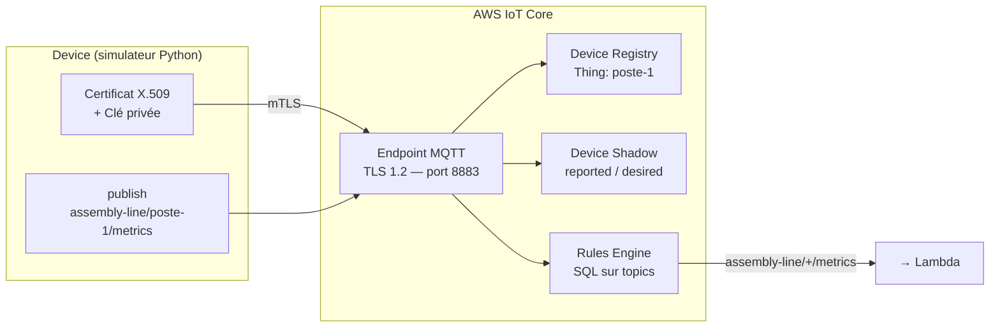
```mermaid
flowchart LR
    subgraph DEVICE["Device (simulateur Python)"]
        PUB[publish\nassembly-line/poste-1/metrics]
        CERT[Certificat X.509\n+ Clé privée]
    end

    subgraph IOTCORE["AWS IoT Core"]
        EP[Endpoint MQTT\nTLS 1.2 — port 8883]
        REG[Device Registry\nThing: poste-1]
        SHADOW_D[Device Shadow\nreported / desired]
        RULES[Rules Engine\nSQL sur topics]
    end

    CERT -->|mTLS| EP
    PUB --> EP
    EP --> REG
    EP --> SHADOW_D
    EP --> RULES
    RULES -->|assembly-line/+/metrics| LAMBDA_OUT[→ Lambda]
```

**Concepts clés :**

- **mTLS** : chaque device s'authentifie avec son propre certificat X.509. Pas de mot de passe. Si un device est compromis, on révoque uniquement son certificat.
- **Device Shadow** : état persistant du device côté cloud. Si le device se déconnecte, l'état reste accessible. Utile pour connaître le dernier état connu d'un poste.
- **Rules Engine** : filtre SQL sur les topics. `SELECT * FROM 'assembly-line/+/metrics'` capte tous les postes en un seul pattern.

---

## 2. AWS IoT Core — Connectivité terrain

### Problème adressé

Les capteurs terrain (vibration, température, pression) doivent envoyer leurs mesures vers le cloud de façon **sécurisée, fiable et scalable**.

Le problème d'une connexion directe vers une API REST classique :
- Pas de gestion native de la déconnexion/reconnexion réseau
- Pas d'authentification device sans infrastructure PKI à maintenir
- Pas de routage intelligent des messages vers plusieurs consommateurs
- Pas de persistance de l'état device côté cloud

AWS IoT Core résout ces quatre problèmes en un seul service managé.

### Architecture

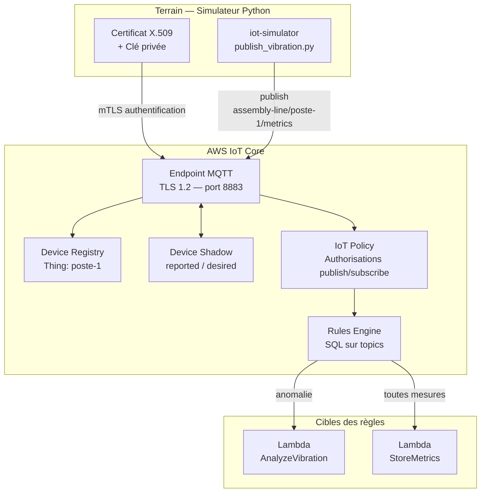
```mermaid
flowchart TD
    subgraph TERRAIN["Terrain — Simulateur Python"]
        SIM[iot-simulator
publish_vibration.py]
        CERT[Certificat X.509
+ Clé privée]
    end

    subgraph IOTCORE["AWS IoT Core"]
        EP[Endpoint MQTT
TLS 1.2 — port 8883]
        REG[Device Registry
Thing: poste-1]
        SHADOW[Device Shadow
reported / desired]
        RULES[Rules Engine
SQL sur topics]
        POL[IoT Policy
Authorisations publish/subscribe]
    end

    subgraph TARGETS["Cibles des règles"]
        L1[Lambda
AnalyzeVibration]
        L2[Lambda
StoreMetrics]
    end

    CERT -->|mTLS authentification| EP
    SIM -->|publish
assembly-line/poste-1/metrics| EP
    EP --> REG
    EP <--> SHADOW
    EP --> POL
    POL --> RULES
    RULES -->|anomalie| L1
    RULES -->|toutes mesures| L2
```

### Format du message MQTT

```json
{
  "id_poste":    "poste-1",
  "vibration":   1.24,
  "temperature": 72.3,
  "pression":    4.2,
  "timestamp":   "2026-07-08T10:00:00Z"
}
```

Publié toutes les **2 secondes** sur le topic `assembly-line/{id_poste}/metrics`.

### Décisions de conception justifiées

**mTLS — authentification mutuelle par certificat X.509**
Chaque device s'authentifie avec son propre certificat signé par une CA AWS.
Pas de mot de passe, pas de token à gérer. Si un device est compromis, on révoque uniquement son certificat — les autres ne sont pas affectés.
C'est le standard de l'industrie pour l'authentification IoT à grande échelle.

**MQTT sur TLS port 8883 — pas HTTP**
MQTT est un protocole publish/subscribe conçu pour les contraintes réseau industrielles : faible bande passante, connexions instables, heartbeat configurable.
Le QoS 1 (At Least Once) garantit la livraison même en cas de coupure réseau courte — le message est bufferisé et renvoyé à la reconnexion.

**Device Shadow — état persistant côté cloud**
Le Shadow maintient l'état du device même quand il est déconnecté.
`reported` = ce que le device a envoyé en dernier.
`desired` = ce qu'on veut que le device fasse (ex : changer un seuil d'alerte à distance).
À la reconnexion, le device reçoit automatiquement le delta entre `reported` et `desired`.

**Rules Engine SQL — routage déclaratif**
```sql
SELECT * FROM 'assembly-line/+/metrics'
```
Le `+` est un wildcard MQTT — une seule règle capture tous les postes.

---

### Device Shadow — approfondissement (Jour 29)

#### Pourquoi le Device Shadow existe

Un device IoT n'est pas toujours connecté : réseau instable en usine, maintenance, redémarrage firmware, coupure de courant. Sans Shadow, toute commande envoyée pendant la déconnexion est perdue. Le Shadow résout ce problème en jouant le rôle de **miroir persistant côté cloud**.

#### Structure du document Shadow

```json
{
  "state": {
    "reported": {
      "firmware_version": "1.2.0",
      "vibration": 2.5,
      "statut": "CRITICAL",
      "connected": true
    },
    "desired": {
      "firmware_version": "1.3.0",
      "seuil_vibration": 2.0,
      "mode": "usinage_titane"
    },
    "delta": {
      "firmware_version": "1.3.0",
      "seuil_vibration": 2.0,
      "mode": "usinage_titane"
    }
  }
}
```

| Champ | Écrit par | Signification |
|---|---|---|
| `reported` | Le device | Dernier état connu du device |
| `desired` | Le cloud / API / opérateur | Ce qu'on veut que le device fasse |
| `delta` | IoT Core (automatique) | Différence entre `desired` et `reported` — le device doit l'appliquer |

#### Flow de synchronisation

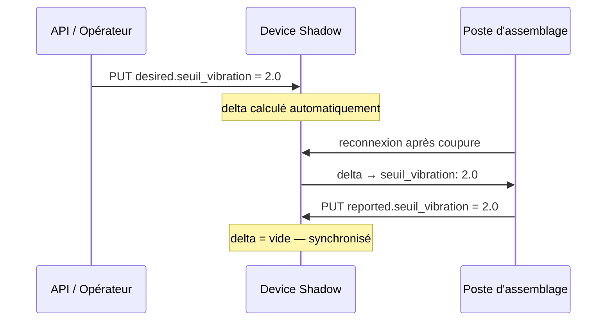
```mermaid
sequenceDiagram
    participant API as API / Opérateur
    participant SHADOW as Device Shadow
    participant DEVICE as Poste d'assemblage

    API->>SHADOW: PUT desired.seuil_vibration = 2.0
    Note over SHADOW: delta calculé automatiquement
    DEVICE->>SHADOW: reconnexion après coupure
    SHADOW->>DEVICE: delta → seuil_vibration: 2.0
    DEVICE->>SHADOW: PUT reported.seuil_vibration = 2.0
    Note over SHADOW: delta = vide — synchronisé
```

#### Cas d'usage industriels généraux

| Secteur | Usage Shadow |
|---|---|
| **Domotique** | Thermostat offline → `desired.temperature = 21°C` attendu → appliqué à la reconnexion |
| **Véhicules connectés** | `desired.limite_vitesse = 90` poussé hors réseau → appliqué en zone couverte |
| **Agriculture** | Irrigation programmée pendant la nuit (seule fenêtre satellite disponible) |
| **CNC industriel** | Paramètres d'usinage changés entre deux cycles sans arrêter la machine |
| **OTA firmware** | `desired.firmware_version = "1.3.0"` → device télécharge depuis S3, installe, confirme via `reported` |

#### OTA (Over-The-Air) via Device Shadow

Le Shadow est le mécanisme fondamental des mises à jour firmware à distance. AWS IoT Jobs s'appuie dessus avec des fonctionnalités supplémentaires (déploiement progressif, rollback automatique).

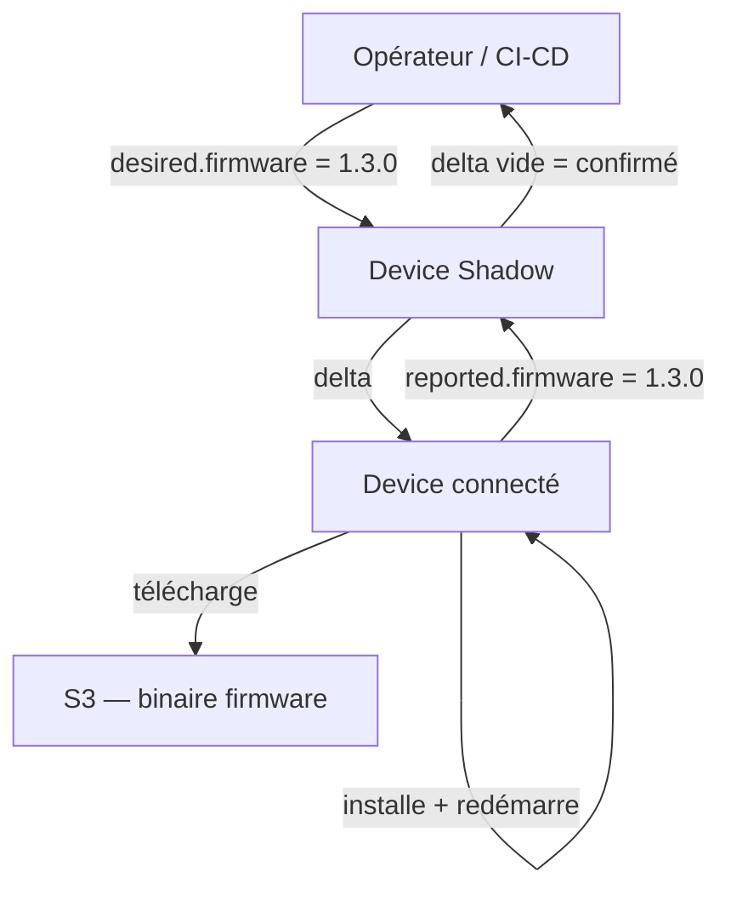
```mermaid
flowchart TD
    OPS[Opérateur / CI-CD] -->|desired.firmware = 1.3.0| SH[Device Shadow]
    SH -->|delta| DEV[Device connecté]
    DEV -->|télécharge| S3[S3 — binaire firmware]
    DEV -->|installe + redémarre| DEV
    DEV -->|reported.firmware = 1.3.0| SH
    SH -->|delta vide = confirmé| OPS
```

#### Application dans ce projet

| Besoin | Shadow `desired` | Bénéfice |
|---|---|---|
| Changer les seuils d'alerte par poste | `seuil_vibration`, `seuil_temperature` | Pas de redéploiement Lambda — config à chaud |
| Afficher l'état offline d'un poste | Lecture de `reported` | Dashboard toujours informé même si le poste est déconnecté |
| Arrêt d'urgence à distance | `arret_urgence: true` | Commande persistante — appliquée à la reconnexion même si envoyée pendant une coupure |
| OTA seuils de détection | `firmware_version`, `modele_ml_version` | Mise à jour du modèle TinyML embarqué sans intervention physique |
Le Rules Engine évalue la règle et déclenche les Lambdas cibles sans qu'on code le routage — c'est AWS qui gère la fanout.

**IoT Policy — least privilege sur les topics**
La policy autorise uniquement :
- `iot:Connect` — se connecter à l'endpoint
- `iot:Publish` sur `assembly-line/${iot:ClientId}/metrics` — publier uniquement sur son propre topic
- `iot:Subscribe` sur son propre shadow

Un device `poste-1` ne peut pas publier sur le topic de `poste-2`. Isolation stricte par device.

### Trade-offs

**IoT Core vs Kafka/MSK pour l'ingestion**
Kafka offre une rétention configurable et un rejeu multi-consommateurs natif.
IoT Core est choisi ici car il gère nativement l'authentification device (certificats X.509), le protocole MQTT, et le Device Shadow — des fonctionnalités qu'il faudrait construire manuellement autour de Kafka.
Pour un flux pur données (pas de devices), Kinesis ou Kafka seraient plus appropriés.

**QoS 1 vs QoS 2**
QoS 2 (Exactly Once) garantit qu'un message est délivré exactement une fois — mais au coût d'un handshake à 4 temps, plus lent.
On choisit QoS 1 (At Least Once) + idempotence côté Lambda : plus simple, plus rapide, et l'idempotence compense les doublons éventuels.

---

## 2. AWS Lambda — Traitement événementiel

### Vue d'ensemble des fonctions

Le système comporte trois fonctions Lambda avec des responsabilités distinctes :

| Fonction | Déclencheur | Sortie | Rôle |
|---|---|---|---|
| `AnalyzeVibration` | IoT Rules Engine | DynamoDB | État temps réel du poste |
| `StoreMetrics` | IoT Rules Engine | S3 | Archivage brut data lake |
| `DetectAnomaly` | IoT Rules Engine | EventBridge | Détection avancée → moteur de décision |

`AnalyzeVibration` et `StoreMetrics` sont des fonctions de **persistence** (écriture directe).
`DetectAnomaly` est une fonction de **décision** — elle publie sur EventBridge et laisse les consommateurs réagir indépendamment.

### Problème adressé

Les messages MQTT arrivent en continu depuis les capteurs. Deux traitements doivent s'exécuter sur chaque message, de façon indépendante et sans serveur à gérer :

- **Analyse des anomalies** : détecter si une mesure dépasse un seuil critique et mettre à jour l'état du poste dans DynamoDB
- **Archivage brut** : persister chaque message dans S3 pour l'historique et le futur ML

Une architecture à base de serveurs (EC2, ECS) demanderait de gérer le provisionnement, la scalabilité et la disponibilité.
Lambda résout le problème différemment : pas de serveur, facturation à l'invocation, scalabilité automatique jusqu'à des milliers d'exécutions parallèles.

### Architecture

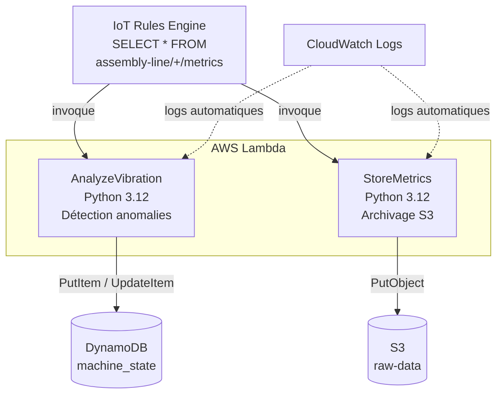
```mermaid
flowchart TD
    RULE[IoT Rules Engine
SELECT * FROM
assembly-line/+/metrics] -->|invoque| L1
    RULE -->|invoque| L2

    subgraph LAMBDA["AWS Lambda"]
        L1[AnalyzeVibration
Python 3.12
Détection anomalies]
        L2[StoreMetrics
Python 3.12
Archivage S3]
    end

    L1 -->|PutItem / UpdateItem| DDB[(DynamoDB
machine_state)]
    L2 -->|PutObject| S3[(S3
raw-data)]

    CW[CloudWatch Logs] -.->|logs automatiques| L1
    CW -.->|logs automatiques| L2
```

### Responsabilités par fonction

**`AnalyzeVibration`**

Reçoit le payload MQTT, évalue les seuils :

| Métrique | Seuil WARN | Seuil CRITICAL |
|---|---|---|
| Vibration (m/s²) | > 1.5 | > 2.5 |
| Température (°C) | > 80 | > 95 |
| Pression (bar) | > 5.0 | > 6.5 |

Met à jour DynamoDB avec le statut (`OK` / `WARN` / `CRITICAL`), la dernière mesure, et le compteur d'anomalies.

**`StoreMetrics`**

Reçoit le même payload, calcule la clé S3 partitionnée par date, et stocke le JSON brut :
```
s3://smart-assembly-raw-data/2026/07/09/20/poste_1_1720555464.json
```

### Décisions de conception justifiées

**Single Responsibility — une fonction = une responsabilité**
`AnalyzeVibration` et `StoreMetrics` sont deux fonctions séparées, pas une seule.
Si l'archivage S3 ralentit (latence réseau), ça n'impacte pas la mise à jour de l'état DynamoDB.
Si la logique d'analyse évolue (nouveau seuil, nouveau type d'anomalie), on redéploie uniquement `AnalyzeVibration` sans toucher à l'archivage.

**Déclenchement via IoT Rules Engine — pas de polling**
L'IoT Rule déclenche les deux Lambdas en push dès qu'un message arrive.
Une architecture en polling (Lambda qui lit une queue toutes les N secondes) introduit une latence artificielle et des appels à vide.
Le push est instantané, sans coût inutile.

**Python 3.12 — pas Node.js**
La communauté Data/ML AWS est majoritairement Python.
Les librairies d'analyse de données (numpy, pandas, scipy pour le futur ML) sont natives Python.
La cohérence avec le simulateur Python simplifie la maintenance.

**Timeout à 10 secondes**
Si DynamoDB ou S3 ne répond pas dans les 10s, Lambda échoue proprement.
Pas de thread bloqué indéfiniment, pas de ressource monopolisée.
DynamoDB répond en < 10ms en condition normale — 10s est une marge de sécurité généreuse.

**Idempotence — clé `id_poste` + `timestamp`**
MQTT QoS 1 peut délivrer un message deux fois en cas de reconnexion.
`AnalyzeVibration` utilise `UpdateItem` avec `ConditionExpression` : si l'item existe déjà avec ce `timestamp`, on n'écrase pas.
`StoreMetrics` utilise un nom de clé S3 incluant le timestamp Unix — une double livraison écrase le même objet avec le même contenu.

### Trade-offs

**Lambda vs ECS (conteneur long-running)**
ECS permettrait de maintenir une connexion DynamoDB persistante (moins de latence de connexion).
Lambda est choisi car la charge est événementielle, pas continue : payer un conteneur ECS 24h/24 pour des messages toutes les 2 secondes serait inefficace économiquement.

**Cold start — impact réel**
Première invocation après inactivité : ~200-500ms de démarrage.
Impact négligeable ici : les messages arrivent toutes les 2 secondes, Lambda reste chaud en permanence.
Si le besoin évolue vers du temps réel strict (< 50ms), on activerait **Provisioned Concurrency** pour maintenir des instances pré-démarrées.

---

### DetectAnomaly — Règles métier avancées

#### Problème adressé

`AnalyzeVibration` détecte les anomalies par seuil simple (une métrique dépasse un threshold).
Mais les pannes industrielles réelles sont souvent **multi-dimensionnelles** : une vibration modérée combinée à une température élevée est plus critique que chacune prise séparément.

`DetectAnomaly` introduit des règles métier combinées et publie le résultat sur **EventBridge** plutôt que d'écrire directement dans DynamoDB — découplage total avec les consommateurs.

#### Architecture

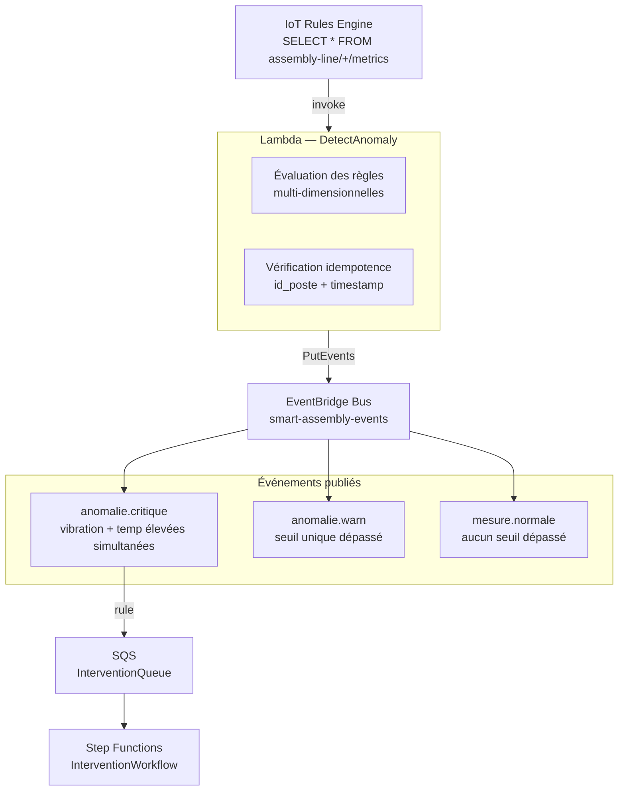
```mermaid
flowchart TD
    RULE[IoT Rules Engine
SELECT * FROM assembly-line/+/metrics] -->|invoke| DA

    subgraph DA["Lambda — DetectAnomaly"]
        RULES_ENGINE[Évaluation des règles\nmulti-dimensionnelles]
        IDEM[Vérification idempotence\nid_poste + timestamp]
    end

    DA -->|PutEvents| EB[EventBridge Bus\nsmart-assembly-events]

    subgraph EVENTS["Événements publiés"]
        E1[anomalie.critique\nvibration + temp élevées simultanées]
        E2[anomalie.warn\nseuil unique dépassé]
        E3[mesure.normale\naucun seuil dépassé]
    end

    EB --> E1
    EB --> E2
    EB --> E3

    E1 -->|rule| SQS[SQS\nInterventionQueue]
    SQS --> SF[Step Functions\nInterventionWorkflow]
```

#### Règles métier combinées

| Règle | Condition | Sévérité | Action |
|---|---|---|---|
| Surchauffe critique | temp > 95°C | CRITICAL | Alerte immédiate + arrêt poste |
| Vibration critique | vib > 2.5 m/s² | CRITICAL | Alerte immédiate |
| Combo dangereux | vib > 1.5 ET temp > 80°C | CRITICAL | Risque de défaillance accélérée |
| Seuil WARN simple | vib > 1.5 OU temp > 80°C OU pres > 5.0 | WARN | Surveillance renforcée |
| Normal | aucun seuil dépassé | OK | Aucune action |

Le **combo dangereux** est la valeur ajoutée de `DetectAnomaly` par rapport à `AnalyzeVibration` : deux métriques en WARN simultanément peuvent indiquer un risque CRITICAL même si aucune n'atteint son seuil CRITICAL individuel.

#### Décisions de conception justifiées

**Sortie EventBridge — pas DynamoDB directement**
`AnalyzeVibration` écrit directement dans DynamoDB (couplage direct).
`DetectAnomaly` publie sur EventBridge (découplage total).
Si on ajoute un nouveau consommateur (SNS, Slack, PagerDuty), on ajoute une règle EventBridge — sans toucher à `DetectAnomaly`.
C'est le pattern **Open/Closed** : ouvert à l'extension, fermé à la modification.

**Idempotence par `id_poste` + `timestamp`**
IoT MQTT QoS 1 peut livrer le même message deux fois.
`DetectAnomaly` vérifie si l'événement a déjà été traité avant de publier sur EventBridge.
Un double-publish déclencherait deux workflows d'intervention pour la même mesure — inacceptable en contexte industriel.

**Logs structurés JSON**
Chaque exécution produit un log JSON avec `id_poste`, `statut`, `règle_déclenchée`, `timestamp`.
CloudWatch Logs Insights peut alors faire des requêtes : "combien d'anomalies CRITICAL sur poste_1 cette semaine ?"

---

## 3. S3 — Data Lake

### Problème adressé

Les messages capteurs arrivent à raison de plusieurs milliers par heure. Il faut les conserver :

- pour l'**analyse historique** (détection de dérives lentes sur semaines/mois)
- pour la **conformité réglementaire** aérospatiale (traçabilité complète de chaque pièce)
- pour le **futur ML** (entraînement de modèles de maintenance prédictive)

DynamoDB stocke l'état *actuel* des postes — il n'est pas conçu pour l'historisation massive.
S3 est le bon outil : stockage objet illimité, coût très faible, et intégration native avec Athena, Glue, SageMaker.

### Architecture

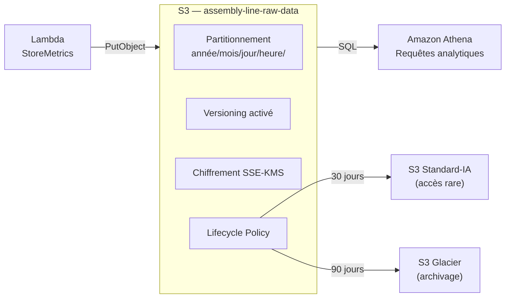
```mermaid
flowchart LR
    LAMBDA[Lambda
StoreMetrics] -->|PutObject| BUCKET

    subgraph BUCKET["S3 — assembly-line-raw-data"]
        direction TB
        PART["Partitionnement
année/mois/jour/heure/"]
        VERS["Versioning activé"]
        KMS["Chiffrement SSE-KMS"]
        LC["Lifecycle Policy"]
    end

    LC -->|"30 jours"| IA["S3 Standard-IA
(accès rare)"]
    LC -->|"90 jours"| GLACIER["S3 Glacier
(archivage)"]

    BUCKET -->|SQL| ATHENA[Amazon Athena
Requêtes analytiques]
```

### Décisions de conception justifiées

**Partitionnement par date : `année/mois/jour/heure/`**
Chaque objet S3 est stocké sous un chemin du type `2026/07/05/14/poste-1_1234567890.json`.
Sans partitionnement, Athena scanne le bucket entier pour chaque requête — coût et latence prohibitifs.
Avec ce partitionnement, une requête sur une heure de données ne lit que `1/8760ème` du bucket.

**Versioning activé**
En contexte réglementaire aérospatial, une suppression accidentelle de données de traçabilité peut entraîner un écart d'audit.
Le versioning conserve toutes les versions de chaque objet — une suppression crée un `DeleteMarker`, pas une destruction définitive.

**Chiffrement SSE-KMS**
Les données capteurs peuvent contenir des informations sur les cadences de production — sensibles commercialement.
SSE-KMS chiffre chaque objet avec une clé KMS gérée par AWS. Avantage sur SSE-S3 : audit complet des accès à la clé via CloudTrail.

**Lifecycle Policy — optimisation des coûts**
Les données fraîches (< 30 jours) sont en `Standard` — accès fréquent pour le monitoring.
Après 30 jours → `Standard-IA` (Infrequent Access) : même durabilité, 40% moins cher, accès facturé à l'utilisation.
Après 90 jours → `Glacier` : archivage long terme réglementaire, 80% moins cher que Standard, récupération en quelques heures.

**Block Public Access activé**
Aucun objet du data lake ne doit être accessible publiquement, même par erreur de configuration.
Le `Block Public Access` est un verrou au niveau bucket — il écrase toute ACL ou policy qui tenterait d'ouvrir l'accès public.

### Tables des classes de stockage

| Classe | Délai | Usage | Coût relatif |
|-|---|---|---|---|
| S3 Standard | 0 – 30 jours | Données fraîches, accès fréquent | $$$ |
| S3 Standard-IA | 30 – 90 jours | Historique récent, accès rare | $$ |
| S3 Glacier | > 90 jours | Archivage réglementaire | $ |

### Trade-off assumé

**S3 vs DynamoDB pour l'historique**
DynamoDB pourrait stocker l'historique avec un sort key `timestamp`, mais le coût explose à grande échelle (facturation à la lecture/écriture par item).
S3 facture au stockage et à la requête Athena uniquement — largement plus économique pour des volumes d'archives.

**Athena vs une base analytique dédiée (Redshift)**
Athena est serverless : pas de cluster à gérer, paiement à la requête.
Redshift serait justifié pour des dashboards temps réel avec requêtes complexes en continu — pas le besoin dominant ici.

---

## 5. AWS IoT Greengrass v2 — Edge Computing (Jour 30)

### Problème adressé

Sans Greengrass, chaque mesure capteur fait un aller-retour cloud :

```
Capteur → IoT Core (cloud) → Lambda → DynamoDB
```

À 1 mesure/2s × 3 postes = **1 440 messages/heure** remontent vers le cloud, y compris les mesures `OK` qui n'ont aucune valeur pour le monitoring.

Trois problèmes concrets :
- **Latence** : 50–200 ms aller-retour cloud pour chaque décision. Insuffisant pour un arrêt d'urgence machine.
- **Coût** : facturation IoT Core à chaque message, même les mesures normales.
- **Résilience** : si le réseau tombe, plus aucune décision locale n'est possible.

Greengrass résout les trois en déplaçant l'intelligence au plus près du capteur.

### Architecture Greengrass — Docker sur PC local

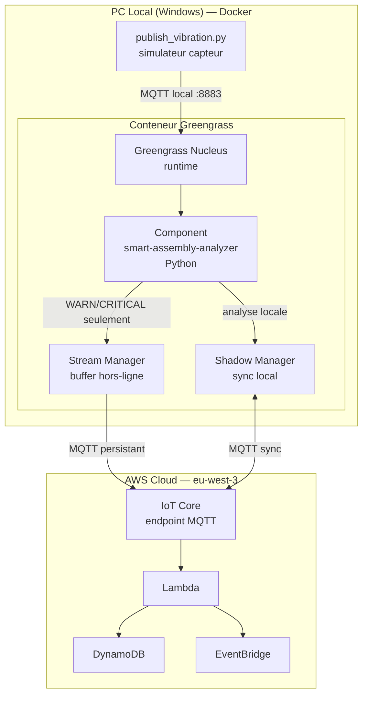
```mermaid
flowchart TD
    subgraph PC["PC Local (Windows) — Docker"]
        subgraph CONTAINER["Conteneur Greengrass"]
            GG[Greengrass Nucleus\nruntime]
            COMP[Component\nsmart-assembly-analyzer\nPython]
            SHADOW_LOCAL[Shadow Manager\nsync local]
            STREAM[Stream Manager\nbuffer hors-ligne]
        end
        SIM[publish_vibration.py\nsimulateur capteur]
        SIM -->|MQTT local :8883| GG
        GG --> COMP
        COMP -->|analyse locale| SHADOW_LOCAL
        COMP -->|WARN/CRITICAL seulement| STREAM
    end

    subgraph CLOUD["AWS Cloud — eu-west-3"]
        IOT[IoT Core\nendpoint MQTT]
        LAMBDA[Lambda]
        DDB[DynamoDB]
        EB[EventBridge]
    end

    STREAM -->|MQTT persistant| IOT
    SHADOW_LOCAL <-->|MQTT sync| IOT
    IOT --> LAMBDA
    LAMBDA --> DDB
    LAMBDA --> EB
```

> **Note région** : le service Greengrass (déploiements cloud) n'est pas disponible en `eu-west-3`.
> Dans ce lab, on utilise le déploiement **local** via `greengrass-cli` — aucune dépendance au service Greengrass cloud.
> L'endpoint IoT Core reste `eu-west-3` pour la connexion MQTT des données.

### Pourquoi MQTT et non HTTPS pour les données ?

Greengrass Nucleus maintient une **connexion MQTT persistante** vers IoT Core. Quand un component publie un message :

```
Component Python
    → publie sur topic local (Greengrass broker interne)
    → Nucleus forward via connexion MQTT persistante
    → IoT Core eu-west-3
    → Rules Engine → Lambda
```

HTTPS n'intervient que pour le téléchargement des artefacts S3 lors de l'installation d'un component — jamais pour les données temps réel. MQTT est maintenu en permanence, ce qui évite l'overhead de l'établissement de connexion à chaque message (économie de 30–50 ms par rapport à HTTPS).

### Les 4 concepts fondamentaux

**1. Core Device**
L'appareil qui exécute Greengrass Nucleus. Dans ce lab : un conteneur Docker sur le PC local. S'enregistre dans IoT Core comme un Thing de type `AWS::GreengrassV2::CoreDevice`.

**2. Component**
Unité de déploiement. Peut être un script Python, un conteneur Docker, ou un composant AWS prédéfini. Chaque component a un cycle de vie : `install → run → shutdown`.

**3. Recipe**
Fichier YAML qui décrit un component : version, dépendances, artefacts, commandes de cycle de vie.

**4. Deployment**
Dans ce lab : déploiement **local** via `greengrass-cli` (pas de service Greengrass cloud requis). En production sur une région supportée : déploiement cloud vers un ou plusieurs Core Devices.

### Greengrass vs IoT Core pur

| Critère | IoT Core seul | IoT Core + Greengrass |
|---|---|---|
| Latence décision | 50–200 ms (aller-retour cloud) | < 5 ms (local) |
| Dépendance réseau | Totale | Optionnelle |
| Coût bande passante | Élevé (toutes les mesures) | Faible (WARN/CRITICAL seulement) |
| Résilience hors-ligne | Aucune | Stream Manager bufferise |
| ML inference au edge | Non | Oui (TinyML, ONNX) |
| Protocole cloud | MQTT | MQTT (connexion persistante Nucleus) |

### Application au projet

**Flux actuel (sans Greengrass) :**
```
Capteur → IoT Core → Lambda → DynamoDB/EventBridge
1 440 messages/heure vers le cloud (OK + WARN + CRITICAL)
```

**Flux cible (avec Greengrass sur Docker local) :**
```
Capteur → Greengrass Component (analyse locale)
              ├── OK → ignoré localement (≈80% des messages)
              └── WARN/CRITICAL → IoT Core (MQTT) → Lambda → DynamoDB/EventBridge
```

Réduction estimée : **80–90% du trafic cloud** supprimé. Décisions locales en < 5 ms.

**Components déployés :**

| Component | Source | Rôle |
|---|---|---|
| `smart-assembly-analyzer` | Custom Python | Analyse locale, filtre les OK |
| `aws.greengrass.ShadowManager` | AWS managed | Sync Device Shadow local ↔ cloud |
| `aws.greengrass.StreamManager` | AWS managed | Buffer WARN/CRITICAL si réseau indisponible |

### Infrastructure lab (Jour 30)

| Ressource | Détail |
|---|---|
| Edge device | Docker sur PC Windows (pas EC2 — edge réaliste, zéro coût) |
| IoT Thing | `greengrass-core-poste` enregistré dans IoT Core eu-west-3 |
| Certificat | X.509 généré par IoT Core, monté dans le conteneur Docker |
| Déploiement | Local via `greengrass-cli` (Greengrass cloud non dispo eu-west-3) |
| IAM Role | Rôle EC2/device avec policies `AWSGreengrassV2TokenExchangeRoleAccess` |

### Recipe du component `smart-assembly-analyzer`

```yaml
RecipeFormatVersion: "2020-01-25"
ComponentName: smart-assembly-analyzer
ComponentVersion: "1.0.0"
ComponentDescription: "Analyse locale des métriques — filtre les OK, publie WARN/CRITICAL vers IoT Core"

ComponentDependencies:
  aws.greengrass.ShadowManager:
    VersionRequirement: ">=2.0.0"
    DependencyType: SOFT

Manifests:
  - Platform:
      os: linux
    Lifecycle:
      Install:
        Script: pip3 install awsiotsdk --break-system-packages
      Run:
        Script: python3 {artifacts:path}/analyzer.py
    Artifacts:
      - URI: s3://smart-assembly-artifacts/components/analyzer.py
```

### Flux OTA via Greengrass

Greengrass gère nativement les mises à jour de logiciels embarqués :

```
1. Ingénieur pousse nouvelle version du component sur S3
2. Crée un nouveau Deployment (local ou cloud selon région)
3. Greengrass Nucleus télécharge via HTTPS (artefacts S3 uniquement)
4. Installe et démarre le nouveau component
5. Rollback automatique si le component ne démarre pas
```

Avantage vs OTA via Device Shadow seul : Greengrass gère le téléchargement, la validation de checksum et le rollback sans code custom.


### Trade-offs

**DynamoDB vs RDS**
RDS permettrait des requêtes SQL complexes (jointures, agrégats multi-postes).
Mais on ne fait ici que des `GetItem` et `PutItem` par clé — RDS serait surdimensionné et plus coûteux à opérer.
Si un module de reporting réglementaire avec jointures complexes émerge, RDS redevient pertinent.

**DynamoDB vs Redis (ElastiCache)**
Redis serait encore plus rapide (< 1ms) mais volatil sans persistance configurée.
DynamoDB est durable par défaut — les données survivent à un redémarrage, Redis non (sans AOF/RDB).
Pour un système critique industriel, la durabilité prime sur la microseconde de latence gagnée.

**GSI `statut-index` vs Scan**
Un `Scan` avec `FilterExpression = statut = EN_INTERVENTION` est plus simple à implémenter mais lit toute la table — coût proportionnel au nombre total de postes.
Le GSI lit uniquement les items correspondants — coût proportionnel au résultat.
À 1 000 postes dont 10 `EN_INTERVENTION` : le GSI lit 10 items, le Scan lit 1 000. Facteur 100.

---

### Throttling — Jour 23

#### Expérience réalisée

Table passée temporairement en mode **provisionné** avec `write_capacity = 1` WCU/s.
Deux simulateurs lancés en parallèle → ~1 écriture/seconde chacun → dépassement immédiat de la capacité.

**Résultat observé via CloudWatch `WriteThrottleEvents`** :
- 83 écritures throttlées en moins de 2 minutes
- Le SDK AWS a retry automatiquement (backoff exponentiel) → le simulateur n'a pas planté
- Chaque retry ajoute de la latence invisible côté application

Table remise en **on-demand** (`PAY_PER_REQUEST`) après le lab.

#### Stratégie de retry — comportement du SDK AWS

Quand DynamoDB répond `ProvisionedThroughputExceededException`, le SDK AWS Python (boto3) applique automatiquement :

```
Tentative 1 → échec → attente 50ms
Tentative 2 → échec → attente 100ms
Tentative 3 → échec → attente 200ms (+ jitter aléatoire)
...jusqu'à max_attempts (défaut : 3)
```

Au-delà des retries → exception remontée à l'application.

#### Stratégie retenue en production

| Situation | Solution |
|---|---|
| Trafic stable et prévisible | Provisionné + auto-scaling (min/max WCU configurés) |
| Trafic variable / imprévisible | On-demand (notre choix) |
| Hot partition avérée | Write sharding sur la partition key |
| Throttling persistant malgré auto-scaling | Revoir le modèle de données (partition key inadaptée) |

#### Auto-scaling Terraform (référence future)

```hcl
resource "aws_appautoscaling_target" "dynamodb_write" {
  max_capacity       = 100
  min_capacity       = 5
  resource_id        = "table/machine_state"
  scalable_dimension = "dynamodb:table:WriteCapacityUnits"
  service_namespace  = "dynamodb"
}

resource "aws_appautoscaling_policy" "dynamodb_write" {
  name               = "smart-assembly-dynamo-write-scaling"
  policy_type        = "TargetTrackingScaling"
  resource_id        = aws_appautoscaling_target.dynamodb_write.resource_id
  scalable_dimension = aws_appautoscaling_target.dynamodb_write.scalable_dimension
  service_namespace  = aws_appautoscaling_target.dynamodb_write.service_namespace

  target_tracking_scaling_policy_configuration {
    predefined_metric_specification {
      predefined_metric_type = "DynamoDBWriteCapacityUtilization"
    }
    target_value = 70.0  # Scale quand utilisation > 70% de la capacité
  }
}
```

Non déployé ici (on-demand suffit à ce volume), documenté pour la montée en charge.

---

## 4. Kinesis Data Streams — Flux haute fréquence

### Problème adressé

Le pipeline actuel invoque Lambda **à chaque message capteur** individuellement.
À 1 poste → 1 invocation/2s — acceptable.
À 1 000 postes → 500 invocations Lambda/seconde — cold starts fréquents, coût élevé, limite de concurrence atteinte.

Kinesis résout ce problème en jouant le rôle de **tampon de flux continu** : les capteurs publient en continu, Lambda consomme par **batch** (100 messages en une invocation au lieu de 100 invocations séparées).

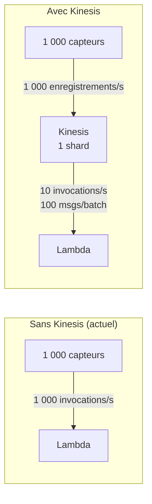
```mermaid
flowchart LR
    subgraph AVANT["Sans Kinesis (actuel)"]
        C1[1 000 capteurs] -->|"1 000 invocations/s"| L1[Lambda]
    end

    subgraph APRES["Avec Kinesis"]
        C2[1 000 capteurs] -->|"1 000 enregistrements/s"| K[Kinesis\n1 shard]
        K -->|"10 invocations/s\n100 msgs/batch"| L2[Lambda]
    end
```

### Architecture

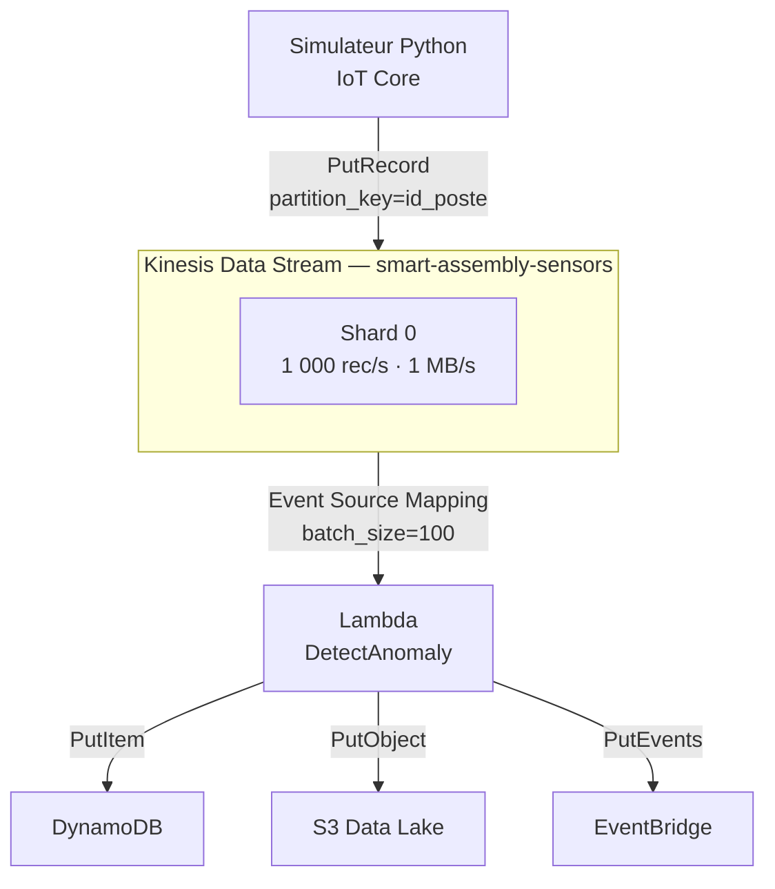
```mermaid
flowchart TD
    SIM[Simulateur Python\nIoT Core] -->|PutRecord\npartition_key=id_poste| KDS

    subgraph KDS["Kinesis Data Stream — smart-assembly-sensors"]
        SH0["Shard 0\n1 000 rec/s · 1 MB/s"]
    end

    KDS -->|"Event Source Mapping\nbatch_size=100"| LAMBDA[Lambda\nDetectAnomaly]
    LAMBDA -->|PutItem| DDB[DynamoDB]
    LAMBDA -->|PutObject| S3[S3 Data Lake]
    LAMBDA -->|PutEvents| EB[EventBridge]
```

### Concepts clés

**Shard** = unité de capacité du stream.

| Limite | Par shard |
|---|---|
| Écriture | 1 000 enregistrements/s ou 1 MB/s |
| Lecture | 2 000 enregistrements/s ou 2 MB/s |
| Consommateurs simultanés | 5 (standard) / illimité (Enhanced Fan-Out) |

**Calcul du nombre de shards :**
```
shard_count = max(
  ceil(records_per_second / 1000),
  ceil(mb_per_second / 1)
)
```

Pour 1 000 capteurs à 1 mesure/s et ~200 bytes/message → **1 shard suffit**.
Pour 5 000 capteurs → 5 shards.

**Partition key** = détermine sur quel shard va l'enregistrement (hash Murmur3).
- Bonne : `id_poste` → distribution équitable
- Mauvaise : `"fixed"` → tout sur le même shard → hot shard

**Rétention** = durée pendant laquelle les données restent dans Kinesis (24h à 365 jours).
Contrairement à SQS, **le message n'est pas supprimé après lecture** — plusieurs consommateurs peuvent relire le même flux indépendamment.

**Iterator types** :

| Type | Comportement |
|---|---|
| `TRIM_HORIZON` | Relire depuis le tout début du flux |
| `LATEST` | Ne lire que les nouveaux messages |
| `AT_TIMESTAMP` | Relire depuis un timestamp précis (replay) |

### Décisions de conception justifiées

**1 shard — dimensionnement actuel**
Volume actuel : 3 postes simulés × 1 mesure/2s = 1,5 enregistrements/seconde.
Largement en dessous du 1 000 rec/s d'un shard. Le shard est choisi pour la structure, pas le volume.
En production à 1 000 postes : 1 shard reste suffisant. À 5 000 postes : `shard_count = 5`.

**Rétention 24h**
Une anomalie critique non traitée dans les 24h est périmée — le technicien n'interviendra pas sur une alerte vieille d'un jour.
24h est suffisant pour absorber une indisponibilité Lambda et rejouer le flux.

**Chiffrement KMS**
Même clé KMS que DynamoDB et S3 — cohérence du modèle de sécurité.
Les données capteurs en transit dans Kinesis sont chiffrées au repos.

**Mode PROVISIONED vs ON_DEMAND**
`PROVISIONED` avec `shard_count = 1` : capacité fixe, coût prévisible (~$0.015/h par shard).
`ON_DEMAND` : Kinesis scale automatiquement, facturation à l'utilisation.
Choix : `PROVISIONED` car le volume est connu et stable — le coût est 2-3× moins cher qu'`ON_DEMAND` à débit constant.

### Trade-offs

**Kinesis vs SQS**

| Critère | Kinesis | SQS |
|---|---|---|
| Modèle | Flux continu, multi-consommateurs | File point-à-point |
| Rétention | 24h – 365 jours | 4 jours (max 14j) |
| Ordre | Garanti par shard | Non garanti (Standard) |
| Replay | Oui (AT_TIMESTAMP) | Non |
| Throughput | 1 000 rec/s/shard | Illimité |
| Usage idéal | Flux haute fréquence, analytics | Découplage de services |

Pour notre pipeline de métriques capteurs haute fréquence → **Kinesis**.
Pour le pipeline d'intervention (anomalie → SQS → Step Functions) → **SQS** (déjà en place).

**Kinesis vs IoT Core direct → Lambda**
IoT Core peut invoquer Lambda directement via une Rules Engine rule.
C'est notre pipeline actuel — simple, efficace à faible volume.
Kinesis s'intercale pour absorber le volume à grande échelle et permettre le replay.
Les deux coexistent : IoT Core → Kinesis → Lambda (nouveau pipeline haute fréquence).

## 4. S3 — Data Lake & Eventual Consistency

### Problème adressé

S3 stocke tous les messages bruts pour analyse historique, audit réglementaire et futur ML.
Contrairement à DynamoDB qui contient l'**état courant**, S3 est l'**historique immuable** — chaque mesure capteur y est conservée indéfiniment selon la politique de rétention.

### Architecture

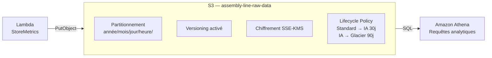
```mermaid
flowchart LR
    LAMBDA[Lambda\nStoreMetrics] -->|PutObject| S3

    subgraph S3["S3 — assembly-line-raw-data"]
        PREFIX[Partitionnement\nannée/mois/jour/heure/]
        VERS[Versioning activé]
        KMS[Chiffrement SSE-KMS]
        LC[Lifecycle Policy\nStandard → IA 30j\nIA → Glacier 90j]
    end

    S3 -->|SQL| ATHENA[Amazon Athena\nRequêtes analytiques]
```

### Politique de rétention (lifecycle confirmée Jour 25)

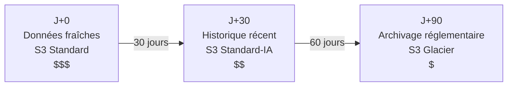
```mermaid
flowchart LR
    J0["J+0\nDonnées fraîches\nS3 Standard\n$$$"] -->|30 jours| J30
    J30["J+30\nHistorique récent\nS3 Standard-IA\n$$"] -->|60 jours| J90
    J90["J+90\nArchivage réglementaire\nS3 Glacier\n$"]
```

| Période | Classe | Coût relatif | Usage |
|---|---|---|---|
| 0 – 30 jours | Standard | $$$ | Monitoring, analytics temps réel |
| 30 – 90 jours | Standard-IA | $$ | Historique récent, accès rare |
| > 90 jours | Glacier | $ | Audit réglementaire aérospatial |

### Cohérence éventuelle — DynamoDB vs S3 (Jour 25)

Notre architecture maintient **deux stores distincts** mis à jour en parallèle par des Lambdas indépendantes :

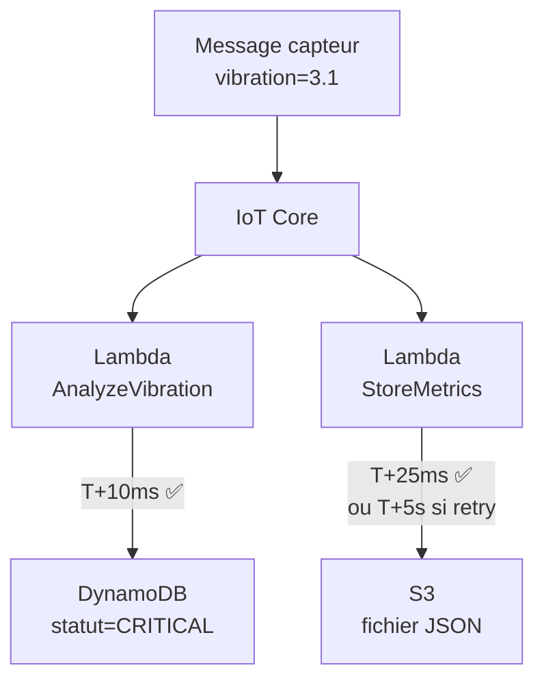
```mermaid
flowchart TD
    MQTT[Message capteur\nvibration=3.1] --> IOT[IoT Core]
    IOT --> L1[Lambda\nAnalyzeVibration] & L2[Lambda\nStoreMetrics]
    L1 -->|"T+10ms ✅"| DDB[DynamoDB\nstatut=CRITICAL]
    L2 -->|"T+25ms ✅\nou T+5s si retry"| S3[S3\nfichier JSON]
```

**Fenêtre d'incohérence possible** : entre le moment où DynamoDB est mis à jour et celui où S3 reçoit le fichier (quelques ms en nominal, quelques secondes en cas de retry Lambda).

**Conséquences pratiques :**

| Requête | Source | Comportement attendu |
|---|---|---|
| Dashboard statut poste | DynamoDB | Toujours à jour (< 10ms) |
| Athena — dernières 10 secondes | S3 | Peut manquer les mesures les plus récentes |
| Audit réglementaire | S3 | Toujours complet — S3 est la source de vérité finale |

**Délai de cohérence acceptable** : quelques secondes pour le monitoring. Pour l'audit → S3 converge toujours, même avec retard.

**Règle de conception** : ne jamais utiliser S3 comme source de vérité pour des décisions temps réel. DynamoDB pour l'état courant, S3 pour l'historique.

### Décisions de conception justifiées

**Partitionnement par date** : `s3://assembly-line-raw-data/2026/07/05/14/poste-1_1234567890.json`. Permet à Athena de lire uniquement la partition pertinente sans scanner tout le bucket. Sans partitionnement, une requête sur une heure de données lirait le bucket entier.

**Versioning** : protection contre les suppressions accidentelles. Obligatoire en contexte réglementaire aérospatial — une suppression crée un `DeleteMarker`, pas une destruction définitive.

**Lifecycle** : les données > 30 jours passent en S3-IA (40% moins cher, accès rare). > 90 jours en Glacier (80% moins cher). Optimisation coût sans perte de données.

**Block Public Access** : aucun objet du data lake ne peut être exposé publiquement, même par erreur de configuration — verrou au niveau bucket.

### Trade-offs

**S3 vs DynamoDB pour l'historique**
DynamoDB pourrait stocker l'historique avec une sort key `timestamp`, mais le coût explose à grande échelle (facturation à la lecture/écriture par item). S3 facture au stockage et à la requête Athena — largement plus économique pour des volumes d'archives.

**Athena vs Redshift**
Athena est serverless : pas de cluster à gérer, paiement à la requête. Redshift serait justifié pour des dashboards temps réel avec requêtes complexes en continu — pas le besoin dominant ici.

---

## 5. VPC — Isolation réseau

### Problème adressé

Par défaut, les ressources AWS créées hors VPC sont exposées sur des endpoints publics.
Pour un système industriel critique, c'est inacceptable : Lambda, l'API et les bases de données
ne doivent jamais être joignables directement depuis internet.

Le VPC crée un réseau privé virtuel dans AWS — l'équivalent d'un réseau d'entreprise isolé,
sur lequel on contrôle intégralement le trafic entrant et sortant.

### Architecture

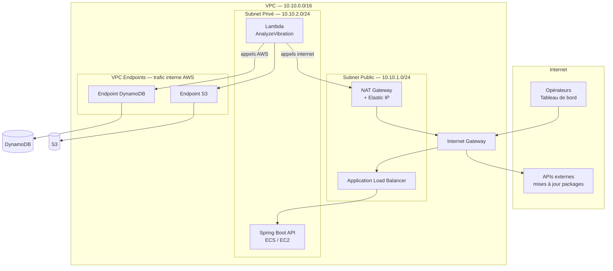
```mermaid
flowchart TB
    subgraph INTERNET["Internet"]
        OPS[Opérateurs
Tableau de bord]
        EXT[APIs externes
mises à jour packages]
    end

    subgraph VPC["VPC — 10.10.0.0/16"]
        IGW[Internet Gateway]

        subgraph PUBLIC["Subnet Public — 10.10.1.0/24"]
            ALB[Application Load Balancer]
            NAT[NAT Gateway
+ Elastic IP]
        end

        subgraph PRIVATE["Subnet Privé — 10.10.2.0/24"]
            LAMBDA_VPC[Lambda
AnalyzeVibration]
            API_VPC[Spring Boot API
ECS / EC2]
        end

        subgraph ENDPOINTS["VPC Endpoints — trafic interne AWS"]
            EP_DDB[Endpoint DynamoDB]
            EP_S3[Endpoint S3]
        end
    end

    OPS --> IGW --> ALB --> API_VPC
    LAMBDA_VPC -->|appels AWS| EP_DDB --> DDB[(DynamoDB)]
    LAMBDA_VPC --> EP_S3 --> S3[(S3)]
    LAMBDA_VPC -->|appels internet| NAT --> IGW --> EXT
```

### Décisions de conception justifiées

**CIDR `10.10.0.0/16` — 65 536 adresses disponibles**
Largement surdimensionné pour ce projet, mais intentionnel : un VPC ne se redimensionne pas après création.
Prévoir de l'espace pour des subnets futurs (multi-AZ, subnets dédiés RDS, ECS) évite une migration coûteuse plus tard.

**Deux subnets distincts : public et privé**
La séparation n'est pas cosmétique — elle est structurelle.
Le subnet public (`10.10.1.0/24`) expose uniquement le Load Balancer et la NAT Gateway, seuls composants qui doivent interagir avec internet.
Le subnet privé (`10.10.2.0/24`) contient Lambda et l'API : aucune IP publique assignée, jamais joignable depuis l'extérieur.

**Internet Gateway attachée au VPC**
L'IGW est la seule porte vers internet. Sans elle, même le subnet public est isolé.
Elle est attachée au VPC, pas au subnet — c'est la route table du subnet public qui décide quels flux passent par l'IGW.

**NAT Gateway dans le subnet public**
Les ressources du subnet privé (Lambda, API) ont parfois besoin de sortir vers internet : appels vers des APIs tierces, téléchargement de packages, appels vers des services AWS non couverts par VPC Endpoint.
La NAT Gateway leur permet de sortir sans être exposées : le trafic sortant porte l'IP publique de la NAT, jamais celle de Lambda.
Depuis internet, on ne voit que la NAT — Lambda reste invisible et inaccessible en entrée.

**VPC Endpoints pour DynamoDB et S3 — pas de NAT pour les services AWS**
La NAT Gateway route le trafic vers internet à ~$0.045/GB traité.
DynamoDB et S3 sont des services AWS internes : les appeler via la NAT serait payer inutilement et allonger le chemin réseau.
Les VPC Endpoints routent ces appels **via le backbone privé AWS**, sans sortir sur internet — zéro coût de transfert, latence réduite, sécurité renforcée.

**Route table privée explicite**
Le subnet privé pourrait hériter implicitement de la main route table du VPC (comportement AWS par défaut).
C'est fonctionnellement correct, mais dangereux : toute modification accidentelle de la main route table affecterait le subnet privé sans avertissement.
On lui associe une route table dédiée avec une seule route de sortie explicite : `0.0.0.0/0 → NAT Gateway`.

### Table de routage complète

| Route table | Subnet | Routes | Rôle |
|---|---|---|---|
| `rt-public` | `10.10.1.0/24` | `0.0.0.0/0 → IGW` + `local` | Trafic internet entrant/sortant via IGW |
| `rt-private` | `10.10.2.0/24` | `0.0.0.0/0 → NAT` + `local` | Sortie internet via NAT uniquement, pas d'entrée |

**Security Groups — deny-all par défaut**
AWS applique un refus implicite sur tout trafic non explicitement autorisé.
Le security group de Lambda n'autorise que les sorties vers les ports DynamoDB (443) et S3 (443).
Aucune règle entrante — Lambda ne reçoit jamais de connexion initiée de l'extérieur.

### Tables de routage

| Route table | Associée à | Règles | Rôle |
|---|---|---|---|
| `smart-assembly-rt-public` | Subnet public `10.10.1.0/24` | `0.0.0.0/0 → IGW` + `local` | Autorise la sortie vers internet via l'IGW |
| `smart-assembly-rt-private` | Subnet privé `10.10.2.0/24` | `local` uniquement | Trafic interne VPC uniquement, aucune sortie internet |
| Main route table (défaut AWS) | Aucun subnet du projet | `local` uniquement | Non utilisée — subnets associés explicitement |

### Trade-off assumé

Ce VPC est en **single-AZ** (`eu-west-3a`) pour ce stade du projet.
En production critique, on déploierait sur **2 ou 3 AZ** avec un subnet public et privé par AZ,
et un ALB multi-AZ pour absorber la défaillance d'une zone.
Ce point est documenté comme dette technique à traiter dans la suite du projet (multi-region / haute disponibilité).

---

## 6. ALB — Load Balancer applicatif

### Problème adressé

Le backend Spring Boot (supervision des postes) doit être accessible depuis internet de façon **fiable et scalable**.
Une instance unique est un point de défaillance : si elle tombe, le tableau de bord des opérateurs devient inaccessible.

L'Application Load Balancer résout trois problèmes simultanément :
- **Haute disponibilité** : distribue le trafic sur plusieurs instances dans plusieurs zones de disponibilité
- **Health check automatique** : exclut les instances défaillantes sans intervention manuelle
- **Terminaison TLS** : gère le certificat HTTPS en façade, le backend peut rester en HTTP interne

### Architecture

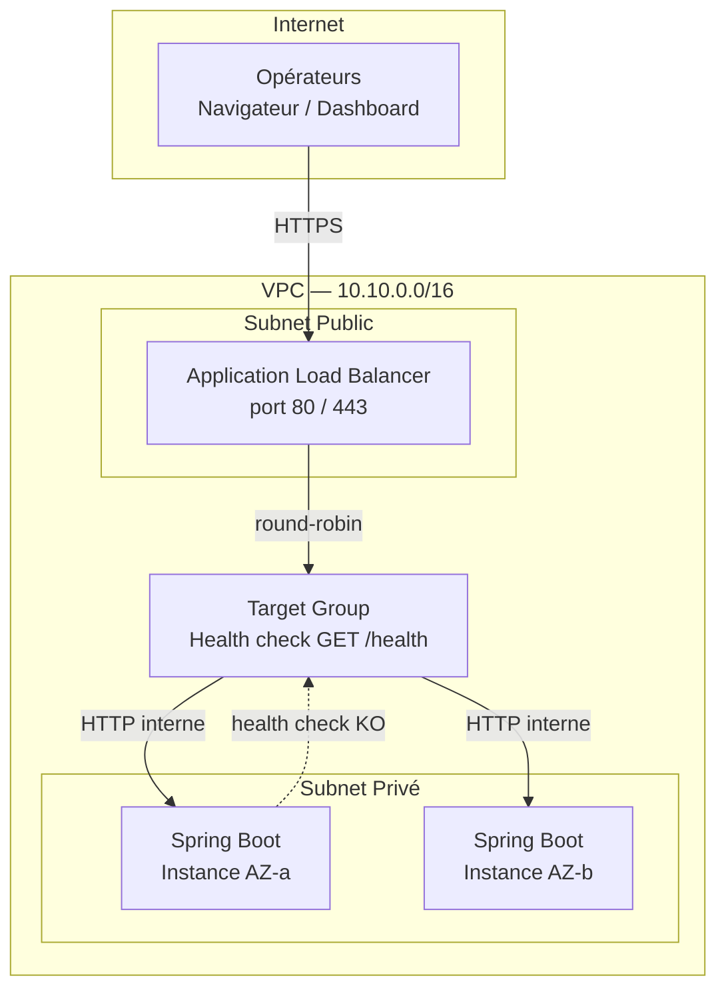
```mermaid
flowchart TB
    subgraph INTERNET["Internet"]
        OPS[Opérateurs
Navigateur / Dashboard]
    end

    subgraph VPC["VPC — 10.10.0.0/16"]
        subgraph PUBLIC["Subnet Public"]
            ALB[Application Load Balancer
port 80 / 443]
        end

        subgraph PRIVATE["Subnet Privé"]
            API1[Spring Boot
Instance AZ-a]
            API2[Spring Boot
Instance AZ-b]
        end

        TG[Target Group
Health check GET /health]
    end

    OPS -->|HTTPS| ALB
    ALB -->|round-robin| TG
    TG -->|HTTP interne| API1
    TG -->|HTTP interne| API2
    API1 -.->|health check KO| TG
```

### Décisions de conception justifiées

**ALB dans le subnet public — instances backend dans le subnet privé**
L'ALB est le seul composant exposé sur internet. Il porte l'IP publique et accepte les connexions entrantes.
Les instances Spring Boot n'ont pas d'IP publique — elles ne reçoivent que le trafic interne provenant de l'ALB.
Un attaquant ne peut pas atteindre directement le backend, même s'il connaît son IP interne.

**Health check sur `/health` toutes les 30 secondes**
L'ALB interroge chaque instance sur `GET /health`. Si l'instance répond `200 OK` → healthy, elle reçoit du trafic.
Si elle ne répond pas en moins de 5 secondes → unhealthy, l'ALB l'exclut du pool immédiatement, sans intervention manuelle.
Dès que l'instance répond à nouveau → l'ALB la réintègre automatiquement.

**Multi-AZ — résilience zonale**
L'ALB est déployé simultanément dans `eu-west-3a` et `eu-west-3b`.
Si une zone de disponibilité tombe (panne datacenter AWS), l'ALB continue de servir depuis l'autre zone.
Les opérateurs ne voient aucune interruption — la bascule est transparente et automatique.

**Listener port 80 → redirect 443**
Tout le trafic HTTP est redirigé vers HTTPS au niveau de l'ALB.
Le certificat TLS est terminé à l'ALB — les instances backend communiquent en HTTP interne dans le VPC privé.
Résultat : chiffrement bout-en-bout depuis le navigateur jusqu'à l'ALB, sans complexité TLS sur le backend.

---

## 9. EventBridge — Bus d'événements

### Problème adressé

`DetectAnomaly` publie un événement d'anomalie. Plusieurs systèmes doivent réagir :
- Une queue d'intervention (SQS) pour déclencher un workflow
- Un système d'alerte (SNS/email) pour notifier l'opérateur
- CloudWatch pour tracer les anomalies

Sans EventBridge, `DetectAnomaly` devrait connaître chaque consommateur et les appeler directement — couplage fort. Si on ajoute un nouveau consommateur, il faut modifier `DetectAnomaly`.

EventBridge inverse ce couplage : `DetectAnomaly` publie un événement, les consommateurs s'abonnent indépendamment. C'est le pattern **publish/subscribe** au niveau cloud.

### Architecture

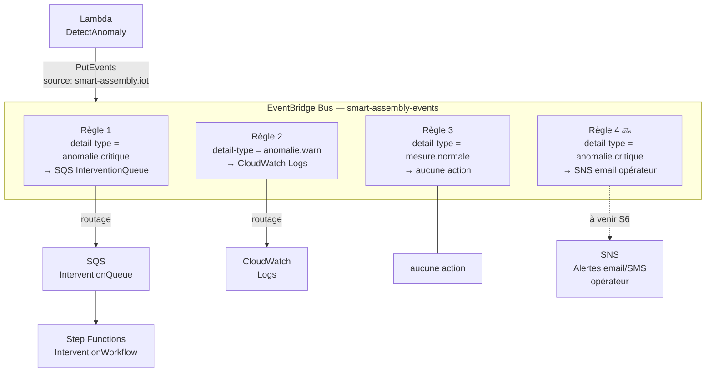
```mermaid
flowchart TD
    DA[Lambda\nDetectAnomaly] -->|PutEvents\nsource: smart-assembly.iot| BUS

    subgraph BUS["EventBridge Bus — smart-assembly-events"]
        R1[Règle 1\ndetail-type = anomalie.critique\n→ SQS InterventionQueue]
        R2[Règle 2\ndetail-type = anomalie.warn\n→ CloudWatch Logs]
        R3[Règle 3\ndetail-type = mesure.normale\n→ aucune action]
        R4[Règle 4 🔜\ndetail-type = anomalie.critique\n→ SNS email opérateur]
    end

    R1 -->|routage| SQS[SQS\nInterventionQueue]
    R2 -->|routage| CW[CloudWatch\nLogs]
    R3 --- NONE[aucune action]
    R4 -.->|à venir S6| SNS[SNS\nAlertes email/SMS\nopérateur]
    SQS --> SF[Step Functions\nInterventionWorkflow]
```

### Format des événements publiés

```json
{
  "source": "smart-assembly.iot",
  "detail-type": "anomalie.critique",
  "detail": {
    "id_poste":  "poste_1",
    "statut":    "CRITICAL",
    "regle":     "combo.dangereux",
    "detail":    "multi-warn: vib=1.6, temp=82.0, pres=4.5",
    "mesures": {
      "vibration":   1.6,
      "temperature": 82.0,
      "pression":    4.5
    },
    "timestamp": "2026-07-12T14:00:00+00:00"
  }
}
```

### Décisions de conception justifiées

**Bus custom vs bus default AWS**
AWS fournit un bus `default` partagé entre tous les services du compte.
On crée un bus dédié `smart-assembly-events` : isolation totale, pas de pollution par les événements AWS système, contrôle d'accès indépendant.

**`detail-type` comme discriminant de routage**
Le `detail-type` encode la sévérité (`anomalie.critique`, `anomalie.warn`, `mesure.normale`).
Les règles EventBridge filtrent sur ce champ — pas besoin de parser le `detail` JSON pour savoir comment router.
C'est le pattern **semantic routing** : le type de l'événement suffit à décider de sa destination.

**Fanout natif — un événement, plusieurs consommateurs**
Une anomalie critique déclenche simultanément SQS (intervention) et CloudWatch (audit) via deux règles distinctes.
`DetectAnomaly` publie une seule fois — EventBridge se charge du fanout.
Ajouter un nouveau consommateur = ajouter une règle Terraform, zéro modification du code Lambda.

**At-least-once delivery assumé**
EventBridge livre at-least-once — un événement peut être délivré deux fois en cas de retry interne.
Les consommateurs (SQS, Step Functions) doivent être idempotents en conséquence.
C'est le même pattern qu'avec MQTT QoS 1 : on assume at-least-once et on conçoit l'idempotence côté consommateur.

### Trade-offs

**EventBridge vs SNS pour le fanout**
SNS est plus simple pour un fanout point-à-point vers Lambda/SQS/HTTP.
EventBridge ajoute le **filtrage par contenu** (pattern matching sur le JSON) — SNS ne peut filtrer que sur des attributs de message simples.
Pour un système industriel où différents types d'anomalies doivent aller vers différentes destinations, EventBridge est plus expressif.

**EventBridge vs SQS direct depuis Lambda**
Lambda pourrait publier directement dans SQS sans passer par EventBridge.
EventBridge ajoute une couche mais apporte le découplage : si on remplace SQS par Step Functions direct, on change une règle Terraform, pas le code Lambda.
Le coût supplémentaire (~$1 pour 1 million d'événements) est négligeable face au gain en maintenabilité.

---

---

## 10. SQS — File d'attente d'intervention

### Problème adressé

Quand EventBridge détecte une `anomalie.critique`, il faut déclencher un workflow d'intervention.
Mais EventBridge ne peut pas invoquer Step Functions directement de façon fiable sans tampon : si Step Functions est temporairement indisponible ou saturé, l'événement est perdu.

SQS joue le rôle de **tampon durable** entre EventBridge et Step Functions :
- Si Step Functions est lent, les messages s'accumulent dans la queue sans être perdus
- Si un workflow échoue, le message est retentié automatiquement jusqu'à 3 fois
- Après 3 échecs, le message est transféré dans la **Dead Letter Queue** pour analyse

### Architecture

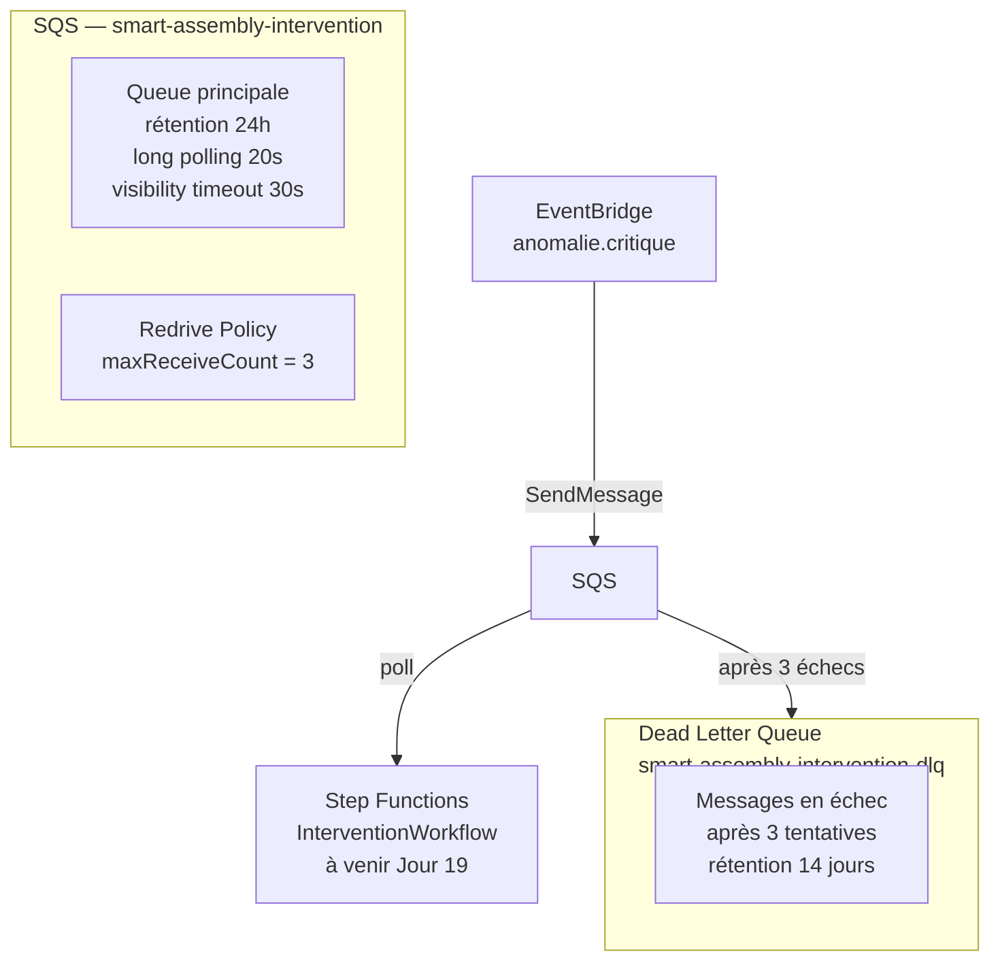
```mermaid
flowchart TD
    EB[EventBridge\nanomalie.critique] -->|SendMessage| SQS

    subgraph SQS_ARCH["SQS — smart-assembly-intervention"]
        Q[Queue principale\nrétention 24h\nlong polling 20s\nvisibility timeout 30s]
        REDRIVE[Redrive Policy\nmaxReceiveCount = 3]
    end

    subgraph DLQ["Dead Letter Queue\nsmart-assembly-intervention-dlq"]
        DEAD[Messages en échec\naprès 3 tentatives\nrétention 14 jours]
    end

    SQS -->|après 3 échecs| DLQ
    SQS -->|poll| SF[Step Functions\nInterventionWorkflow\nà venir Jour 19]
```

### Décisions de conception justifiées

**Long polling — `receive_wait_time_seconds = 20`**
Sans long polling, le consommateur (Step Functions / Lambda) interroge SQS en continu même quand la queue est vide — coût inutile et CPU gaspillé.
Avec long polling à 20s, SQS attend jusqu'à 20 secondes qu'un message arrive avant de répondre vide.
Pour un système d'intervention industrielle, une latence de 20s est parfaitement acceptable et réduit le coût de polling de 95%.

**Visibility timeout à 30 secondes**
Quand Step Functions récupère un message, SQS le rend invisible aux autres consommateurs pendant 30s.
Si Step Functions ne confirme pas (`DeleteMessage`) dans ce délai → SQS suppose un échec et remet le message visible.
30s est supérieur au timeout Step Functions attendu (< 10s) — marge de sécurité suffisante.

**Dead Letter Queue — `maxReceiveCount = 3`**
Après 3 tentatives infructueuses, le message est déplacé en DLQ.
La DLQ conserve les messages 14 jours — temps suffisant pour déboguer un workflow défaillant, inspecter le payload, et rejouer manuellement si nécessaire.
Sans DLQ, un message "poison pill" (malformé, qui fait planter le consommateur) bloquerait la queue indéfiniment.

**Rétention 24h sur la queue principale**
Une intervention sur une anomalie critique ne peut pas attendre plus de 24h — si le message n'est pas traité dans ce délai, il est périmé.
La DLQ conserve 14 jours pour l'analyse post-mortem.

**SQS Queue Policy — `aws:SourceArn` = ARN de la règle EventBridge**
La policy autorise `events.amazonaws.com` à envoyer des messages.
La condition `aws:SourceArn` doit pointer vers l'ARN de la **règle EventBridge** (pas du bus).
C'est un piège classique : EventBridge propage l'ARN de la règle comme `SourceArn`, pas celui du bus — une erreur sur ce point fait échouer silencieusement les livraisons.

### Trade-offs

**SQS vs EventBridge → Step Functions direct**
EventBridge peut invoquer Step Functions directement via un target `aws_cloudwatch_event_target`.
Mais sans tampon SQS, si Step Functions rejette l'invocation (throttling, erreur interne), EventBridge retente jusqu'à 24h — comportement difficile à observer et à contrôler.
SQS donne une visibilité claire : nombre de messages en attente, en échec, en DLQ — tout est observable avec des métriques CloudWatch natives.

**SQS Standard vs SQS FIFO**
SQS FIFO garantit l'ordre de traitement et l'exactly-once delivery.
SQS Standard est choisi ici : les interventions d'anomalies critiques ne nécessitent pas d'ordre strict entre elles (chaque poste est indépendant).
Step Functions gère l'idempotence côté consommateur — le at-least-once de SQS Standard est suffisant.

---

---

## 11. Step Functions — Orchestration du workflow d'intervention

### Problème adressé

Quand SQS reçoit une `anomalie.critique`, plusieurs actions doivent s'enchaîner de façon **fiable et traçable** :

1. Vérifier si une intervention est déjà en cours sur ce poste (circuit breaker)
2. Marquer le poste comme `EN_INTERVENTION` dans DynamoDB
3. Logger l'intervention pour l'audit
4. Gérer les erreurs et les retries à chaque étape

Coder cet enchaînement dans une Lambda unique est fragile : si la Lambda crashe à l'étape 3, l'état intermédiaire est perdu et on ne sait pas où reprendre. Les retries et la gestion d'erreur doivent être codés manuellement.

Step Functions externalise l'état du workflow hors du code. Chaque étape est une **State** persistée par AWS — un crash à l'étape 3 est visible dans la console, et le retry reprend exactement à l'étape 3.

### Architecture

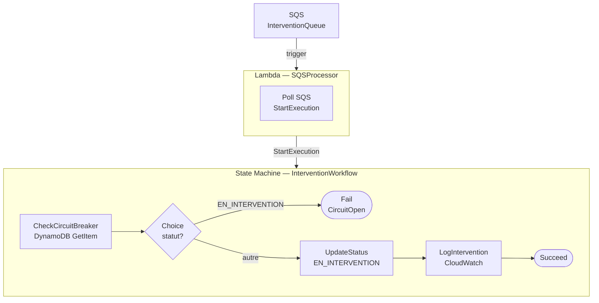
```mermaid
flowchart TD
    SQS[SQS\nInterventionQueue] -->|trigger| PROC

    subgraph PROC["Lambda — SQSProcessor"]
        POLL[Poll SQS\nStartExecution]
    end

    PROC -->|StartExecution| SM

    subgraph SM["State Machine — InterventionWorkflow"]
        S1[CheckCircuitBreaker\nDynamoDB GetItem]
        S2{Choice\nstatut?}
        S3[UpdateStatus\nEN_INTERVENTION]
        S4[LogIntervention\nCloudWatch]
        S5([Succeed])
        S6([Fail\nCircuitOpen])

        S1 --> S2
        S2 -->|EN_INTERVENTION| S6
        S2 -->|autre| S3
        S3 --> S4
        S4 --> S5
    end
```

### États du workflow

| État | Type ASL | Action | Sortie |
|---|---|---|---|
| `CheckCircuitBreaker` | `Task` | DynamoDB `GetItem` sur `id_poste` | Item DynamoDB complet |
| `Choice` | `Choice` | Si `statut == EN_INTERVENTION` → Fail | Branchement conditionnel |
| `UpdateStatus` | `Task` | DynamoDB `UpdateItem` → `statut = EN_INTERVENTION` | Confirmation mise à jour |
| `LogIntervention` | `Task` | Lambda log structuré JSON dans CloudWatch | Log d'audit |
| `Succeed` | `Succeed` | Fin du workflow en succès | — |
| `Fail (CircuitOpen)` | `Fail` | Fin du workflow — circuit déjà ouvert | Cause: `InterventionDejaEnCours` |

### Pattern Circuit Breaker

Le circuit breaker empêche de lancer deux workflows d'intervention simultanés sur le même poste.

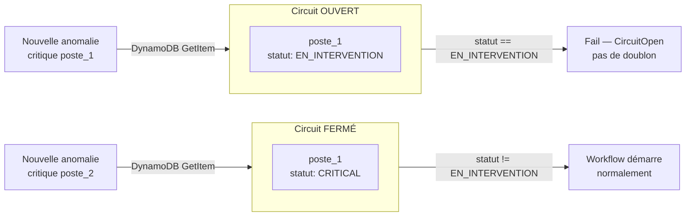
```mermaid
flowchart LR
    subgraph OPEN["Circuit OUVERT"]
        O1[poste_1\nstatut: EN_INTERVENTION]
    end

    subgraph CLOSED["Circuit FERMÉ"]
        C1[poste_1\nstatut: CRITICAL]
    end

    NEW[Nouvelle anomalie\ncritique poste_1]

    NEW -->|DynamoDB GetItem| OPEN
    OPEN -->|statut == EN_INTERVENTION| FAIL[Fail — CircuitOpen\npas de doublon]

    NEW2[Nouvelle anomalie\ncritique poste_2]
    NEW2 -->|DynamoDB GetItem| CLOSED
    CLOSED -->|statut != EN_INTERVENTION| OK[Workflow démarre\nnormalement]
```

Sans circuit breaker : 10 anomalies critiques en rafale sur `poste_1` → 10 workflows simultanés, 10 techniciens envoyés sur le même poste.
Avec circuit breaker : seul le premier workflow passe, les suivants sont court-circuités proprement.

### Amazon States Language (ASL) — extrait

```json
{
  "Comment": "Workflow d'intervention suite à anomalie critique",
  "StartAt": "CheckCircuitBreaker",
  "States": {
    "CheckCircuitBreaker": {
      "Type": "Task",
      "Resource": "arn:aws:states:::dynamodb:getItem",
      "Parameters": {
        "TableName": "machine_state",
        "Key": {
          "id_poste": { "S.$": "$.id_poste" }
        }
      },
      "ResultPath": "$.dynamodb_result",
      "Next": "EvalCircuit"
    },
    "EvalCircuit": {
      "Type": "Choice",
      "Choices": [
        {
          "Variable": "$.dynamodb_result.Item.statut.S",
          "StringEquals": "EN_INTERVENTION",
          "Next": "CircuitOuvert"
        }
      ],
      "Default": "UpdateStatus"
    },
    "CircuitOuvert": {
      "Type": "Fail",
      "Error": "CircuitOpen",
      "Cause": "Intervention déjà en cours sur ce poste"
    },
    "UpdateStatus": {
      "Type": "Task",
      "Resource": "arn:aws:states:::dynamodb:updateItem",
      "Parameters": {
        "TableName": "machine_state",
        "Key": { "id_poste": { "S.$": "$.id_poste" } },
        "UpdateExpression": "SET statut = :s",
        "ExpressionAttributeValues": { ":s": { "S": "EN_INTERVENTION" } }
      },
      "Next": "LogIntervention"
    },
    "LogIntervention": {
      "Type": "Task",
      "Resource": "arn:aws:lambda:eu-west-3:169237360990:function:smart-assembly-log-intervention",
      "End": true
    }
  }
}
```

### Décisions de conception justifiées

**Express Workflow — pas Standard**
Les interventions durent moins de 5 minutes — la limite Standard (1 an) est inutile ici.
Express coûte $1/million d'exécutions vs $0.025/1000 transitions pour Standard.
Pour un système IoT haute fréquence (une anomalie toutes les secondes en cas de problème), Express est largement plus économique.
Contrepartie : l'historique des exécutions n'est pas conservé nativement — on le compense avec des logs CloudWatch structurés.

**SDK Integrations — DynamoDB natif sans Lambda**
Step Functions peut appeler DynamoDB directement via `arn:aws:states:::dynamodb:getItem` sans passer par une Lambda intermédiaire.
C'est une **optimized integration** : moins de latence (pas de cold start Lambda), moins de coût (pas d'invocation Lambda), moins de code à maintenir.
La règle : si Step Functions supporte l'intégration native avec le service AWS, on l'utilise — Lambda est réservé à la logique métier qui ne peut pas être exprimée en ASL.

**`ResultPath` pour préserver l'input**
Sans `ResultPath`, le résultat de `CheckCircuitBreaker` écrase l'input initial (le payload SQS).
`"ResultPath": "$.dynamodb_result"` merge le résultat dans l'input sous la clé `dynamodb_result` — le payload original reste accessible dans les états suivants.
C'est un pattern fondamental ASL à maîtriser pour les entretiens.

**Lambda SQSProcessor — Option A vs EventBridge Pipes**
EventBridge Pipes permettrait de connecter SQS → Step Functions sans Lambda.
On choisit une Lambda intermédiaire pour trois raisons : contrôle explicite des erreurs de parsing SQS, possibilité de filtrer les messages avant de démarrer, et visibilité claire dans les logs CloudWatch.
EventBridge Pipes sera envisagé si le volume de messages justifie de réduire la latence.

### Trade-offs

**Step Functions vs Lambda seul pour l'orchestration**
Une Lambda unique pourrait enchaîner toutes les étapes avec des `await` successifs.
Mais si Lambda crashe à l'étape 3, on ne sait pas où en était le workflow — pas de visibilité, pas de reprise partielle possible.
Step Functions persiste l'état à chaque transition : un crash à l'étape 3 est visible dans la console, le retry repart de l'étape 3, pas du début.

**Step Functions vs SQS pour la séquence d'états**
SQS pourrait simuler une orchestration avec plusieurs queues chaînées.
Mais SQS n'a pas de notion de branchement conditionnel (Choice), de timeout par étape, ni de visibilité sur l'état global du workflow.
Step Functions est conçu exactement pour ça — c'est son domaine.

---

## 12. Chaos Day — Résilience de la pipeline événementielle

### Objectif

Valider que chaque mécanisme de résilience fonctionne en conditions réelles : DLQ, circuit breaker sous charge, gestion des payloads invalides.

### Tests réalisés (Jour 21)

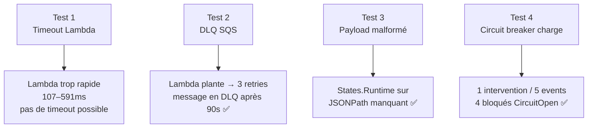
```mermaid
flowchart TD
    T1[Test 1\nTimeout Lambda] --> R1[Lambda trop rapide\n107–591ms\npas de timeout possible]
    T2[Test 2\nDLQ SQS] --> R2[Lambda plante → 3 retries\nmessage en DLQ après 90s ✅]
    T3[Test 3\nPayload malformé] --> R3[States.Runtime sur\nJSONPath manquant ✅]
    T4[Test 4\nCircuit breaker charge] --> R4[1 intervention / 5 events\n4 bloqués CircuitOpen ✅]
```

| Test | Scénario | Résultat | Leçon |
|---|---|---|---|
| 1 — Timeout | Lambda avec `time.sleep(2)`, timeout = 1s | Lambda complète en < 600ms — pas de timeout possible | Lambda trop efficace pour un timeout à 1s. En prod : augmenter le timeout de test ou simuler une opération lente réelle |
| 2 — DLQ | `FORCE_ERROR=true` → exception intentionnelle | 3 retries × 30s → message en DLQ après ~90s ✅ | Le redrive policy fonctionne. Aucun message perdu silencieusement |
| 3 — Payload malformé | Event sans `id_poste` | `States.Runtime` sur `$.id_poste` dans CheckCircuitBreaker ✅ | Le JSONPath ASL est strict. Ajouter une validation du payload en entrée de state machine |
| 4 — Charge | 5 events simultanés sur `poste_1` | 1 seul LogIntervention, 4 × CircuitOpen ✅ | Le circuit breaker tient sous charge concurrente |

### Observations notables

**Terraform écrase les variables manuelles**
Pendant le Test 2, la variable `FORCE_ERROR=true` ajoutée manuellement dans la console Lambda a été supprimée par un `terraform apply` ultérieur.
Comportement attendu : Terraform est la source de vérité. Toute modification manuelle d'une ressource gérée par Terraform est écrasée au prochain apply.
En production, les variables d'environnement de chaos testing doivent être définies dans les `.tf` avec une valeur par défaut `false`.

**Express Workflows — historique non visible dans la console**
`list-executions` retourne `StateMachineTypeNotSupported` pour les Express Workflows.
Source de vérité : CloudWatch Logs `/aws/states/smart-assembly-intervention-workflow` (niveau ERROR) et `/aws/lambda/smart-assembly-log-intervention` pour les succès.

**4 INIT_START simultanés — comportement normal**
Lors du Test 4, SQS a déclenché 5 invocations Lambda en parallèle (une par message, `batch_size=1`).
Les 4 INIT_START consécutifs confirment que Lambda a scalé horizontalement pour traiter les messages en parallèle — comportement attendu et souhaitable.

### Chaos Day Axe 2 — Data (Jour 27)

#### Résultats

| Test | Scénario | Résultat | Statut |
|---|---|---|---|
| 1 — DynamoDB throttling | Table en provisionné 1 WCU/s, 2 simulateurs | Latence 23× plus élevée (3 293ms vs 140ms), SDK retry silencieux, 0 perte de données | ✅ Validé |
| 2 — S3 failure | Deny policy sur StoreMetrics | Deny policy non appliquée — test non réalisé | ⚠️ Non réalisé |
| 3 — Kinesis enregistrement malformé | Injecter un record invalide dans le stream | Kinesis non disponible sur ce compte AWS | ❌ Non réalisé |

#### Analyse Test 1 — DynamoDB throttling prolongé

```
Sans throttling : DetectAnomaly → DynamoDB PutItem → 120-140ms
Avec throttling  : DetectAnomaly → DynamoDB PutItem → 3 293ms (retry × 3 avec backoff exponentiel)
```

**Comportement observé** : boto3 SDK retente automatiquement jusqu'à 3 fois avec backoff exponentiel.
Aucune erreur visible côté application — le throttling est **absorbé silencieusement**.

**Risque en production** : à grande échelle, cette latence cachée peut faire exploser le timeout Lambda (30s).
Si tous les retries échouent → `ProvisionedThroughputExceededException` remonte à l'application.

**Mitigation** : on-demand billing (notre choix actuel), ou provisionné + auto-scaling avec alarme CloudWatch sur `WriteThrottleEvents > 0`.

#### Tests non réalisés — architecture cible documentée

**Test 2 — S3 failure**
En production, simuler via une Deny policy inline sur le rôle Lambda :
```json
{
  "Effect": "Deny",
  "Action": "s3:*",
  "Resource": "*"
}
```
Comportement attendu : `ClientError: AccessDenied` dans CloudWatch, Lambda plante, IoT Core ne retente pas → donnée perdue pour cet événement. Mitigation : DLQ sur l'erreur Lambda, ou écriture S3 en mode best-effort avec fallback CloudWatch Logs.

**Test 3 — Kinesis enregistrement malformé**
Architecture cible avec `bisect_on_function_error = true` :
- Lambda reçoit un batch de 100 records dont 1 malformé
- Lambda plante → Kinesis divise le batch en deux et retente chaque moitié
- Le record malformé est isolé dans un batch de 1 → redirigé vers la DLQ via `destination_on_failure`
- Les 99 records valides sont traités normalement

### Jour 28 — Atelier pipeline à 1 000 events/seconde

#### Baseline et estimation théorique

| Paramètre | Valeur théorique | Source |
|---|---|---|
| Débit cible | 1 000 events/s | Cible projet (1 000 capteurs × 1 msg/s) |
| 1 shard Kinesis | 1 000 rec/s ou 1 MB/s | AWS documentation |
| Shards nécessaires | 1 shard | 1 000 rec/s ÷ 1 000 rec/s/shard |
| Lambda invocations | 10/s | batch_size=100 → 1 000 rec/s ÷ 100 |
| Coût estimé test | < $0.01 | IoT Core + Lambda + DynamoDB dans Free Tier |

#### Résultats du stress test (Jour 28)

**Script** : 10 threads Python × 100 messages = 1 000 events via boto3 `iot-data.publish()`

| Métrique | Valeur mesurée |
|---|---|
| Messages envoyés | 1 000 / 1 000 (0 erreur) |
| Durée totale | 6.84s |
| Débit moyen mesuré | **146 msg/s** |
| Débit par thread | ~15-16 msg/s |
| Latence par appel HTTP | ~65ms |

#### Analyse de l'écart théorie / mesure

| | Théorique | Mesuré | Écart |
|---|---|---|---|
| Débit | 1 000 msg/s | 146 msg/s | **6.8×** |

**Cause principale** : chaque `client.publish()` boto3 est un appel **HTTPS synchrone** vers IoT Core. La latence réseau (~65ms Paris → eu-west-3) est payée pour chaque message individuellement.

```
Thread → HTTPS request (65ms) → IoT Core → réponse → message suivant
100 messages × 65ms = 6.5s par thread
```

#### Voies d'optimisation pour atteindre 1 000 msg/s

| Approche | Débit estimé | Mécanisme |
|---|---|---|
| boto3 synchrone (actuel) | ~150 msg/s | 1 appel HTTPS par message |
| MQTT (async, QoS 0) | ~500-800 msg/s | Connexion persistante, pas de handshake par message |
| Kinesis `put_records` batch 500 | ~1 000+ msg/s | 500 records en 1 seul appel HTTPS |
| Kinesis + asyncio Python | ~5 000+ msg/s | I/O non bloquant + batch |

**Kinesis `put_records` est la clé** : 500 records par appel HTTP → latence réseau divisée par 500.
Au lieu de payer 65ms × 1 000 = 65 secondes, on paie 65ms × 2 = 130ms pour 1 000 records.

#### Leçon architecturale

Le dimensionnement des shards (capacité théorique) et la performance réelle (latence réseau) sont deux problèmes séparés.

Un architecte senior doit savoir répondre à deux questions distinctes en entretien :
- **"Combien de shards ?"** → calcul théorique basé sur le débit et la taille des records
- **"Quel débit réel ?"** → dépend du protocole (HTTP sync vs async vs batch), de la région, et du client SDK

### Tableau de résilience global — Smart Aerospace Assembly Line

Vue consolidée de tous les mécanismes de résilience du système, des tests réalisés et des comportements observés.

#### Légende

| Symbole | Signification |
|---|---|
| ✅ | Testé et validé en conditions réelles |
| ⚠️ | Documenté, test non réalisé (contrainte compte AWS) |
| 🔜 | Prévu, non encore implémenté |

#### Résilience par composant

| Composant | Mode de panne | Mécanisme de protection | Comportement observé | Statut |
|---|---|---|---|---|
| **MQTT / IoT Core** | Déconnexion réseau (`UNEXPECTED_HANGUP`) | Reconnexion automatique du SDK `awsiot` | Reconnexion en < 2s, aucun message perdu pendant la coupure | ✅ Jour 5 |
| **Lambda DetectAnomaly** | Timeout (durée > limite configurée) | Lambda timeout = 30s, IoT Core ne retente pas | Lambda trop rapide (107-591ms) — pas de timeout observé à 1s | ✅ Jour 21 Test 1 |
| **Lambda SQSProcessor** | Exception non gérée (`FORCE_ERROR`) | SQS redrive policy : 3 retries × 30s → DLQ | Message en DLQ après ~90s, 0 perte | ✅ Jour 21 Test 2 |
| **Step Functions ASL** | Payload invalide (champ manquant) | `States.Runtime` sur JSONPath invalide | Exécution échoue proprement sur `CheckCircuitBreaker` — `$.id_poste` absent | ✅ Jour 21 Test 3 |
| **Circuit breaker DynamoDB** | Interventions dupliquées sur le même poste | `statut = EN_INTERVENTION` bloque les nouveaux workflows | 5 events simultanés → 1 intervention, 4 `CircuitOpen` | ✅ Jour 21 Test 4 |
| **SQS Dead Letter Queue** | Messages en échec répétés (poison pill) | `maxReceiveCount = 3`, DLQ rétention 14 jours | Messages isolés en DLQ, analysables sans bloquer la queue principale | ✅ Jour 18 + 21 |
| **DynamoDB — throttling** | Débit d'écriture > capacité provisionnée | boto3 SDK : retry exponentiel (3 tentatives, jitter) | Latence ×23 (3 293ms vs 140ms), 0 erreur remontée, 0 perte de données | ✅ Jour 23 + 27 |
| **DynamoDB — hot partition GSI** | Forte cardinalité sur `statut` (faible) | Write sharding documenté (`statut#shard`) | Non testé à volume — mitigation documentée pour 100 000+ postes | ⚠️ Documenté |
| **S3 StoreMetrics** | Perte d'accès S3 (AccessDenied) | Comportement Lambda : exception non gérée → IoT Core abandonne | Test non concluant (policy non appliquée) — comportement attendu : perte du record | ⚠️ Jour 27 Test 2 |
| **EventBridge** | Livraison at-least-once (doublon possible) | Consommateurs idempotents (circuit breaker DynamoDB) | Doublons absorbés par le circuit breaker — pas d'intervention dupliquée | ✅ Design |
| **Step Functions Express** | Historique non visible en console | CloudWatch Logs `/aws/states/...` niveau ERROR | Toutes les exécutions tracées dans CloudWatch — console inutilisable pour Express | ✅ Jour 19 |
| **Kinesis — record malformé** | Un record invalide bloque tout le batch | `bisect_on_function_error = true` + DLQ `destination_on_failure` | Non testé (Kinesis indisponible) — architecture cible documentée | ⚠️ Documenté |
| **Kinesis — shard saturé** | Débit > 1 000 rec/s/shard | Augmentation `shard_count` ou passage ON_DEMAND | Non testé — dimensionnement théorique validé via stress test HTTP | ⚠️ Documenté |
| **Pipeline 1 000 events/s** | Débit insuffisant via HTTP synchrone | Kinesis `put_records` batch 500 records/appel | 146 msg/s mesuré vs 1 000 théoriques — bottleneck : latence HTTPS 65ms/appel | ✅ Jour 28 |

#### Couverture des patterns de résilience

| Pattern | Implémenté | Composant(s) |
|---|---|---|
| **Retry avec backoff exponentiel** | ✅ | DynamoDB (boto3 SDK), SQS (redrive), Step Functions |
| **Dead Letter Queue** | ✅ | SQS → DLQ, Kinesis → DLQ (documenté) |
| **Circuit breaker** | ✅ | DynamoDB `statut = EN_INTERVENTION` |
| **Idempotence** | ✅ | Circuit breaker absorbe les doublons EventBridge |
| **At-least-once assumé** | ✅ | EventBridge, SQS Standard, MQTT QoS 1 |
| **Observabilité des pannes** | ✅ | CloudWatch Logs structurés, métriques `WriteThrottleEvents` |
| **Isolation des messages poison** | ✅ | SQS DLQ après 3 échecs |
| **Dégradation gracieuse** | 🔜 | Mode dégradé si IoT Core down (Semaine 5 Greengrass) |
| **Backpressure** | 🔜 | SQS absorbe le surplus — alerting DLQ à implémenter |
| **Replay de flux** | ⚠️ | Kinesis `AT_TIMESTAMP` — documenté, non déployé |

### Actions correctives identifiées

- **Validation du payload** : ajouter un état `ValidateInput` en entrée de la state machine avec un `Catch` sur `States.Runtime` → redirection vers un état `PayloadInvalide` avec log structuré
- **Alerting DLQ** : ajouter une alarme CloudWatch sur `ApproximateNumberOfMessages` de la DLQ > 0 → notification SNS opérateur
- **Variables chaos en Terraform** : définir `FORCE_ERROR = false` dans `lambda_sqs_processor.tf` pour permettre l'activation sans modification manuelle
- **Débit réel → Kinesis + put_records** : pour atteindre 1 000 msg/s, remplacer le publish HTTP synchrone par Kinesis `put_records` (batch 500 records/appel)

---

### Trade-offs

**ALB vs NLB (Network Load Balancer)**
Le NLB opère en couche 4 (TCP) — plus rapide, adapté aux flux MQTT ou TCP bruts.
L'ALB opère en couche 7 (HTTP) — permet le routage par path (`/api/*` → backend A, `/admin/*` → backend B), par header, et la terminaison TLS.
Pour une API REST Spring Boot, la couche 7 est le bon niveau.

**ALB vs API Gateway**
API Gateway gère nativement l'authentification, le throttling et la transformation des requêtes, mais facture à l'appel.
L'ALB facture à l'heure (~$18/mois fixe) — plus économique pour un trafic continu élevé.
Pour un tableau de bord opérateur avec trafic constant, l'ALB est plus avantageux. Pour une API publique à trafic variable, API Gateway serait préférable.

!!! warning "Coût"
    L'ALB coûte ~$18/mois fixe + $0.008/LCU. À créer uniquement pour un lab ou la production — détruire après le lab.

---

## 7. KMS — Chiffrement bout-en-bout

### Problème adressé

Par défaut, S3 et DynamoDB utilisent des clés AWS managées (`aws/s3`, `aws/dynamodb`).
Ces clés appartiennent à AWS — on ne contrôle pas leur utilisation, et aucun audit granulaire n'est possible.

En contexte aérospatial réglementaire, ce n'est pas acceptable : l'auditeur veut savoir **qui** a accédé à quelle donnée, **quand**, et **depuis quel rôle**.
Une Customer Managed Key (CMK) répond à cette exigence : chaque accès à la clé est tracé dans CloudTrail.

### Architecture — Envelope Encryption

```mermaid
flowchart TD
    subgraph KMS["AWS KMS"]
        CMK[Customer Managed Key
smart-assembly-key
Rotation annuelle automatique]
    end

    subgraph LAMBDA["Lambda"]
        L1[AnalyzeVibration]
        L2[StoreMetrics]
    end

    subgraph STORAGE["Stockage chiffré"]
        DDB[(DynamoDB
machine_state)]
        S3[(S3
raw-data)]
    end

    L1 -->|PutItem| DDB
    L2 -->|PutObject| S3
    DDB -->|GenerateDataKey| CMK
    S3 -->|GenerateDataKey| CMK
    CMK -->|DEK chiffrée| DDB
    CMK -->|DEK chiffrée| S3
```

### Pattern Envelope Encryption

KMS ne chiffre pas directement les données — ce serait trop lent pour des fichiers volumineux.
Il génère une **Data Encryption Key (DEK)** éphémère qui chiffre les données réelles.
La DEK elle-même est ensuite chiffrée par la CMK et stockée à côté des données.

```
Donnée brute  →  [chiffrée par DEK]  →  Donnée chiffrée stockée
DEK           →  [chiffrée par CMK]  →  DEK chiffrée stockée
CMK           →  stockée dans HSM AWS, jamais exposée ni exportable
```

Pour déchiffrer : S3/DynamoDB demande à KMS de déchiffrer la DEK → utilise la DEK pour déchiffrer la donnée → la DEK est détruite en mémoire.

### Décisions de conception justifiées

**CMK vs clé AWS managée**
La clé AWS managée est gratuite mais opaque — AWS la gère entièrement, aucun audit des accès possible.
La CMK coûte $1/mois mais donne le contrôle total : Key Policy granulaire, audit CloudTrail de chaque utilisation, rotation configurable.
En contexte réglementaire aérospatial (DO-178C, EN 9100), la traçabilité des accès aux données est une exigence d'audit — la CMK est non négociable.

**Key Policy — least privilege**
Seuls les rôles qui ont besoin de la clé y ont accès :
- Rôle Lambda : `kms:GenerateDataKey` + `kms:Decrypt` pour lire/écrire S3 et DynamoDB
- Administrateur IAM : gestion de la clé (`kms:Create*`, `kms:Delete*`)
- Tout autre rôle : accès refusé implicitement

Un rôle compromis sans permission KMS ne peut pas déchiffrer les données — même s'il accède au bucket S3.

**Rotation automatique annuelle**
Tous les ans, AWS génère un nouveau matériel cryptographique sous le même ARN de clé.
Les données chiffrées avec l'ancien matériel restent déchiffrables — AWS conserve les versions historiques.
Zéro intervention manuelle, zéro interruption de service.

**Une seule clé pour S3 et DynamoDB**
On pourrait créer une clé par service (isolation maximale).
Ici on choisit une clé partagée entre S3 et DynamoDB : même projet, même niveau de confidentialité, gestion simplifiée.
Si des exigences réglementaires différentes émergent par service, on créera des clés dédiées.

### Trade-offs

**KMS vs chiffrement applicatif (client-side encryption)**
Le chiffrement côté client (avant d'envoyer à S3) offre une isolation maximale — AWS ne voit jamais les données en clair.
Mais il ajoute une complexité applicative significative (gestion des clés dans le code, rotation applicative).
SSE-KMS est le bon compromis : AWS gère le chiffrement/déchiffrement de façon transparente, la CMK reste sous notre contrôle.

### Coût

$1/mois par clé + $0.03 pour 10 000 appels API KMS. Négligeable — c'est une ressource permanente.

---

## 8. IAM avancé — Contrôle d'accès granulaire

### Problème adressé

Un rôle IAM avec trop de permissions est une bombe à retardement : si Lambda est compromise, l'attaquant hérite de tous ses droits.
Deux risques concrets dans notre architecture :

- **Privilege escalation** : une équipe peut créer un rôle avec plus de droits qu'elle n'en a
- **Blast radius trop large** : un rôle Lambda compromis peut lire/écrire sur toutes les ressources du compte

IAM avancé répond à ces deux risques avec deux mécanismes complémentaires.

### Permission Boundary — plafond de permissions

```mermaid
flowchart TD
    subgraph POLICY["Policy attachée au rôle Lambda"]
        P1[s3:PutObject]
        P2[dynamodb:PutItem]
        P3[s3:DeleteBucket]
        P4[iam:CreateRole]
    end

    subgraph BOUNDARY["Permission Boundary"]
        B1[s3:PutObject ✅]
        B2[dynamodb:PutItem ✅]
        B3[dynamodb:GetItem ✅]
        B4[kms:GenerateDataKey ✅]
        B5[kms:Decrypt ✅]
        B6[logs:CreateLogGroup ✅]
    end

    subgraph EFFECTIVE["Permissions effectives"]
        E1[s3:PutObject ✅]
        E2[dynamodb:PutItem ✅]
    end

    POLICY -->|intersection| EFFECTIVE
    BOUNDARY -->|intersection| EFFECTIVE

    note["s3:DeleteBucket et iam:CreateRole\nsont dans la policy mais pas dans la boundary\n→ refusés"]
```

**Règle** : `Permissions effectives = Policy attachée ∩ Permission Boundary`

Même si quelqu'un attache `AdministratorAccess` au rôle Lambda, la boundary l'empêche de dépasser les actions autorisées.

### Policy data lake — écriture restreinte

```mermaid
flowchart LR
    subgraph ROLES["Rôles IAM"]
        LAMBDA[smart-assembly-lambda-role
Peut écrire dans S3]
        OTHER[Autre rôle
Refusé en écriture S3]
    end

    subgraph S3["S3 — raw-data"]
        WRITE[s3:PutObject ✅]
        DELETE[s3:DeleteObject ❌]
        READ[s3:GetObject ❌]
    end

    LAMBDA -->|PutObject autorisé| WRITE
    OTHER -->|AccessDenied| WRITE
```

Seul `smart-assembly-lambda-role` peut écrire dans le data lake. Lecture interdite depuis Lambda (séparation des responsabilités : Lambda écrit, les outils analytiques lisent).

### Décisions de conception justifiées

**Permission Boundary sur le rôle Lambda**
Sans boundary, une misconfiguration ou une injection de code dans Lambda pourrait permettre à l'attaquant de s'octroyer des droits IAM supplémentaires.
La boundary fixe un plafond absolu : même avec `iam:*` dans la policy, Lambda ne peut pas créer de rôles ni modifier ses propres permissions.
C'est le pattern **defense in depth** appliqué à IAM.

**Policy data lake — PutObject uniquement, pas GetObject**
Lambda écrit les données brutes dans S3 (`StoreMetrics`).
Lambda n'a pas besoin de lire S3 — c'est le rôle d'Athena ou d'un pipeline analytique.
Appliquer le moindre privilège à la lettre : si Lambda n'a pas besoin de lire, elle ne peut pas lire.
Si un attaquant prend le contrôle de Lambda, il ne peut pas exfiltrer l'historique complet du data lake.

**Pas de SCP dans ce projet (single-account)**
Les SCPs s'appliquent dans AWS Organizations (multi-comptes).
Ce projet utilise un compte unique pour l'instant — les SCPs ne sont pas applicables.
En production multi-comptes (Dev / Staging / Prod dans des comptes séparés), les SCPs seraient la première ligne de défense : interdire les suppressions S3, bloquer les régions non autorisées, interdire la création de ressources publiques.

### Trade-offs

**Granularité vs maintenabilité**
Plus les policies sont granulaires, plus elles sont sécurisées — mais plus elles sont difficiles à maintenir quand l'architecture évolue.
Ici on choisit un niveau intermédiaire : actions spécifiques par service, pas de wildcard `s3:*`, mais pas non plus une policy par ressource individuelle.
La règle de décision : une action non nécessaire aujourd'hui est refusée, on l'ajoute si le besoin émerge.


## 6. Circuit Breaker IoT Core — Résilience Edge (Jour 31)

### Problème adressé

Sans circuit breaker, l'analyzer edge a deux comportements catastrophiques quand IoT Core est indisponible :

**Au démarrage** : `iot_connection.connect().result()` bloque indéfiniment ou lève une exception → le conteneur crashe → Docker redémarre → boucle infinie de crashs.

**En cours d'exécution** : chaque `publish()` vers IoT Core échoue silencieusement ou lève une exception → les événements WARN/CRITICAL sont perdus sans aucun enregistrement local.

En contexte aérospatial, la perte d'événements critiques pendant une coupure réseau est inacceptable : une anomalie de vibration non enregistrée peut conduire à une pièce défectueuse qui passe en production.

### Pattern Circuit Breaker

Le circuit breaker est un automate à 3 états qui protège le système contre les appels répétés vers un service dégradé.

```mermaid
stateDiagram-v2
    [*] --> CLOSED

    CLOSED --> OPEN : 3 échecs consécutifs vers IoT Core
    OPEN --> HALF_OPEN : 30 secondes écoulées
    HALF_OPEN --> CLOSED : message test réussi + flush buffer
    HALF_OPEN --> OPEN : message test échoué

    CLOSED : CLOSED\nEnvoi normal vers IoT Core
    OPEN : OPEN\nBuffer local — aucune tentative cloud
    HALF_OPEN : HALF_OPEN\nTest un seul message
```

| État | Comportement edge | Trigger de transition |
|---|---|---|
| **CLOSED** | Envoi direct vers IoT Core | Démarrage, reconnexion réussie |
| **OPEN** | Buffer local (JSONL), zéro tentative cloud | 3 échecs consécutifs |
| **HALF_OPEN** | Teste un message unique | 30s après passage en OPEN |

### Buffer local JSONL

Quand le circuit est OPEN, les événements WARN/CRITICAL sont persistés localement dans un fichier JSON Lines :

```
src/greengrass/buffer/events_buffer.jsonl
```

**Pourquoi JSONL (JSON Lines) ?**
- Chaque ligne est un JSON autonome → append atomique sans verrouillage
- Résistant aux crashs : les lignes écrites avant un crash sont lisibles
- Lecture séquentielle naturelle pour un flush ordonné
- Pas de dépendance externe (SQLite, Redis, etc.)

**Format d'un événement bufferisé :**
```json
{"id_poste":"poste_1","vibration":2.91,"temperature":92.3,"statut":"CRITICAL","edge_filtered":true,"buffered_at":"2026-07-17T21:45:00Z"}
```

**Flush au retour en CLOSED :**
1. Lecture séquentielle du fichier (ordre chronologique préservé)
2. Envoi de chaque événement vers IoT Core
3. Suppression du fichier après succès complet

### Architecture mise à jour

```mermaid
flowchart TD
    SIM[publish_vibration_edge.py\nsimulateur capteur]
    MOSQ[Mosquitto\nbroker local Docker]
    ANALYZER[analyzer.py\nComposant edge]
    CB{Circuit\nBreaker}
    IOT[IoT Core\neu-west-3]
    BUFFER[(buffer/\nevents_buffer.jsonl)]
    LAMBDA[Lambda\nAnalyzeVibration]
    DDB[DynamoDB\nmachine_state]

    SIM -->|MQTT local| MOSQ
    MOSQ -->|tous les messages| ANALYZER
    ANALYZER -->|WARN/CRITICAL| CB
    CB -->|CLOSED| IOT
    CB -->|OPEN| BUFFER
    BUFFER -->|flush au retour CLOSED| IOT
    IOT --> LAMBDA
    LAMBDA --> DDB
```

### Implémentation — classe CircuitBreaker

```python
class CircuitBreaker:
    CLOSED    = "CLOSED"
    OPEN      = "OPEN"
    HALF_OPEN = "HALF_OPEN"

    def __init__(self, failure_threshold=3, recovery_timeout=30):
        self.state             = self.CLOSED
        self.failure_count     = 0
        self.failure_threshold = failure_threshold
        self.recovery_timeout  = recovery_timeout
        self.last_failure_time = None

    def record_success(self):
        self.state         = self.CLOSED
        self.failure_count = 0

    def record_failure(self):
        self.failure_count += 1
        self.last_failure_time = time.time()
        if self.failure_count >= self.failure_threshold:
            self.state = self.OPEN

    def can_attempt(self) -> bool:
        if self.state == self.CLOSED:
            return True
        if self.state == self.OPEN:
            if time.time() - self.last_failure_time >= self.recovery_timeout:
                self.state = self.HALF_OPEN
                return True
            return False
        return True  # HALF_OPEN : on tente
```

### Décisions de conception justifiées

**Seuil de 3 échecs avant OPEN**
Un seul échec peut être transitoire (pic de latence réseau). Trois échecs consécutifs indiquent une panne réelle. En dessous de 3, trop de faux positifs.

**Recovery timeout de 30 secondes**
Trop court (< 10s) → on teste trop souvent un service encore indisponible, ce qui aggrave la charge. Trop long (> 5min) → perte de données inutilement longue. 30s est le compromis standard pour les connexions MQTT industrielles.

**JSONL plutôt qu'en mémoire**
Si le conteneur Docker redémarre pendant une coupure IoT Core, les données en mémoire sont perdues. Le fichier JSONL persiste sur le volume Docker et survit aux redémarrages.

**Flush ordonné et atomique**
Le buffer est vidé ligne par ligne dans l'ordre chronologique. Si le flush échoue à mi-chemin, les lignes non encore envoyées restent dans le fichier (le fichier est tronqué progressivement, pas supprimé en bloc).

### Test du circuit breaker (lab)

**Simulation coupure IoT Core :**
Modifier temporairement l'endpoint dans `analyzer.py` → mauvais endpoint → 3 échecs → OPEN → buffer local.

**Vérification :**
1. Les logs affichent `[CB] OPEN — buffering local`
2. Le fichier `buffer/events_buffer.jsonl` se remplit
3. Restaurer le bon endpoint → `[CB] HALF_OPEN → CLOSED` → flush automatique
4. Vérifier dans DynamoDB que les événements bufferisés sont bien arrivés