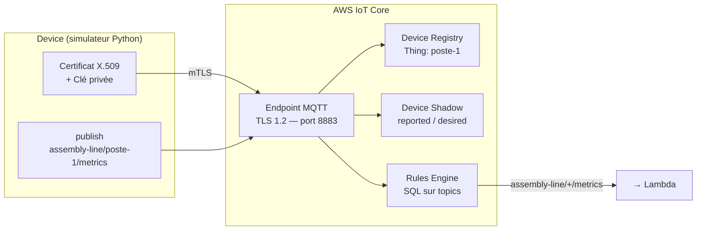
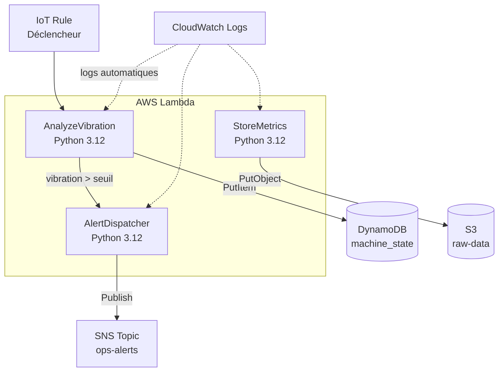
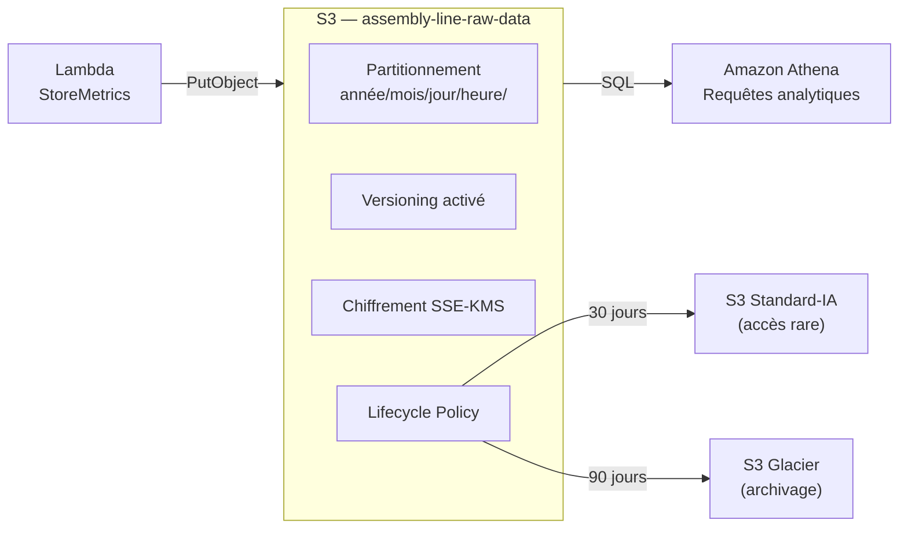
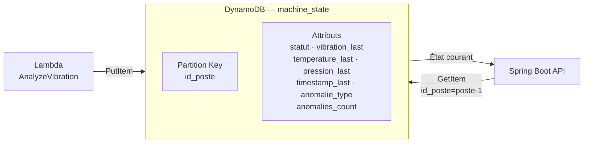
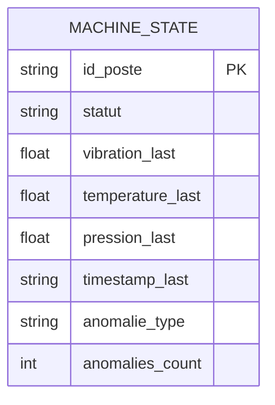
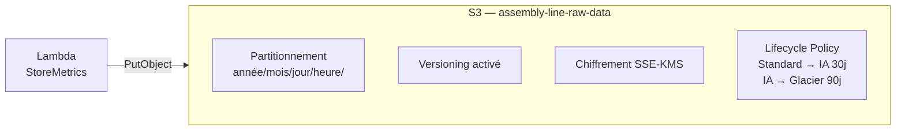
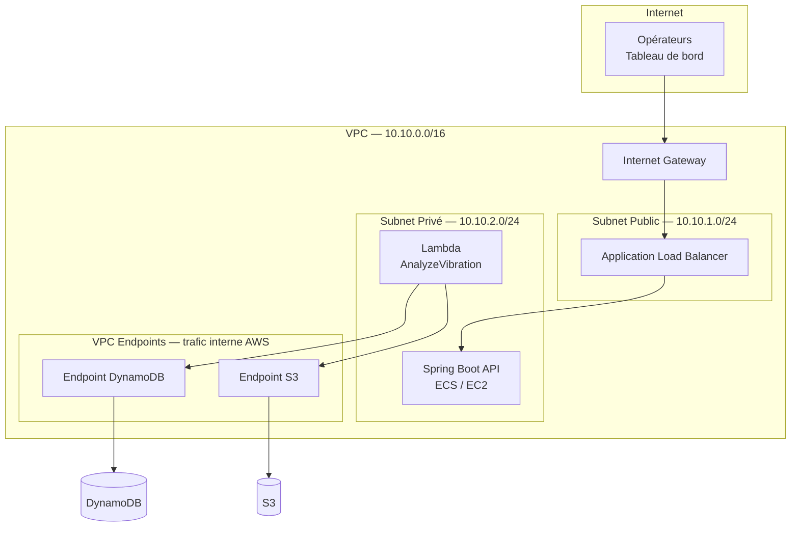

# Architecture par Composant

---

## 1. AWS IoT Core — Connectivité terrain

IoT Core est le point d'entrée de tous les messages capteurs. Il gère l'authentification des devices, le routage des messages et la synchronisation d'état.

**Concepts clés :**

- **mTLS** : chaque device s'authentifie avec son propre certificat X.509. Pas de mot de passe. Si un device est compromis, on révoque uniquement son certificat.
- **Device Shadow** : état persistant du device côté cloud. Si le device se déconnecte, l'état reste accessible. Utile pour connaître le dernier état connu d'un poste.
- **Rules Engine** : filtre SQL sur les topics. `SELECT * FROM 'assembly-line/+/metrics'` capte tous les postes en un seul pattern.

---

## 2. AWS IoT Core — Connectivité terrain

### Problème adressé

Les capteurs terrain (vibration, température, pression) doivent envoyer leurs mesures vers le cloud de façon **sécurisée, fiable et scalable**.

Le problème d'une connexion directe vers une API REST classique :
- Pas de gestion native de la déconnexion/reconnexion réseau
- Pas d'authentification device sans infrastructure PKI à maintenir
- Pas de routage intelligent des messages vers plusieurs consommateurs
- Pas de persistance de l'état device côté cloud

AWS IoT Core résout ces quatre problèmes en un seul service managé.

---

## 2. AWS Lambda — Traitement événementiel

Lambda exécute le code métier sans serveur. Chaque fonction a une responsabilité unique (Single Responsibility Principle).

**Points d'architecte à retenir :**

- **Cold start** : première invocation après inactivité (~100-500ms). Impact négligeable ici car les messages arrivent toutes les 2 secondes — Lambda reste "chaud".
- **Idempotence** : chaque Lambda doit produire le même résultat si le même message est reçu deux fois (réseau peut dupliquer). On utilise l'`id_poste` + `timestamp` comme clé de déduplication dans DynamoDB.
- **Timeout** : configuré à 10s. Si DynamoDB ou S3 ne répond pas, Lambda échoue proprement — pas de thread bloqué indéfiniment.

---

## 3. S3 — Data Lake

### Problème adressé

Les messages capteurs arrivent à raison de plusieurs milliers par heure. Il faut les conserver :

- pour l'**analyse historique** (détection de dérives lentes sur semaines/mois)
- pour la **conformité réglementaire** aérospatiale (traçabilité complète de chaque pièce)
- pour le **futur ML** (entraînement de modèles de maintenance prédictive)

DynamoDB stocke l'état *actuel* des postes — il n'est pas conçu pour l'historisation massive.
S3 est le bon outil : stockage objet illimité, coût très faible, et intégration native avec Athena, Glue, SageMaker.

### Architecture

### Décisions de conception justifiées

**Partitionnement par date : `année/mois/jour/heure/`**
Chaque objet S3 est stocké sous un chemin du type `2026/07/05/14/poste-1_1234567890.json`.
Sans partitionnement, Athena scanne le bucket entier pour chaque requête — coût et latence prohibitifs.
Avec ce partitionnement, une requête sur une heure de données ne lit que `1/8760ème` du bucket.

**Versioning activé**
En contexte réglementaire aérospatial, une suppression accidentelle de données de traçabilité peut entraîner un écart d'audit.
Le versioning conserve toutes les versions de chaque objet — une suppression crée un `DeleteMarker`, pas une destruction définitive.

**Chiffrement SSE-KMS**
Les données capteurs peuvent contenir des informations sur les cadences de production — sensibles commercialement.
SSE-KMS chiffre chaque objet avec une clé KMS gérée par AWS. Avantage sur SSE-S3 : audit complet des accès à la clé via CloudTrail.

**Lifecycle Policy — optimisation des coûts**
Les données fraîches (< 30 jours) sont en `Standard` — accès fréquent pour le monitoring.
Après 30 jours → `Standard-IA` (Infrequent Access) : même durabilité, 40% moins cher, accès facturé à l'utilisation.
Après 90 jours → `Glacier` : archivage long terme réglementaire, 80% moins cher que Standard, récupération en quelques heures.

**Block Public Access activé**
Aucun objet du data lake ne doit être accessible publiquement, même par erreur de configuration.
Le `Block Public Access` est un verrou au niveau bucket — il écrase toute ACL ou policy qui tenterait d'ouvrir l'accès public.

### Tables des classes de stockage

| Classe | Délai | Usage | Coût relatif |
|---|---|---|---|
| S3 Standard | 0 – 30 jours | Données fraîches, accès fréquent | $$$ |
| S3 Standard-IA | 30 – 90 jours | Historique récent, accès rare | $$ |
| S3 Glacier | > 90 jours | Archivage réglementaire | $ |

### Trade-off assumé

**S3 vs DynamoDB pour l'historique**
DynamoDB pourrait stocker l'historique avec un sort key `timestamp`, mais le coût explose à grande échelle (facturation à la lecture/écriture par item).
S3 facture au stockage et à la requête Athena uniquement — largement plus économique pour des volumes d'archives.

**Athena vs une base analytique dédiée (Redshift)**
Athena est serverless : pas de cluster à gérer, paiement à la requête.
Redshift serait justifié pour des dashboards temps réel avec requêtes complexes en continu — pas le besoin dominant ici.

---

## 4. DynamoDB — État temps réel des postes

### Problème adressé

Le système a besoin d'un accès **instantané** à l'état courant de chaque poste : statut, dernière mesure, dernière anomalie.
S3 n'est pas adapté — il est conçu pour stocker, pas pour répondre en millisecondes à une requête par clé.
RDS (PostgreSQL/MySQL) peut le faire, mais introduit un schéma rigide, un serveur à maintenir, et une latence plus variable.

DynamoDB répond à ce besoin précis : **accès par clé primaire en < 10ms**, scalabilité automatique, zéro serveur à opérer.

### Architecture

### Modèle de données

| Attribut | Type | Description |
|---|---|---|
| `id_poste` | String (PK) | Identifiant unique du poste — `poste-1`, `poste-2`... |
| `statut` | String | `OK`, `WARN`, `CRITICAL` |
| `vibration_last` | Number | Dernière mesure vibration (m/s²) |
| `temperature_last` | Number | Dernière mesure température (°C) |
| `pression_last` | Number | Dernière mesure pression (bar) |
| `timestamp_last` | String | ISO 8601 — horodatage de la dernière mesure |
| `anomalie_type` | String | Type d'anomalie détectée (`VIBRATION`, `TEMP`, `null`) |
| `anomalies_count` | Number | Compteur d'anomalies depuis la dernière remise à zéro |

### Décisions de conception justifiées

**Partition key = `id_poste` — pas de hot partition**
Une hot partition se produit quand trop de requêtes ciblent la même clé de partition simultanément.
Ici chaque poste est indépendant et sollicité à fréquence identique (une mesure toutes les 2 secondes par poste).
La charge est distribuée équitablement sur toutes les partitions — pas de risque de throttling.

**On-demand billing — pas de capacité provisionnée**
Le trafic varie selon les shifts : intense en journée, quasi nul la nuit.
En capacité provisionnée, on paie les unités réservées même quand la table est idle.
On-demand facture à la requête — optimal pour un trafic variable et imprévisible.

**Un seul item par poste — écrasement à chaque message**
DynamoDB n'est pas un historique — c'est une **vue courante**.
Chaque `PutItem` écrase l'item existant avec l'état le plus récent.
L'historique complet est dans S3, interrogeable via Athena.
Ce partage de responsabilité (état actuel → DynamoDB, historique → S3) est un pattern fondamental des architectures event-driven.

**Pas de sort key sur cette table**
Une sort key permettrait de stocker plusieurs items par poste (ex : historique dans DynamoDB).
Ce n'est pas le choix retenu — on garde DynamoDB simple et rapide, S3 pour l'historique.
Si le besoin évolue vers un historique court terme (dernières 24h) dans DynamoDB, on ajoutera une GSI avec `timestamp` comme sort key.

### Trade-offs

**DynamoDB vs RDS**
RDS permettrait des requêtes SQL complexes (jointures, agrégats multi-postes).
Mais on ne fait ici que des `GetItem` et `PutItem` par clé — RDS serait surdimensionné et plus coûteux à opérer.
Si un module de reporting réglementaire avec jointures complexes émerge, RDS redevient pertinent.

**DynamoDB vs Redis (ElastiCache)**
Redis serait encore plus rapide (< 1ms) mais volatil sans persistance configurée.
DynamoDB est durable par défaut — les données survivent à un redémarrage, Redis non (sans AOF/RDB).
Pour un système critique industriel, la durabilité prime sur la microseconde de latence gagnée.

---

## 4. S3 — Data Lake

S3 stocke tous les messages bruts pour analyse historique, audit réglementaire et futur ML.

**Décisions de conception :**

- **Partitionnement par date** : `s3://assembly-line-raw-data/2026/07/05/14/poste-1_1234567890.json`. Permet à Athena de lire uniquement la partition pertinente sans scanner tout le bucket.
- **Versioning** : protection contre les suppressions accidentelles. Obligatoire en contexte réglementaire aérospatial.
- **Lifecycle** : les données > 30 jours passent en S3-IA (moins cher, accès rare). > 90 jours en Glacier (archivage long terme). Optimisation coût sans perte de données.

---

## 5. VPC — Isolation réseau

### Problème adressé

Par défaut, les ressources AWS créées hors VPC sont exposées sur des endpoints publics.
Pour un système industriel critique, c'est inacceptable : Lambda, l'API et les bases de données
ne doivent jamais être joignables directement depuis internet.

Le VPC crée un réseau privé virtuel dans AWS — l'équivalent d'un réseau d'entreprise isolé,
sur lequel on contrôle intégralement le trafic entrant et sortant.

### Architecture

### Décisions de conception justifiées

**CIDR `10.10.0.0/16` — 65 536 adresses disponibles**
Largement surdimensionné pour ce projet, mais intentionnel : un VPC ne se redimensionne pas après création.
Prévoir de l'espace pour des subnets futurs (multi-AZ, subnets dédiés RDS, ECS) évite une migration coûteuse plus tard.

**Deux subnets distincts : public et privé**
La séparation n'est pas cosmétique — elle est structurelle.
Le subnet public (`10.10.1.0/24`) expose uniquement le Load Balancer, seul composant qui doit recevoir du trafic externe.
Le subnet privé (`10.10.2.0/24`) contient Lambda et l'API : aucune route vers internet, aucune IP publique assignée.

**Internet Gateway attachée au VPC**
L'IGW est la seule porte vers internet. Sans elle, même le subnet public est isolé.
Elle est attachée au VPC, pas au subnet — c'est la route table du subnet public qui décide quels flux passent par l'IGW.

**VPC Endpoints pour DynamoDB et S3**
Sans VPC Endpoint, une Lambda en subnet privé qui appelle DynamoDB doit soit passer par un NAT Gateway
(coûteux : ~32$/mois fixe + trafic), soit avoir une IP publique (non acceptable).
Les VPC Endpoints permettent d'atteindre DynamoDB et S3 **via le réseau backbone AWS**, sans sortir sur internet.
Résultat : sécurité, latence réduite, et zéro coût de transfert inter-réseau.

**Route table privée explicite**
Le subnet privé pourrait hériter implicitement de la main route table du VPC (comportement AWS par défaut).
C'est fonctionnellement correct, mais dangereux : toute modification accidentelle de la main route table
affecterait le subnet privé sans avertissement.
On lui associe une route table dédiée, vide de toute route externe — l'intention est dans le code, pas dans le comportement implicite AWS.

**Security Groups — deny-all par défaut**
AWS applique un refus implicite sur tout trafic non explicitement autorisé.
Le security group de Lambda n'autorise que les sorties vers les ports DynamoDB (443) et S3 (443).
Aucune règle entrante — Lambda ne reçoit jamais de connexion initiée de l'extérieur.

### Tables de routage

| Route table | Associée à | Règles | Rôle |
|---|---|---|---|
| `smart-assembly-rt-public` | Subnet public `10.10.1.0/24` | `0.0.0.0/0 → IGW` + `local` | Autorise la sortie vers internet via l'IGW |
| `smart-assembly-rt-private` | Subnet privé `10.10.2.0/24` | `local` uniquement | Trafic interne VPC uniquement, aucune sortie internet |
| Main route table (défaut AWS) | Aucun subnet du projet | `local` uniquement | Non utilisée — subnets associés explicitement |

### Trade-off assumé

Ce VPC est en **single-AZ** (`eu-west-3a`) pour ce stade du projet.
En production critique, on déploierait sur **2 ou 3 AZ** avec un subnet public et privé par AZ,
et un ALB multi-AZ pour absorber la défaillance d'une zone.
Ce point est documenté comme dette technique à traiter dans la suite du projet (multi-region / haute disponibilité).