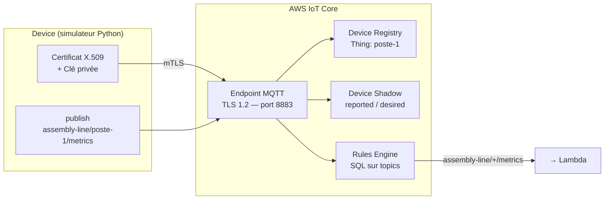
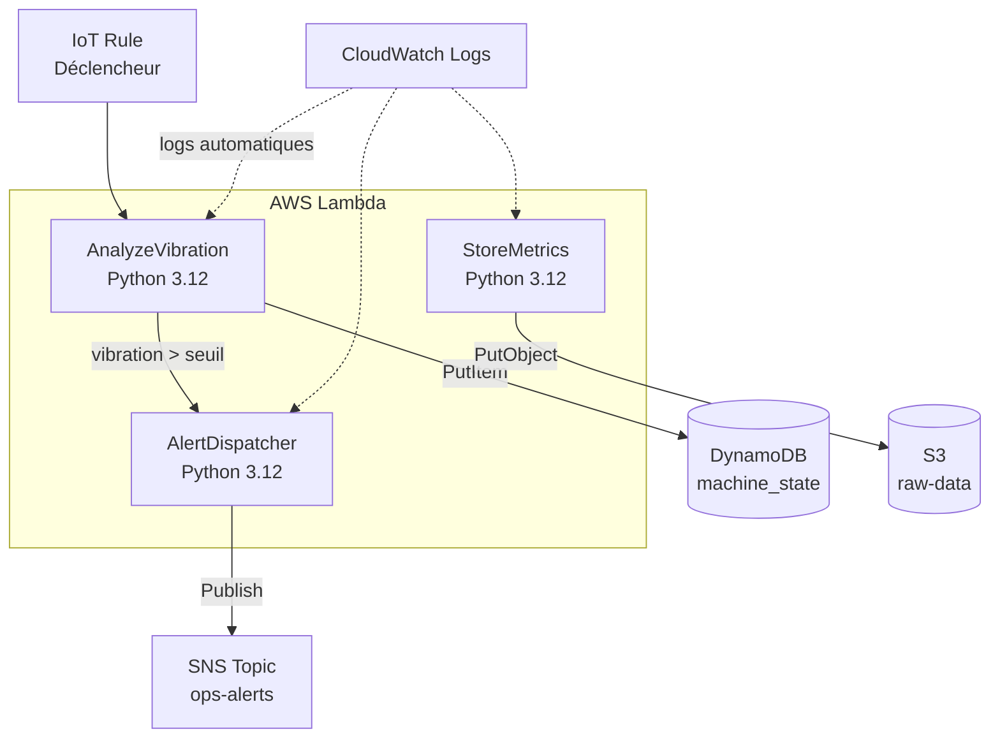
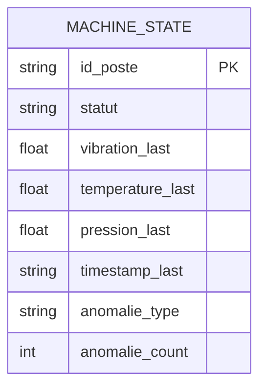
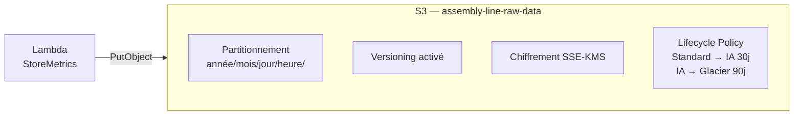
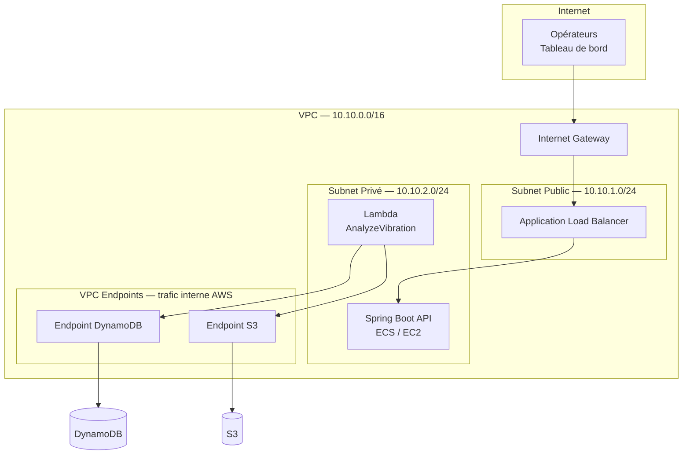

# Architecture par Composant

---

## 1. AWS IoT Core — Connectivité terrain

IoT Core est le point d'entrée de tous les messages capteurs. Il gère l'authentification des devices, le routage des messages et la synchronisation d'état.

**Concepts clés :**

- **mTLS** : chaque device s'authentifie avec son propre certificat X.509. Pas de mot de passe. Si un device est compromis, on révoque uniquement son certificat.
- **Device Shadow** : état persistant du device côté cloud. Si le device se déconnecte, l'état reste accessible. Utile pour connaître le dernier état connu d'un poste.
- **Rules Engine** : filtre SQL sur les topics. `SELECT * FROM 'assembly-line/+/metrics'` capte tous les postes en un seul pattern.

---

## 2. AWS Lambda — Traitement événementiel

Lambda exécute le code métier sans serveur. Chaque fonction a une responsabilité unique (Single Responsibility Principle).

**Points d'architecte à retenir :**

- **Cold start** : première invocation après inactivité (~100-500ms). Impact négligeable ici car les messages arrivent toutes les 2 secondes — Lambda reste "chaud".
- **Idempotence** : chaque Lambda doit produire le même résultat si le même message est reçu deux fois (réseau peut dupliquer). On utilise l'`id_poste` + `timestamp` comme clé de déduplication dans DynamoDB.
- **Timeout** : configuré à 10s. Si DynamoDB ou S3 ne répond pas, Lambda échoue proprement — pas de thread bloqué indéfiniment.

---

## 3. DynamoDB — État temps réel des postes

DynamoDB stocke l'état courant de chaque poste. Accès en millisecondes, scalabilité native.

**Décisions de conception :**

- **Partition key = `id_poste`** : chaque poste est une entité distincte. Pas de hot partition car les postes sont indépendants et équitablement sollicités.
- **On-demand billing** : trafic variable selon les shifts de production. Pas de capacité provisionnée à gérer.
- **Un seul item par poste** : on écrase l'état à chaque message (`PutItem`). L'historique complet est dans S3, pas dans DynamoDB. DynamoDB = état actuel uniquement.

---

## 4. S3 — Data Lake

S3 stocke tous les messages bruts pour analyse historique, audit réglementaire et futur ML.

**Décisions de conception :**

- **Partitionnement par date** : `s3://assembly-line-raw-data/2026/07/05/14/poste-1_1234567890.json`. Permet à Athena de lire uniquement la partition pertinente sans scanner tout le bucket.
- **Versioning** : protection contre les suppressions accidentelles. Obligatoire en contexte réglementaire aérospatial.
- **Lifecycle** : les données > 30 jours passent en S3-IA (moins cher, accès rare). > 90 jours en Glacier (archivage long terme). Optimisation coût sans perte de données.

---

## 5. VPC — Isolation réseau

### Problème adressé

Par défaut, les ressources AWS créées hors VPC sont exposées sur des endpoints publics.
Pour un système industriel critique, c'est inacceptable : Lambda, l'API et les bases de données
ne doivent jamais être joignables directement depuis internet.

Le VPC crée un réseau privé virtuel dans AWS — l'équivalent d'un réseau d'entreprise isolé,
sur lequel on contrôle intégralement le trafic entrant et sortant.

### Architecture

### Décisions de conception justifiées

**CIDR `10.10.0.0/16` — 65 536 adresses disponibles**
Largement surdimensionné pour ce projet, mais intentionnel : un VPC ne se redimensionne pas après création.
Prévoir de l'espace pour des subnets futurs (multi-AZ, subnets dédiés RDS, ECS) évite une migration coûteuse plus tard.

**Deux subnets distincts : public et privé**
La séparation n'est pas cosmétique — elle est structurelle.
Le subnet public (`10.10.1.0/24`) expose uniquement le Load Balancer, seul composant qui doit recevoir du trafic externe.
Le subnet privé (`10.10.2.0/24`) contient Lambda et l'API : aucune route vers internet, aucune IP publique assignée.

**Internet Gateway attachée au VPC**
L'IGW est la seule porte vers internet. Sans elle, même le subnet public est isolé.
Elle est attachée au VPC, pas au subnet — c'est la route table du subnet public qui décide quels flux passent par l'IGW.

**VPC Endpoints pour DynamoDB et S3**
Sans VPC Endpoint, une Lambda en subnet privé qui appelle DynamoDB doit soit passer par un NAT Gateway
(coûteux : ~32$/mois fixe + trafic), soit avoir une IP publique (non acceptable).
Les VPC Endpoints permettent d'atteindre DynamoDB et S3 **via le réseau backbone AWS**, sans sortir sur internet.
Résultat : sécurité, latence réduite, et zéro coût de transfert inter-réseau.

**Route table privée explicite**
Le subnet privé pourrait hériter implicitement de la main route table du VPC (comportement AWS par défaut).
C'est fonctionnellement correct, mais dangereux : toute modification accidentelle de la main route table
affecterait le subnet privé sans avertissement.
On lui associe une route table dédiée, vide de toute route externe — l'intention est dans le code, pas dans le comportement implicite AWS.

**Security Groups — deny-all par défaut**
AWS applique un refus implicite sur tout trafic non explicitement autorisé.
Le security group de Lambda n'autorise que les sorties vers les ports DynamoDB (443) et S3 (443).
Aucune règle entrante — Lambda ne reçoit jamais de connexion initiée de l'extérieur.

### Tables de routage

| Route table | Associée à | Règles | Rôle |
|---|---|---|---|
| `smart-assembly-rt-public` | Subnet public `10.10.1.0/24` | `0.0.0.0/0 → IGW` + `local` | Autorise la sortie vers internet via l'IGW |
| `smart-assembly-rt-private` | Subnet privé `10.10.2.0/24` | `local` uniquement | Trafic interne VPC uniquement, aucune sortie internet |
| Main route table (défaut AWS) | Aucun subnet du projet | `local` uniquement | Non utilisée — subnets associés explicitement |

### Trade-off assumé

Ce VPC est en **single-AZ** (`eu-west-3a`) pour ce stade du projet.
En production critique, on déploierait sur **2 ou 3 AZ** avec un subnet public et privé par AZ,
et un ALB multi-AZ pour absorber la défaillance d'une zone.
Ce point est documenté comme dette technique à traiter dans la suite du projet (multi-region / haute disponibilité).