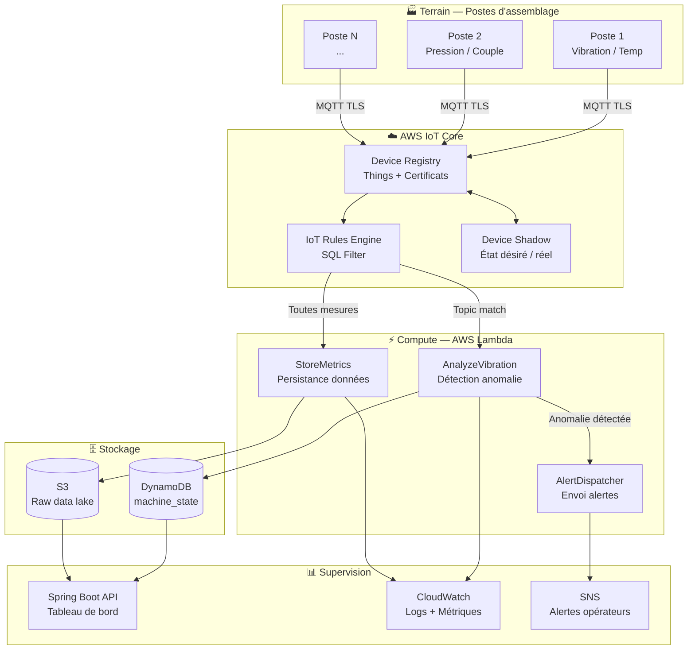

# Architecture Globale

## Vue d'ensemble

Le système **Smart Assembly Line** est structuré en quatre couches, inspiré du modèle ITU-T Y.2060 (IoT reference model) :

| Couche | Rôle | Technologies |
|---|---|---|
| **Terrain** | Capteurs, simulation des postes | Python MQTT simulator |
| **Connectivity** | Transport sécurisé des données | AWS IoT Core, MQTT/TLS |
| **Cloud** | Traitement, stockage, orchestration | Lambda, DynamoDB, S3 |
| **Application** | Supervision, API, alerting | Spring Boot, CloudWatch |

---

## Diagramme global

---

## Flux de données — scénario nominal

**1. Publication capteur**
Le simulateur Python publie toutes les 2 secondes sur le topic `assembly-line/{id_poste}/metrics` un payload JSON contenant vibration, température et pression.

**2. Réception IoT Core**
IoT Core reçoit le message via MQTT/TLS (port 8883). Le Device Registry valide le certificat du device. Le Rules Engine évalue les règles SQL configurées.

**3. Traitement Lambda**
Deux règles déclenchent deux Lambdas en parallèle :
- `AnalyzeVibration` : compare les valeurs aux seuils configurés, écrit l'état en DynamoDB
- `StoreMetrics` : archive le message brut en S3 pour le data lake

**4. Alerting**
Si `AnalyzeVibration` détecte une anomalie, elle déclenche `AlertDispatcher` qui publie sur SNS → notification opérateur.

**5. Supervision**
L'API Spring Boot expose les états DynamoDB en temps réel. CloudWatch agrège les logs et métriques de toutes les Lambdas.

---

## Principes d'architecture retenus

!!! success "Least Privilege"
    Chaque composant a son propre rôle IAM avec uniquement les permissions nécessaires. Lambda ne peut pas écrire dans S3, IoT Core ne peut pas lire DynamoDB.

!!! success "Event-driven"
    Aucun polling. Chaque événement capteur déclenche le traitement. Scalabilité native : 1 poste ou 1000, l'architecture ne change pas.

!!! success "Immutable Infrastructure"
    100% Terraform. La console AWS n'est utilisée que pour la visualisation. Toute modification passe par Git → `terraform apply`.
