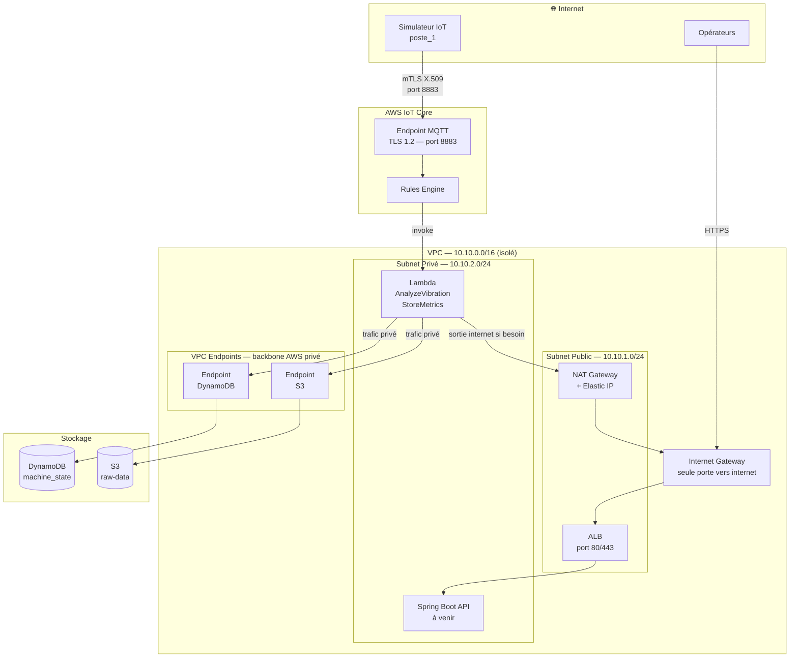
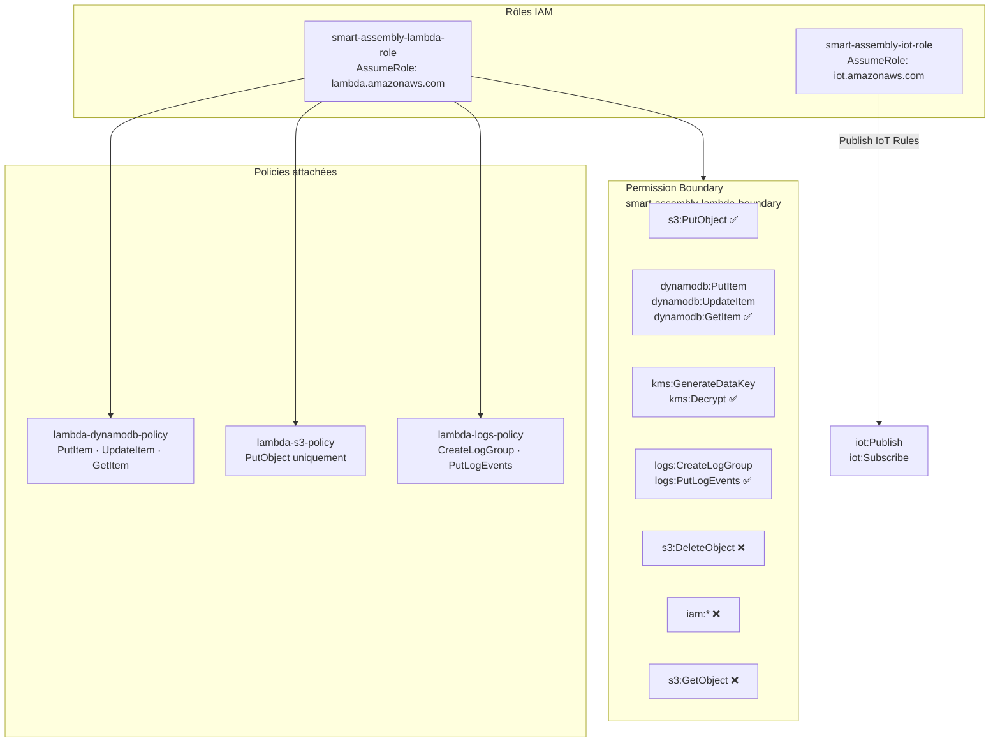
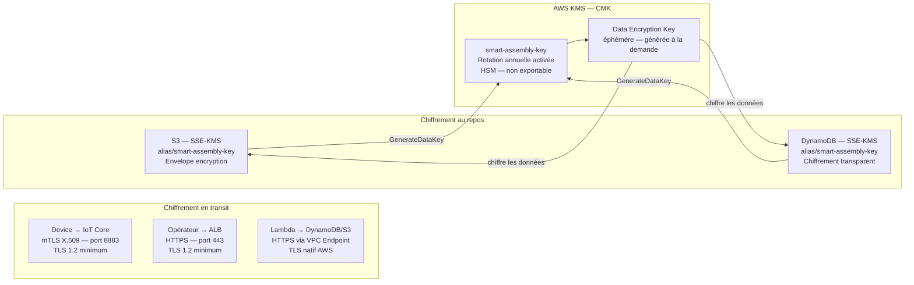
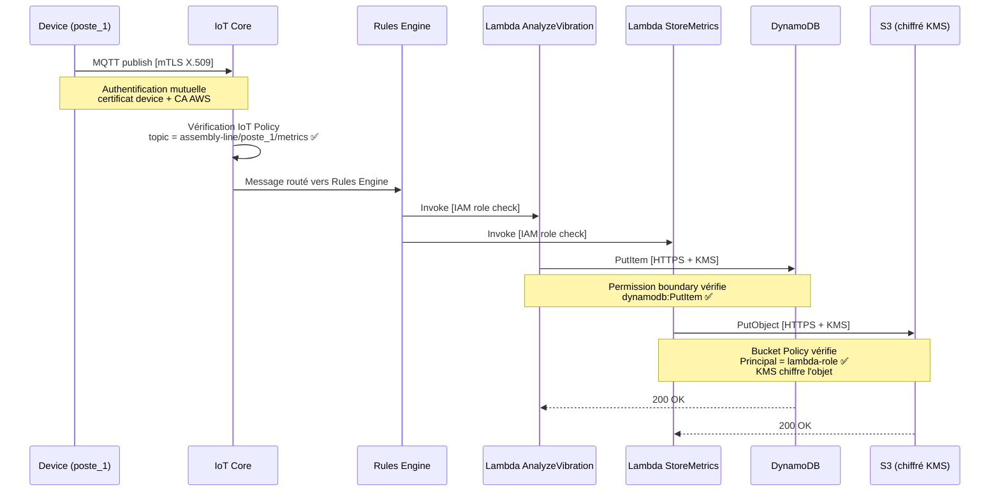

# Sécurité — Vue d'ensemble

Ce document synthétise la posture de sécurité du système Smart Assembly Line.
Il couvre les quatre axes : réseau, identité, chiffrement et flux de données sécurisés.
Ce document est mis à jour à chaque évolution de l'architecture.

---

## 1. Zones réseau — Isolation et contrôle du trafic

### Règles d'isolation

| Zone | Trafic entrant | Trafic sortant |
|---|---|---|
| Subnet public | Internet → ALB (80/443) | IGW → Internet |
| Subnet privé | ALB → API (8080) uniquement | NAT → Internet, VPC Endpoints → AWS |
| IoT Core | Device → MQTT (8883) mTLS | Rules Engine → Lambda |
| VPC Endpoints | Lambda → DynamoDB/S3 | Backbone AWS privé |

---

## 2. Identité — Rôles IAM et moindre privilège

### Matrice des permissions effectives

| Action | Rôle Lambda | Rôle IoT | Admin CLI |
|---|---|---|---|
| `s3:PutObject` | ✅ | ❌ | ✅ |
| `s3:GetObject` | ❌ | ❌ | ✅ |
| `s3:DeleteObject` | ❌ | ❌ | ✅ |
| `dynamodb:PutItem` | ✅ | ❌ | ✅ |
| `dynamodb:Scan` | ❌ | ❌ | ✅ |
| `kms:GenerateDataKey` | ✅ | ❌ | ✅ |
| `iam:CreateRole` | ❌ | ❌ | ✅ |
| `iot:Publish` (propre topic) | ❌ | ✅ | ✅ |
| `iot:Publish` (topic autre device) | ❌ | ❌ | ✅ |

---

## 3. Chiffrement — Données en transit et au repos

### Matrice de chiffrement

| Canal / Stockage | Protocole | Clé | Niveau |
|---|---|---|---|
| Device → IoT Core | mTLS / TLS 1.2 | Certificat X.509 par device | Fort |
| Opérateur → ALB | HTTPS / TLS 1.2 | Certificat ACM | Fort |
| Lambda → AWS Services | HTTPS (VPC Endpoint) | TLS natif | Fort |
| S3 (au repos) | SSE-KMS | CMK `smart-assembly-key` | Fort + auditabilité |
| DynamoDB (au repos) | SSE-KMS | CMK `smart-assembly-key` | Fort + auditabilité |

---

## 4. Flux de données sécurisé — Du capteur au data lake

---

## 5. Synthèse — Niveaux de défense (Defense in Depth)

| Couche | Mécanisme | Composant protégé |
|---|---|---|
| **Réseau** | VPC isolation, subnet privé sans IP publique | Lambda, API backend |
| **Authentification device** | mTLS X.509, certificat par device | IoT Core |
| **Autorisation device** | IoT Policy — publish sur son seul topic | IoT Core |
| **Autorisation service** | IAM roles + least privilege | Lambda, S3, DynamoDB |
| **Plafond de permissions** | Permission Boundary | Rôle Lambda |
| **Contrôle ressource** | S3 Bucket Policy — PutObject uniquement | Data lake |
| **Chiffrement transit** | TLS 1.2 partout | Tous les flux |
| **Chiffrement repos** | SSE-KMS avec CMK | S3, DynamoDB |
| **Auditabilité** | CloudTrail + KMS audit logs | Toutes les actions AWS |

---

## 6. Dette technique — Points à adresser

| Point | Risque | Priorité |
|---|---|---|
| Lambda hors VPC | Lambda appelle DynamoDB/S3 via endpoints publics AWS, pas via VPC Endpoints | Semaine 6 |
| Single-AZ | Pas de résilience zonale sur le subnet privé | Semaine 7 |
| Pas de WAF sur l'ALB | Trafic HTTP non filtré sur le tableau de bord | Semaine 6 |
| CloudTrail non activé | Pas de trace des appels API AWS | Jour 37 |
| Certificats IoT gérés manuellement | Pas de rotation automatique des certs device | Backlog |
