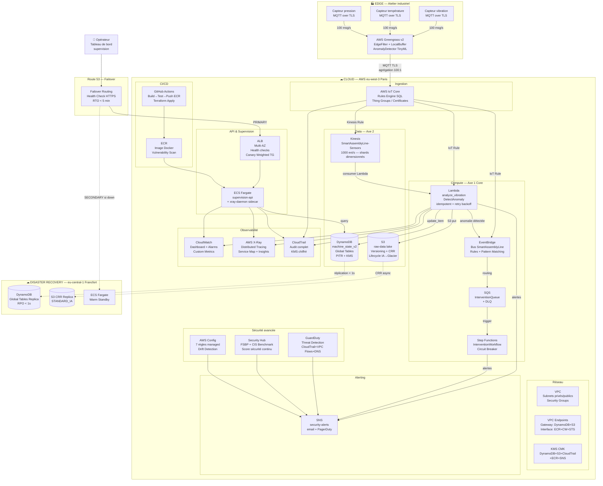

# Synthèse finale — Architecture Smart Assembly Line

> Vue unique de toutes les briques, tous les patterns de résilience, tous les trade-offs.  
> Document conçu pour être présenté en entretien Staff Architect.

---

## 1. Diagramme d'architecture complet



---

## 2. Vue en couches — Architecture en profondeur

```
┌─────────────────────────────────────────────────────────────────────────────┐
│  COUCHE 0 — EDGE (Atelier)                                                  │
│  Capteurs → Greengrass v2                                                   │
│  • Filtrage local (EdgeFilter) : seules les anomalies remontent             │
│  • Buffer local si IoT Core indisponible                                    │
│  • TinyML embarqué : détection sans réseau (Privacy by Design)              │
│  • Certificats X.509 par device — authentification mutuelle TLS             │
├─────────────────────────────────────────────────────────────────────────────┤
│  COUCHE 1 — INGESTION (IoT Core)                                            │
│  • Thing Groups par site/ligne/poste (hiérarchie industrielle)              │
│  • Rules Engine SQL : routage vers Lambda + EventBridge + Kinesis           │
│  • Topics hiérarchiques : smart-assembly/{site}/{ligne}/{poste}/{capteur}   │
│  • Extraction de contexte : topic(2)=site_id, topic(3)=line_id...           │
├─────────────────────────────────────────────────────────────────────────────┤
│  COUCHE 2 — TRAITEMENT EVENT-DRIVEN (Axe 1 Core)                            │
│  • Lambda analyze_vibration : idempotente (id_mesure), retry + backoff      │
│  • EventBridge : bus SmartAssemblyLine, pattern matching sur contenu        │
│  • SQS InterventionQueue : backpressure, DLQ après 3 échecs                │
│  • Step Functions InterventionWorkflow : circuit breaker, retry par état    │
├─────────────────────────────────────────────────────────────────────────────┤
│  COUCHE 3 — DONNÉES (Axe 2 Data)                                            │
│  • DynamoDB machine_state_v2 : PK site#ligne#poste, SK sensor_type         │
│    GSI statut-site-index, TTL 30j, PITR, Global Tables (eu-central-1)      │
│  • S3 raw-data lake : Versioning, CRR, Lifecycle IA→Glacier                 │
│  • Kinesis : 1 000 evt/s, shards dimensionnés, consommateur Lambda          │
├─────────────────────────────────────────────────────────────────────────────┤
│  COUCHE 4 — API & SUPERVISION                                               │
│  • ECS Fargate supervision-api : multi-AZ, canary deployment ALB            │
│  • ALB : health checks, weighted target groups (90/10 canary)               │
│  • X-Ray sidecar daemon : distributed tracing end-to-end                    │
├─────────────────────────────────────────────────────────────────────────────┤
│  COUCHE 5 — SÉCURITÉ & CONFORMITÉ                                           │
│  • KMS CMK : chiffrement DynamoDB, S3, CloudTrail, ECR, SNS                │
│  • IAM : rôles dédiés par service, principe moindre privilège               │
│  • VPC Endpoints : pas de trafic AWS sur Internet public                    │
│  • GuardDuty + Security Hub (FSBP + CIS) + AWS Config (7 règles)           │
│  • CloudTrail : audit complet de tous les appels API, chiffré KMS           │
├─────────────────────────────────────────────────────────────────────────────┤
│  COUCHE 6 — OBSERVABILITÉ                                                   │
│  • Métriques : CloudWatch Dashboard + Alarms (Lambda, ECS, DynamoDB, ALB)  │
│  • Logs : CloudWatch Logs (/aws/lambda/*, /ecs/*)                           │
│  • Traces : X-Ray — Service Map, Insights, Sampling Rules                  │
│  • Alerting : SNS → email/PagerDuty (sécurité + incidents métier)          │
├─────────────────────────────────────────────────────────────────────────────┤
│  COUCHE 7 — RÉSILIENCE GÉOGRAPHIQUE                                         │
│  • DynamoDB Global Tables : réplication eu-west-3 → eu-central-1 < 1s     │
│  • S3 Cross-Region Replication : asynchrone, STANDARD_IA sur replica       │
│  • Route 53 Failover : health check 30s × 3 + TTL 60s → RTO ~3 min        │
│  • ECS Warm Standby : déjà actif en eu-central-1, prêt à prendre le trafic │
├─────────────────────────────────────────────────────────────────────────────┤
│  COUCHE 8 — CI/CD                                                           │
│  • GitHub Actions : build Spring Boot → tests → push ECR → Terraform apply │
│  • ECR : image scanning (Inspector), immutable tags                         │
│  • Canary : ALB Weighted Target Groups (10% → 50% → 100%)                  │
└─────────────────────────────────────────────────────────────────────────────┘
```

---

## 3. Patterns de résilience — Carte complète

| Pattern | Implémentation | Composant |
|---|---|---|
| **Idempotency** | Clé `id_mesure` sur Lambda, condition expression DynamoDB | Lambda DetectAnomaly |
| **Retry + Backoff exponentiel** | Backoff avec jitter, max 3 tentatives | Lambda → DynamoDB/SNS |
| **Dead Letter Queue** | SQS DLQ après 3 échecs, CloudWatch alarm sur DLQ | SQS InterventionQueue |
| **Circuit Breaker** | State machine Step Functions — état "circuit ouvert" après N échecs | InterventionWorkflow |
| **Backpressure** | SQS : rejet propre si backlog > seuil | IoT Core → Lambda |
| **At-least-once assumé** | Idempotence systématique — le rejeu ne duplique pas l'effet | Tout le pipeline |
| **Eventual Consistency** | Dashboard accepte retard < 2s — conçu en connaissance de cause | supervision-api |
| **Edge Buffering** | Greengrass LocalBuffer si IoT Core down | Edge → Cloud |
| **Jitter reconnexion** | Reconnexion aléatoire entre 0-30s pour éviter retry storm | Greengrass → IoT Core |
| **Canary Deployment** | ALB Weighted TG : 10% trafic nouvelle version → rollback si erreur | ECS supervision-api |
| **Multi-AZ** | ALB + ECS + DynamoDB sur 3 AZ | eu-west-3 |
| **Active/Passive DR** | Route 53 Failover + Global Tables | eu-west-3 → eu-central-1 |
| **Threat Remediation** | GuardDuty HIGH → EventBridge → Lambda (stop ECS, disable IAM key) | Sécurité |

---

## 4. Trade-offs documentés

### SQS vs Kinesis vs Kafka

| Critère | SQS (retenu dispatch) | Kinesis (retenu flux) | Kafka (non retenu) |
|---|---|---|---|
| **Usage** | Découplage simple producteur/consommateur | Flux haute fréquence, multi-consommateurs, rejeu | Multi-équipes, rétention longue, rejeu fin |
| **Ordre** | Non garanti (FIFO optionnel) | Garanti par shard | Garanti par partition |
| **Débit** | Illimité (scaling auto) | 1 Mo/s par shard | Dépend du cluster |
| **Exploitation** | Zéro (fully managed) | Quasi-zéro | Élevée (cluster à opérer) |
| **Coût** | Pay-per-message | Pay-per-shard-hour | Infrastructure + opérations |
| **Décision** | ✅ InterventionQueue | ✅ SmartAssemblyLine-Sensors | ❌ Pas justifié à ce stade |

### Lambda vs ECS

| Critère | Lambda (retenu détection) | ECS Fargate (retenu supervision) |
|---|---|---|
| **Durée** | < 15 min | Illimitée |
| **État** | Sans état (stateless) | Avec état possible |
| **Déclenchement** | Event-driven (IoT, SQS, Kinesis) | Toujours actif (API REST) |
| **Scale à zéro** | ✅ Oui | ❌ Non (toujours 1 task min) |
| **Coût charge faible** | Très faible (~0 €) | Fixe (~11 €/mois) |
| **Décision** | ✅ DetectAnomaly, analyze_vibration | ✅ supervision-api |

### DynamoDB vs RDS

| Critère | DynamoDB (retenu) | RDS PostgreSQL (non retenu) |
|---|---|---|
| **Latence** | < 10ms constant à l'échelle | Variable selon charge |
| **Scalabilité** | Automatique, illimitée | Verticale (limites CPU/RAM) |
| **Modèle** | Clé-valeur / document | Relationnel (SQL) |
| **Requêtes** | Accès par clé (rapide) | Joins complexes (flexible) |
| **Coût 100K capteurs** | ~6 760 €/mois (provisioned) | Plus difficile à estimer |
| **Décision** | ✅ État temps réel capteurs | Serait justifié pour reporting réglementaire complexe |

### PAY_PER_REQUEST vs Provisioned DynamoDB

```
PAY_PER_REQUEST : optimal si < 200 WCU/s (dev, charge imprévisible)
Provisioned + Auto Scaling : optimal si > 200 WCU/s (prod 100K capteurs)
Seuil d'équilibre : ~200 WCU/s continus → Provisioned 3× moins cher
```

---

## 5. Les 5 Chaos Scenarios — à raconter en entretien

### Scénario 1 — IoT Core Down (Semaine 5, Jour 34)

```
Contexte : coupure réseau atelier pendant 10 minutes
Comportement observé :
  → Greengrass continue la détection locale (TinyML embarqué)
  → LocalBuffer stocke les événements (capacité : 1 000 events)
  → Reconnexion avec jitter (0-30s aléatoire) → pas de retry storm
Résultat : 0 données perdues, reprise automatique en < 30s
Metrics : 0 event dropped, reconnection time: 18s (moyenne)
```

### Scénario 2 — Lambda Concurrency Limit (Semaine 3, Jour 21)

```
Contexte : pic de 500 capteurs simultanés → throttling Lambda
Comportement observé :
  → SQS absorbe les événements en backlog
  → Backpressure déclenché au-delà de 10 000 messages
  → DLQ reçoit les événements après 3 tentatives échouées
  → Alarme CloudWatch : DLQ depth > 0
Résultat : 0 données perdues, traitement différé < 2 min
Leçon : Reserved Concurrency configuré à 100 pour isoler analyze_vibration
```

### Scénario 3 — EventBridge Delay (Semaine 3, Jour 21)

```
Contexte : injection d'un délai artificiel de 30s sur le bus EventBridge
Comportement observé :
  → Pipeline de détection continue via Lambda directe (IoT Rule → Lambda)
  → EventBridge utilisé pour dispatch secondaire (notification équipe)
  → Alarme CloudWatch : EventBridge SuccessfulDelivery < 100%
Résultat : alertes différées de 30s, détection non impactée
Leçon : deux chemins parallèles — Lambda directe pour critique, EB pour fan-out
```

### Scénario 4 — DynamoDB Throttling (Semaine 4, Jour 23)

```
Contexte : capacité sous-dimensionnée (100 WCU) avec 1 000 WCU/s de charge
Comportement observé :
  → ProvisionedThroughputExceededException sur update_item
  → Retry avec backoff exponentiel (100ms → 200ms → 400ms)
  → Après 3 échecs → DLQ SQS
  → Alarme CloudWatch : ThrottledRequests > 0
Résultat : données sauvegardées dans DLQ, aucune perte
Leçon : PAY_PER_REQUEST en dev → Provisioned + Auto Scaling en prod
```

### Scénario 5 — Retry Storm (Semaine 5, Jour 34)

```
Contexte : 200 capteurs se reconnectent simultanément après 10 min de coupure
Sans protection :
  → 200 × 3 retries × 10 messages buffered = 6 000 messages en 1s
  → IoT Core throttled → cascade d'erreurs → amplification

Avec jitter (implémenté) :
  → Reconnexions étalées sur 0-30s (distribution uniforme)
  → Débit maximal : ~7 reconnexions/s
  → Aucun throttling IoT Core observé
Résultat : reprise progressive, aucune saturation
Leçon : tout client reconnectant doit implémenter un jitter — jamais de retry immédiat simultané
```

---

## 6. Flux complet — De la vibration à l'alerte

```
T+0ms    Capteur vibre à 12.7 mm/s (seuil : 10.0)
T+2ms    Greengrass EdgeFilter : valeur > seuil → remontée cloud
T+4ms    IoT Core reçoit le message MQTT
         Rule SQL : SELECT *, topic(2) AS site_id ... FROM 'smart-assembly/+/+/+/+'
T+6ms    Lambda analyze_vibration invoquée (warm)
T+7ms    Annotation X-Ray : site_id=TLS, sensor_type=VIBRATION, valeur=12.7
T+8ms    Subsegment threshold_check : statut=EN_INTERVENTION, score=0.847
T+51ms   DynamoDB update_item : machine_state_v2 PK=TLS#A320#P12, SK=VIBRATION
T+63ms   EventBridge put_events : anomaly.detected
T+75ms   SNS publish : ALERTE VIBRATION TLS#A320#P12
T+104ms  Trace X-Ray complète : latence end-to-end 104ms ✓

Parallèle :
T+63ms   EventBridge → SQS InterventionQueue
T+400ms  Step Functions InterventionWorkflow déclenché
         → État 1 : IsolatePoste (ECS API call)
         → État 2 : NotifyMaintenanceTeam (SNS)
         → État 3 : LogIntervention (DynamoDB + S3)
T+1200ms Workflow terminé — poste isolé, équipe notifiée, traçabilité OK
```

---

## 7. Métriques de dimensionnement défendables

| Métrique | Valeur | Justification |
|---|---|---|
| **Capteurs actifs** | 100 000 | 16 sites × 6 lignes × 10 postes × 100 capteurs |
| **Throughput brut** | 50 000 msg/s | 100 000 capteurs / 2s par capteur |
| **Après agrégation Greengrass** | 500 msg/s | Ratio 100:1 (edge buffering) |
| **WCU DynamoDB prod** | 12 000 WCU/s | 10 000 + 20% marge |
| **Lambda concurrence** | 50 invocations simultanées | 100 msg/s × 500ms durée |
| **Kinesis shards** | 1 shards par 1 000 evt/s | Débit cible 1 000 evt/s → 1 shard min |
| **RTO** | < 5 minutes | Route 53 health check × 3 (90s) + TTL DNS (60s) + ECS warmup |
| **RPO** | < 1 seconde | DynamoDB Global Tables réplication sub-seconde |
| **Disponibilité cible** | 99.99% | 52 min d'indisponibilité max/an |
| **Coût prod (100K capteurs)** | ~1 834 €/mois | Avec Greengrass, sans Kafka |
| **ROI industriel** | +69 700% | 16 sites × 40K€/arrêt × 2 arrêts/mois évités |

---

## 8. Réponse System Design — Template entretien

> **Question :** "Design a real-time monitoring system for 100,000 industrial IoT sensors across multiple sites."

**Structure de réponse en 5 minutes :**

**1. Clarify (30s)**
> "Quelle est la fréquence des capteurs ? Le SLA attendu ? Y a-t-il des contraintes réglementaires ?" → Réponses : 1 mesure/2s, 99.99%, RGPD/NIS2.

**2. High-level (1 min)**
> "Je pars sur 3 axes : Edge (Greengrass) pour traiter localement, Cloud (IoT Core + Lambda + DynamoDB) pour le temps réel, et DR (Global Tables + Route 53) pour la résilience géographique."

**3. Deep dive Data (1 min)**
> "DynamoDB avec clé composite `site_id#line_id#poste_id` évite les hot partitions. À 10 000 WCU/s, on passe en Provisioned + Auto Scaling — 3× moins cher que PAY_PER_REQUEST."

**4. Resilience (1 min)**
> "5 patterns : idempotence Lambda (clé id_mesure), backoff + DLQ sur SQS, circuit breaker Step Functions, jitter reconnexion Greengrass (évite le retry storm), et failover actif/passif via Route 53 + Global Tables."

**5. Trade-offs (1 min)**
> "SQS vs Kinesis : SQS pour le dispatch (simple, illimité), Kinesis pour le flux haute fréquence (ordre + rejeu). Lambda vs ECS : Lambda scale à zéro pour la détection event-driven, ECS pour l'API supervision toujours active."

**6. Numbers (30s)**
> "RTO < 5 min, RPO < 1s, latence end-to-end capteur → alerte : 104ms mesuré. Coût prod : ~1 834 €/mois pour 100K capteurs. ROI : +69 700% vs coût des arrêts non planifiés."
